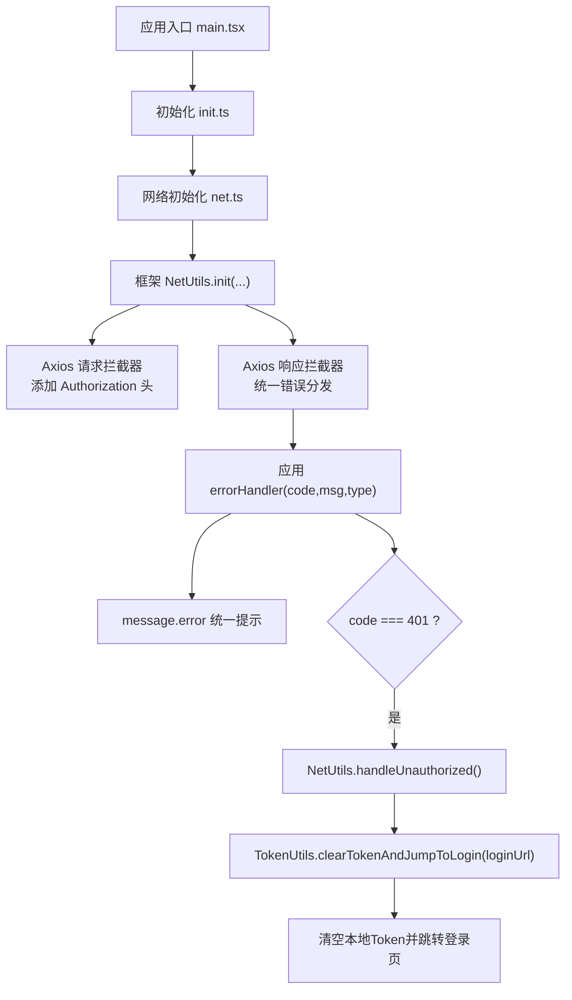
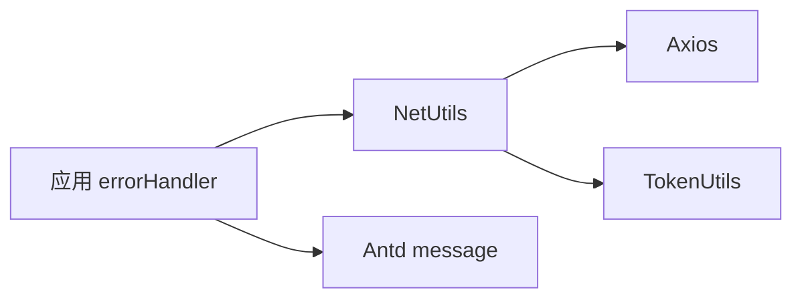
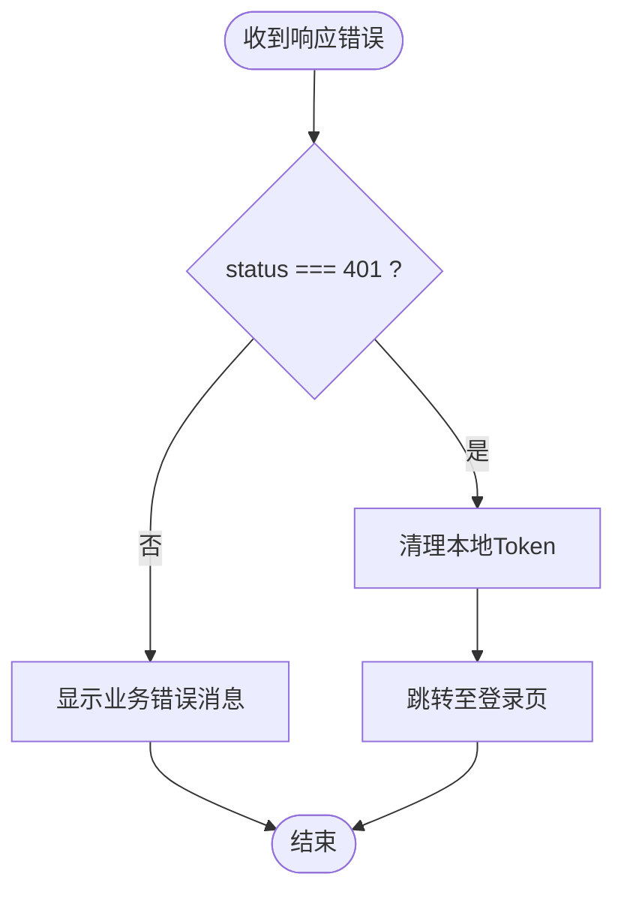

# 错误处理

<cite>
**本文引用的文件**
- [apps/demo/src/init/net.ts](file://apps/demo/src/init/net.ts)
- [packages/framework/src/utils/netUtils/index.ts](file://packages/framework/src/utils/netUtils/index.ts)
- [packages/framework/src/utils/netUtils/interface.ts](file://packages/framework/src/utils/netUtils/interface.ts)
- [packages/framework/src/utils/netUtils/tokenUtils.ts](file://packages/framework/src/utils/netUtils/tokenUtils.ts)
- [packages/mock/src/routes/login/index.ts](file://packages/mock/src/routes/login/index.ts)
- [apps/demo/src/main.tsx](file://apps/demo/src/main.tsx)
- [apps/demo/src/init/init.ts](file://apps/demo/src/init/init.ts)
</cite>

## 目录
1. [简介](#简介)
2. [项目结构](#项目结构)
3. [核心组件](#核心组件)
4. [架构总览](#架构总览)
5. [详细组件分析](#详细组件分析)
6. [依赖关系分析](#依赖关系分析)
7. [性能与可靠性](#性能与可靠性)
8. [故障排查指南](#故障排查指南)
9. [结论](#结论)
10. [附录：常见错误场景与调试技巧](#附录：常见错误场景与调试技巧)

## 简介
本文件聚焦于前端网络请求的错误处理机制，覆盖以下目标：
- 统一分类处理网络错误、业务错误与超时错误
- 自动处理 401 未授权（Token 失效）并跳转登录
- 统一错误消息展示与用户友好提示
- 提供自定义错误处理器的扩展点与实现方法
- 给出常见错误场景的处理示例与调试技巧

该方案基于 Axios 拦截器与统一的 NetUtils 封装，结合 Token 工具类完成鉴权与路由跳转。

## 项目结构
错误处理相关代码主要分布在应用初始化与框架工具层：
- 应用初始化：在应用启动时调用 netInit，注册全局错误处理器
- 框架工具层：NetUtils 负责创建 Axios 实例、注入请求/响应拦截器、统一错误分发；TokenUtils 负责 Token 存取、过期检查与跳转登录
- Mock 服务：模拟登录接口返回 Token 头，便于本地联调



图表来源
- [apps/demo/src/main.tsx:1-53](file://apps/demo/src/main.tsx#L1-L53)
- [apps/demo/src/init/init.ts:1-8](file://apps/demo/src/init/init.ts#L1-L8)
- [apps/demo/src/init/net.ts:1-20](file://apps/demo/src/init/net.ts#L1-L20)
- [packages/framework/src/utils/netUtils/index.ts:1-116](file://packages/framework/src/utils/netUtils/index.ts#L1-L116)
- [packages/framework/src/utils/netUtils/tokenUtils.ts:1-63](file://packages/framework/src/utils/netUtils/tokenUtils.ts#L1-L63)

章节来源
- [apps/demo/src/main.tsx:1-53](file://apps/demo/src/main.tsx#L1-L53)
- [apps/demo/src/init/init.ts:1-8](file://apps/demo/src/init/init.ts#L1-L8)
- [apps/demo/src/init/net.ts:1-20](file://apps/demo/src/init/net.ts#L1-L20)

## 核心组件
- NetUtils：封装 Axios，提供 init、login、get、post、checkToken、handleUnauthorized 等方法；内置请求/响应拦截器，统一错误分发
- TokenUtils：管理 Token 的存储、过期校验、清理与跳转登录
- 应用 errorHandler：接收 code、msg、type，进行 UI 提示与 401 流程触发

关键职责划分：
- 请求阶段：若缺少 Token，直接以 401 错误回调并拒绝请求
- 响应阶段：捕获 HTTP 状态码与后端返回 message，统一回调 errorHandler
- 401 处理：清除本地 Token 并跳转到登录页
- 错误展示：通过 Antd message.error 统一提示

章节来源
- [packages/framework/src/utils/netUtils/index.ts:1-116](file://packages/framework/src/utils/netUtils/index.ts#L1-L116)
- [packages/framework/src/utils/netUtils/tokenUtils.ts:1-63](file://packages/framework/src/utils/netUtils/tokenUtils.ts#L1-L63)
- [apps/demo/src/init/net.ts:1-20](file://apps/demo/src/init/net.ts#L1-L20)

## 架构总览
下图展示了从发起请求到错误处理的完整链路，包括 401 自动处理流程。

```mermaid
sequenceDiagram
participant App as "应用"
participant AX as "Axios(NetUtils.service)"
participant ReqInt as "请求拦截器"
participant ResInt as "响应拦截器"
participant EH as "应用 errorHandler"
participant TU as "TokenUtils"
App->>AX : 发起 GET/POST
AX->>ReqInt : 进入请求拦截器
ReqInt->>TU : getToken()
alt 无Token
ReqInt-->>EH : errorHandler(401, "未找到授权Token", "request")
EH-->>App : 提示并拒绝请求
else 有Token
ReqInt->>AX : 设置 Authorization 头
AX->>ResInt : 进入响应拦截器
alt 成功响应
ResInt-->>App : 返回数据
else 失败响应
ResInt->>EH : errorHandler(status, message, "response")
EH->>EH{"code === 401 ?"}
alt 是
EH->>TU : clearTokenAndJumpToLogin(loginUrl)
TU-->>App : 清空Token并跳转登录页
else 否
EH-->>App : 显示错误提示
end
end
end
```

图表来源
- [packages/framework/src/utils/netUtils/index.ts:34-72](file://packages/framework/src/utils/netUtils/index.ts#L34-L72)
- [packages/framework/src/utils/netUtils/tokenUtils.ts:42-60](file://packages/framework/src/utils/netUtils/tokenUtils.ts#L42-L60)
- [apps/demo/src/init/net.ts:5-17](file://apps/demo/src/init/net.ts#L5-L17)

## 详细组件分析

### NetUtils：网络请求与错误分发
- 初始化：创建 Axios 实例，配置 baseURL 与 timeout；注册请求/响应拦截器；执行 Token 检查
- 请求拦截器：读取 Token，缺失则回调 errorHandler(401) 并拒绝；存在则注入 Authorization 头
- 响应拦截器：捕获错误，提取 status 与 message，回调 errorHandler；成功直接透传
- 登录流程：调用登录接口后从响应头获取 Token，写入本地存储并设置过期时间
- 未授权处理：clearTokenAndJumpToLogin，清空 Token 并跳转登录页

复杂度与性能：
- 拦截器为 O(1) 操作，不影响主流程性能
- 超时默认 15s，可根据业务调整

错误分类映射：
- 网络错误：由 Axios 抛出，status 可能为空或为网络错误码，message 来自 error.message
- 业务错误：后端返回非 2xx，status 为业务错误码，message 来自 response.data.message
- 超时错误：timeout 触发，error.message 包含超时信息，status 通常为 0

章节来源
- [packages/framework/src/utils/netUtils/index.ts:18-116](file://packages/framework/src/utils/netUtils/index.ts#L18-L116)

### TokenUtils：Token 生命周期管理
- setToken：保存 token 与过期时间戳
- getToken：读取 token，校验是否过期，过期则清理并返回 null
- clearToken：移除本地 token 与过期时间
- clearTokenAndJumpToLogin：清理 token 并替换当前历史，跳转至登录页
- checkToken：应用启动时校验 token，缺失则跳转登录

章节来源
- [packages/framework/src/utils/netUtils/tokenUtils.ts:1-63](file://packages/framework/src/utils/netUtils/tokenUtils.ts#L1-L63)

### 应用 errorHandler：统一错误展示与 401 处理
- 接收参数：code、msg、type（'request' | 'response'）
- 统一提示：使用 message.error 展示“类型错误[码 xxx]: 消息”
- 401 处理：调用 NetUtils.handleUnauthorized() 触发 Token 清理与跳转

章节来源
- [apps/demo/src/init/net.ts:5-17](file://apps/demo/src/init/net.ts#L5-L17)

### 登录与 Mock 服务
- 登录接口：POST /api/login，成功后在响应头中返回 authorization 字段
- CORS 暴露头：Access-Control-Expose-Headers: authorization, X-Rate-Limit，允许前端读取
- 前端解析：从响应头读取 token 并持久化

章节来源
- [packages/mock/src/routes/login/index.ts:1-37](file://packages/mock/src/routes/login/index.ts#L1-L37)

## 依赖关系分析
- 应用层依赖框架 NetUtils，通过 init 注入 errorHandler
- NetUtils 依赖 TokenUtils 管理鉴权
- Axios 作为底层 HTTP 客户端，提供拦截器能力
- Antd message 用于统一错误提示



图表来源
- [apps/demo/src/init/net.ts:1-20](file://apps/demo/src/init/net.ts#L1-L20)
- [packages/framework/src/utils/netUtils/index.ts:1-116](file://packages/framework/src/utils/netUtils/index.ts#L1-L116)
- [packages/framework/src/utils/netUtils/tokenUtils.ts:1-63](file://packages/framework/src/utils/netUtils/tokenUtils.ts#L1-L63)

章节来源
- [apps/demo/src/init/net.ts:1-20](file://apps/demo/src/init/net.ts#L1-L20)
- [packages/framework/src/utils/netUtils/index.ts:1-116](file://packages/framework/src/utils/netUtils/index.ts#L1-L116)

## 性能与可靠性
- 超时控制：默认 15s，避免长时间阻塞；可按模块或接口单独配置
- 拦截器开销：O(1)，对性能影响可忽略
- 错误收敛：所有错误统一经 errorHandler，便于集中管理与埋点
- 401 处理：即时清理无效 Token，减少后续无效请求
- 建议：
  - 对高频接口增加重试与退避策略
  - 对敏感操作增加二次确认与防抖
  - 根据环境区分错误提示文案

## 故障排查指南
- 401 未授权但无法跳转：
  - 检查 VITE_LOGIN_URL 是否正确
  - 确认 TokenUtils.checkToken 在初始化时被调用
  - 确认 handleUnauthorized 被 errorHandler 触发
- 登录成功但无 Token：
  - 检查后端是否设置 authorization 响应头
  - 检查 CORS 是否暴露 authorization 头
  - 确认前端从响应头正确读取并持久化
- 网络错误频繁：
  - 检查 baseURL 与代理配置
  - 查看浏览器 Network 面板，确认请求是否发出
  - 检查跨域与证书问题
- 超时错误：
  - 适当增大 timeout
  - 检查服务端响应时间与负载
  - 对大文件或复杂查询考虑分页或异步任务

章节来源
- [packages/framework/src/utils/netUtils/index.ts:34-72](file://packages/framework/src/utils/netUtils/index.ts#L34-L72)
- [packages/mock/src/routes/login/index.ts:22-34](file://packages/mock/src/routes/login/index.ts#L22-L34)

## 结论
本方案通过 Axios 拦截器与 NetUtils 封装实现了统一的网络错误处理与鉴权流程：
- 请求前校验 Token，缺失即阻断并提示
- 响应错误统一回调 errorHandler，支持 401 自动处理
- 通过 TokenUtils 管理 Token 生命周期与跳转逻辑
- 借助 Antd message 提供一致的用户反馈体验

该设计具备良好的可扩展性，可通过 errorHandler 接入日志、埋点与更丰富的交互策略。

## 附录：常见错误场景与调试技巧

### 错误分类与处理要点
- 网络错误：
  - 特征：无有效 status，error.message 包含网络异常信息
  - 处理：统一提示“网络错误”，必要时引导用户检查网络或重试
- 业务错误：
  - 特征：后端返回非 2xx，status 为业务错误码，message 描述具体原因
  - 处理：按业务语义提示，如“参数校验失败”、“资源不存在”等
- 超时错误：
  - 特征：error.message 包含超时信息，status 常为 0
  - 处理：提示“请求超时”，并提供重试按钮或优化建议

### 401 未授权自动处理流程


图表来源
- [apps/demo/src/init/net.ts:10-15](file://apps/demo/src/init/net.ts#L10-L15)
- [packages/framework/src/utils/netUtils/tokenUtils.ts:42-60](file://packages/framework/src/utils/netUtils/tokenUtils.ts#L42-L60)

### 自定义错误处理器扩展点
- 在 NetUtils.init 中传入自定义 errorHandler，实现：
  - 统一日志记录与上报
  - 多语言错误文案
  - 条件提示（如仅首次报错弹窗）
  - 特定业务码的特殊处理（如封禁、维护中）
- 参考路径：
  - [apps/demo/src/init/net.ts:5-17](file://apps/demo/src/init/net.ts#L5-L17)
  - [packages/framework/src/utils/netUtils/index.ts:23-72](file://packages/framework/src/utils/netUtils/index.ts#L23-L72)

### 调试技巧
- 打开浏览器 Network 面板，观察请求头是否携带 Authorization
- 检查响应头是否包含 authorization（登录接口）
- 在 errorHandler 中打印 code、msg、type，定位错误来源
- 使用断点调试拦截器，验证 Token 读取与注入逻辑
- 切换不同环境（dev/prod），确认 baseURL 与 API 地址配置正确

章节来源
- [packages/framework/src/utils/netUtils/index.ts:39-69](file://packages/framework/src/utils/netUtils/index.ts#L39-L69)
- [packages/mock/src/routes/login/index.ts:22-34](file://packages/mock/src/routes/login/index.ts#L22-L34)