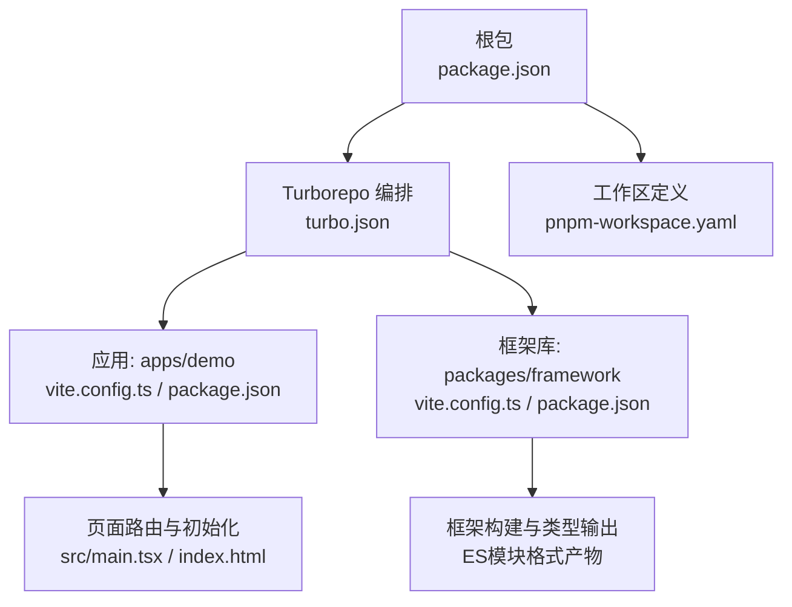
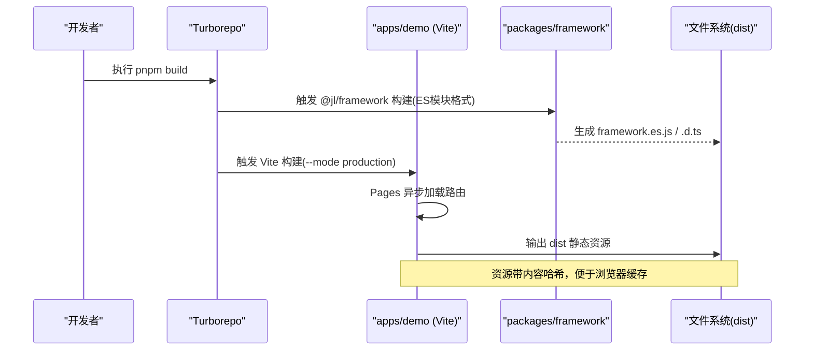
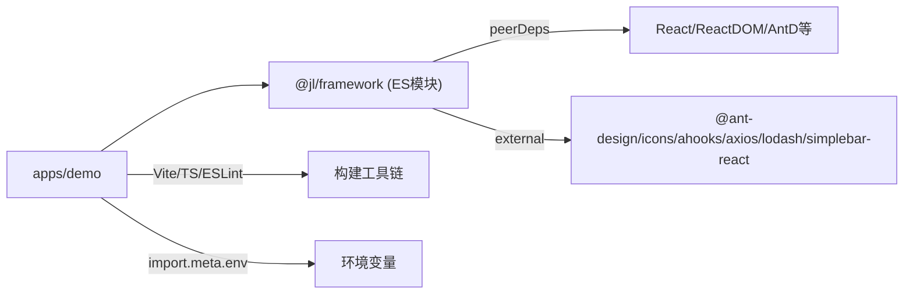

# 部署运维

<cite>
**本文引用的文件**
- [package.json](file://package.json)
- [turbo.json](file://turbo.json)
- [pnpm-workspace.yaml](file://pnpm-workspace.yaml)
- [apps/demo/package.json](file://apps/demo/package.json)
- [apps/demo/vite.config.ts](file://apps/demo/vite.config.ts)
- [apps/demo/index.html](file://apps/demo/index.html)
- [apps/demo/src/main.tsx](file://apps/demo/src/main.tsx)
- [packages/framework/vite.config.ts](file://packages/framework/vite.config.ts)
- [packages/framework/package.json](file://packages/framework/package.json)
- [docs/1.运行与构建.md](file://docs/1.运行与构建.md)
</cite>

## 更新摘要
**所做更改**
- 更新了框架构建配置部分，反映UMD格式支持移除和ES模块格式输出
- 更新了依赖外部化列表，包含新的peer dependencies
- 优化了多环境管理部分的描述
- 更新了构建流程说明以反映现代化配置

## 目录
1. [简介](#简介)
2. [项目结构](#项目结构)
3. [核心组件](#核心组件)
4. [架构总览](#架构总览)
5. [详细组件分析](#详细组件分析)
6. [依赖分析](#依赖分析)
7. [性能考虑](#性能考虑)
8. [故障排查指南](#故障排查指南)
9. [结论](#结论)
10. [附录](#附录)

## 简介
本文件面向生产环境的构建、部署与运维，覆盖以下主题：
- 构建配置与优化策略：代码分割、资源压缩、缓存策略
- 多环境管理：开发、测试、生产的配置差异与环境变量管理
- 部署流程与 CI/CD 管道：自动化构建、测试与部署脚本建议
- 监控与日志收集：错误追踪、性能监控、用户行为分析
- 容器化与云服务部署最佳实践
- 备份恢复与灾难恢复计划

## 项目结构
本项目采用 pnpm monorepo + Turborepo 组织方式，应用位于 apps/demo，共享框架库位于 packages/framework。根级 package.json 提供统一脚本入口，turbo.json 定义任务缓存与执行顺序，pnpm-workspace.yaml 声明工作区范围。

**图表来源**
- [package.json:1-19](file://package.json#L1-L19)
- [turbo.json:1-29](file://turbo.json#L1-L29)
- [pnpm-workspace.yaml:1-5](file://pnpm-workspace.yaml#L1-L5)
- [apps/demo/vite.config.ts:1-36](file://apps/demo/vite.config.ts#L1-L36)
- [apps/demo/package.json:1-44](file://apps/demo/package.json#L1-L44)
- [packages/framework/vite.config.ts:1-44](file://packages/framework/vite.config.ts#L1-L44)
- [packages/framework/package.json:1-55](file://packages/framework/package.json#L1-L55)

**章节来源**
- [package.json:1-19](file://package.json#L1-L19)
- [turbo.json:1-29](file://turbo.json#L1-L29)
- [pnpm-workspace.yaml:1-5](file://pnpm-workspace.yaml#L1-L5)
- [apps/demo/package.json:1-44](file://apps/demo/package.json#L1-L44)
- [apps/demo/vite.config.ts:1-36](file://apps/demo/vite.config.ts#L1-L36)
- [packages/framework/vite.config.ts:1-44](file://packages/framework/vite.config.ts#L1-L44)
- [packages/framework/package.json:1-55](file://packages/framework/package.json#L1-L55)

## 核心组件
- 构建工具链：Vite（React SWC 插件）、TypeScript 编译、Pages 路由插件
- 任务编排：Turborepo（缓存、并行、依赖图）
- 工作区：pnpm workspace（apps/*, packages/*）
- 运行时：React 19 + React Router v7 + Ant Design 6
- 框架库：@jl/framework（仅输出 ES 模块格式，现代化构建配置）

**章节来源**
- [apps/demo/vite.config.ts:1-36](file://apps/demo/vite.config.ts#L1-L36)
- [apps/demo/package.json:1-44](file://apps/demo/package.json#L1-L44)
- [packages/framework/vite.config.ts:1-44](file://packages/framework/vite.config.ts#L1-L44)
- [packages/framework/package.json:1-55](file://packages/framework/package.json#L1-L55)
- [turbo.json:1-29](file://turbo.json#L1-L29)
- [pnpm-workspace.yaml:1-5](file://pnpm-workspace.yaml#L1-L5)

## 架构总览
下图展示从源码到静态产物的构建链路，以及应用启动时的路由与初始化流程。

**图表来源**
- [turbo.json:1-29](file://turbo.json#L1-L29)
- [apps/demo/vite.config.ts:1-36](file://apps/demo/vite.config.ts#L1-L36)
- [packages/framework/vite.config.ts:1-44](file://packages/framework/vite.config.ts#L1-L44)

## 详细组件分析

### 构建与优化策略（代码分割、压缩、缓存）
- 代码分割
  - 使用 vite-plugin-pages 的 importMode: 'async' 实现按页面路由的代码分割，减少首屏体积并提升加载速度。
  - 路由在 src/main.tsx 中通过 ~react-pages 动态引入，配合 Suspense 进行懒加载。
- 资源压缩
  - Vite 默认在生产构建启用 JS/CSS 压缩与 Tree-shaking；可结合 Rollup 选项进一步调优（如 chunk 大小阈值、minify 选项）。
- 缓存策略
  - 构建产物文件名含内容哈希，浏览器可长期缓存；建议服务端对静态资源设置强缓存（Cache-Control: public, max-age=31536000, immutable），HTML 不缓存或短缓存。
- 环境变量注入
  - 通过 loadEnv(mode) 读取 .env.* 文件，define 注入 __APP_ENV__，并在路由配置中使用 import.meta.env 变量（如登录页路径）。

**章节来源**
- [apps/demo/vite.config.ts:1-36](file://apps/demo/vite.config.ts#L1-L36)
- [apps/demo/src/main.tsx:1-53](file://apps/demo/src/main.tsx#L1-L53)
- [apps/demo/index.html:1-155](file://apps/demo/index.html#L1-L155)

### 多环境管理与环境变量
- 环境模式
  - 通过 --mode 切换 dev、production、mock，分别对应不同 .env.* 配置文件。
- 关键变量
  - VITE_ENV、VITE_SERVER_PORT、VITE_BASE_URL、VITE_TITLE、VITE_LOGIN_URL、VITE_API_* 等，用于控制服务端口、API 地址、标题、路由等。
- 变量注入点
  - Vite 配置中 define(__APP_ENV__) 与 server.port 读取；页面侧通过 import.meta.env 访问。
- 文档参考
  - 运行与构建文档提供了环境变量说明与常用命令。

**章节来源**
- [apps/demo/vite.config.ts:1-36](file://apps/demo/vite.config.ts#L1-L36)
- [apps/demo/package.json:1-44](file://apps/demo/package.json#L1-L44)
- [docs/1.运行与构建.md:1-91](file://docs/1.运行与构建.md#L1-L91)

### 框架构建配置现代化

**更新** 框架构建配置已现代化，移除了 UMD 格式支持，现在仅输出 ES 模块格式，同时更新了依赖外部化列表。

- **ES 模块格式输出**
  - 框架现在仅输出 ES 模块格式（formats: ['es']），移除了传统的 UMD 格式支持
  - 构建产物为 framework.es.js，符合现代前端工程化标准
  - 通过 exports 字段明确指定 ES 模块入口点

- **依赖外部化优化**
  - 更新了 rollupOptions.external 列表，包含完整的 peer dependencies：
    - react、react-dom（React 核心）
    - antd、@ant-design/icons（UI 组件库）
    - ahooks（React Hooks 库）
    - axios（HTTP 客户端）
    - lodash（工具函数库）
    - simplebar-react（滚动条组件）
  - 避免重复打包宿主应用已有的依赖，减小最终包体积

- **构建配置优势**
  - 更小的包体积：外部化大型依赖避免重复打包
  - 更好的兼容性：ES 模块格式支持现代打包工具
  - 更清晰的依赖管理：通过 peerDependencies 明确依赖关系

**章节来源**
- [packages/framework/vite.config.ts:18-42](file://packages/framework/vite.config.ts#L18-L42)
- [packages/framework/package.json:13-21](file://packages/framework/package.json#L13-L21)
- [packages/framework/package.json:28-37](file://packages/framework/package.json#L28-L37)

### 部署流程与 CI/CD 管道建议
- 本地构建
  - 根脚本：pnpm build（调用 turbo run build）
  - 应用脚本：tsc -b && vite build --mode production
  - 框架脚本：tsc -b && vite build（生成 ES 模块格式）
- CI/CD 建议步骤
  - 安装依赖：pnpm install
  - 类型检查与 Lint：tsc -b、eslint
  - 构建：turbo run build（利用缓存加速）
  - 产物校验：检查 dist 目录存在性与体积
  - 部署：将 dist 上传至对象存储/CDN，或发布到 Nginx/Apache 静态站点
- 缓存与增量
  - 利用 Turborepo 的 cache 与 outputs 配置，缓存依赖与中间产物，缩短流水线时间。

**章节来源**
- [package.json:1-19](file://package.json#L1-L19)
- [turbo.json:1-29](file://turbo.json#L1-L29)
- [apps/demo/package.json:1-44](file://apps/demo/package.json#L1-L44)

### 监控与日志收集方案
- 前端性能监控
  - 可使用内置性能统计工具 PerfTrackUtils 包装关键函数，采集调用次数、耗时、异常次数等指标，并通过 printStats/resetStats 输出或上报。
- 错误追踪
  - 建议在业务层捕获全局错误并上报至错误追踪平台（如 Sentry），同时记录上下文（URL、用户态、请求参数脱敏）。
- 用户行为分析
  - 接入埋点 SDK，记录页面浏览、点击、转化漏斗等事件，注意隐私合规与数据最小化。
- 日志规范
  - 区分 info/warn/error 级别，避免打印敏感信息；结构化日志便于检索与分析。

**章节来源**
- [packages/framework/src/utils/sysUtils/perfTrackerUtils.ts:1-154](file://packages/framework/src/utils/sysUtils/perfTrackerUtils.ts#L1-L154)

### 容器化部署指导
- 镜像选择
  - 基础镜像：node:20-alpine（构建）+ nginx:alpine（静态托管）
- 构建阶段
  - 安装依赖：pnpm install --frozen-lockfile
  - 构建应用：pnpm build（或指定 mode）
  - 清理：移除 node_modules 与临时文件
- 运行阶段
  - 将 dist 复制到 Nginx 静态目录，配置 gzip/brotli、HTTP/2、HTTPS
  - 暴露 80/443 端口，健康检查返回 200
- 安全加固
  - 非 root 用户运行、只读文件系统、最小权限原则

### 云服务部署最佳实践
- CDN 与缓存
  - 静态资源开启 CDN，设置长缓存与版本化文件名；HTML 短缓存或 no-cache
- 灰度与回滚
  - 蓝绿/金丝雀发布，基于版本号或标签快速回滚
- 弹性伸缩
  - 根据 QPS/内存自动扩缩容，关注冷启动与连接池
- 密钥管理
  - 使用云密钥管理服务（KMS/Secrets Manager），禁止硬编码

### 备份恢复与灾难恢复计划
- 备份策略
  - 定期备份静态资源与配置（对象存储快照、数据库快照）
  - 保留多版本产物与历史构建记录
- 恢复演练
  - 制定 RTO/RPO 目标，定期进行恢复演练
- 高可用
  - 多可用区部署、跨地域容灾、DNS 故障转移
- 告警与通知
  - 建立可用性、错误率、延迟等指标的告警规则

## 依赖分析
- 工作区依赖
  - apps/demo 依赖 @jl/framework（workspace:*），通过别名指向源码目录，便于开发与调试
- 构建依赖
  - Vite、React SWC、Pages、TypeScript、ESLint
- 运行时依赖
  - React、React Router、Ant Design、Axios、ahooks、lodash、simplebar-react
- 框架库外部化
  - 更新了外部化依赖列表，包含完整的 peer dependencies：react、react-dom、antd、@ant-design/icons、ahooks、axios、lodash、simplebar-react，避免重复打包

**图表来源**
- [apps/demo/package.json:1-44](file://apps/demo/package.json#L1-L44)
- [packages/framework/package.json:1-55](file://packages/framework/package.json#L1-L55)
- [packages/framework/vite.config.ts:29-41](file://packages/framework/vite.config.ts#L29-L41)
- [apps/demo/vite.config.ts:1-36](file://apps/demo/vite.config.ts#L1-L36)

**章节来源**
- [apps/demo/package.json:1-44](file://apps/demo/package.json#L1-L44)
- [packages/framework/package.json:1-55](file://packages/framework/package.json#L1-L55)
- [packages/framework/vite.config.ts:29-41](file://packages/framework/vite.config.ts#L29-L41)
- [apps/demo/vite.config.ts:1-36](file://apps/demo/vite.config.ts#L1-L36)

## 性能考虑
- 首屏优化
  - 路由级代码分割、按需加载第三方库、预加载关键资源
- 构建优化
  - 合理分包（splitChunks）、Tree-shaking、压缩与内联小资源
  - 框架库外部化大型依赖，避免重复打包
- 缓存优化
  - 静态资源强缓存、HTML 短缓存、Service Worker 可选
- 运行时优化
  - 减少重排重绘、虚拟列表、防抖节流、网络请求合并与重试
- 监控与度量
  - 使用 PerfTrackUtils 采集关键路径耗时，结合 Web Vitals 指标持续优化

## 故障排查指南
- 常见问题定位
  - 环境变量未生效：确认 mode 与 .env.* 文件命名及前缀（VITE_）
  - 路由 404：检查 Pages 目录结构与 importMode 配置
  - 构建失败：检查 TypeScript 类型与依赖版本冲突
  - 框架导入问题：确认 peerDependencies 正确安装
- 日志与诊断
  - 使用 PerfTrackUtils.printStats 输出性能摘要，定位慢函数
  - 集中收集前端错误日志，关联用户会话与请求上下文
- 回滚与热修复
  - 基于版本号快速回滚到上一稳定版本，保持产物可追溯

**章节来源**
- [apps/demo/vite.config.ts:1-36](file://apps/demo/vite.config.ts#L1-L36)
- [apps/demo/src/main.tsx:1-53](file://apps/demo/src/main.tsx#L1-L53)
- [packages/framework/vite.config.ts:29-41](file://packages/framework/vite.config.ts#L29-L41)

## 结论
本项目基于 Vite + Turborepo + pnpm workspace 的现代前端工程体系，具备清晰的构建与部署边界。通过现代化的框架构建配置（ES 模块格式输出、优化的依赖外部化）、路由级代码分割、严格的缓存策略与完善的监控手段，可在生产环境获得良好的性能与稳定性。建议结合容器化与云服务最佳实践，完善 CI/CD、备份恢复与灾难恢复流程，持续提升交付效率与系统韧性。

## 附录
- 常用命令
  - 开发：pnpm dev / pnpm dev:mock
  - 构建：pnpm build
  - 预览：pnpm preview
- 环境变量清单
  - 详见运行与构建文档中的变量说明与示例

**章节来源**
- [apps/demo/package.json:1-44](file://apps/demo/package.json#L1-L44)
- [docs/1.运行与构建.md:1-91](file://docs/1.运行与构建.md#L1-L91)