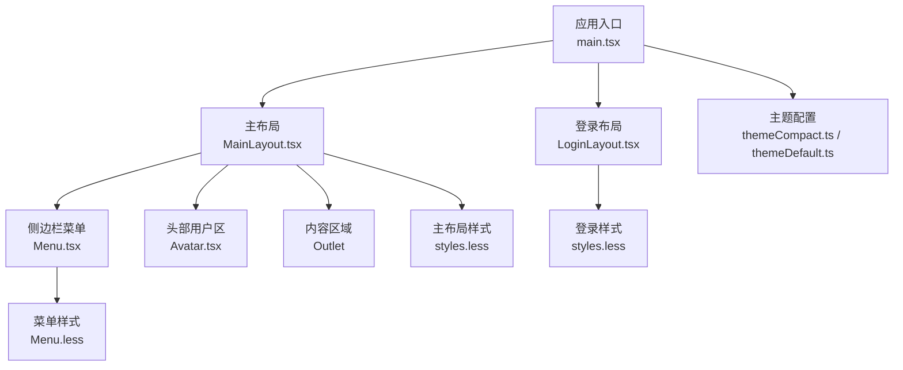
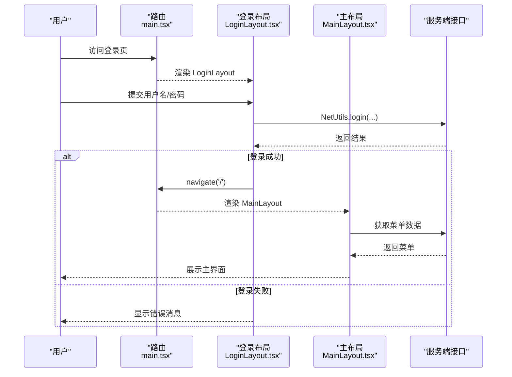
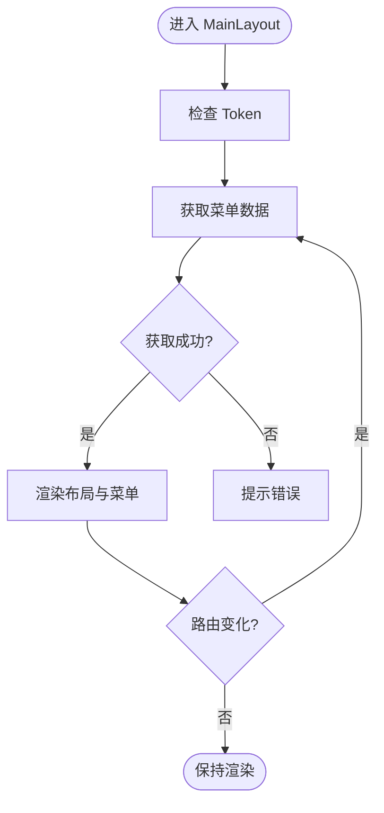
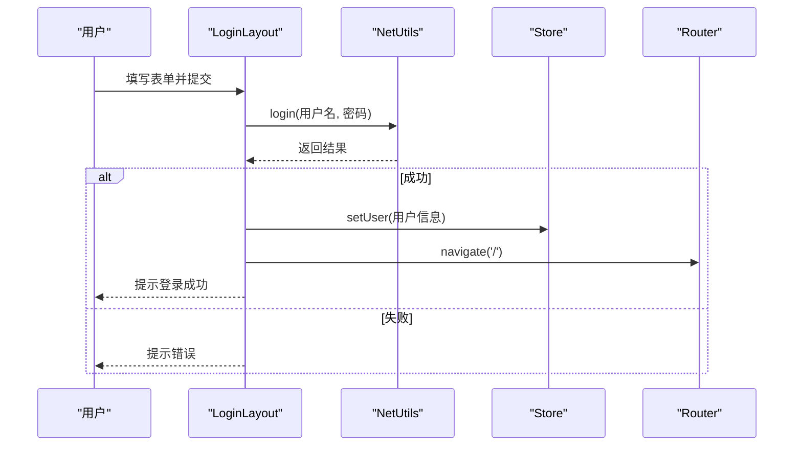
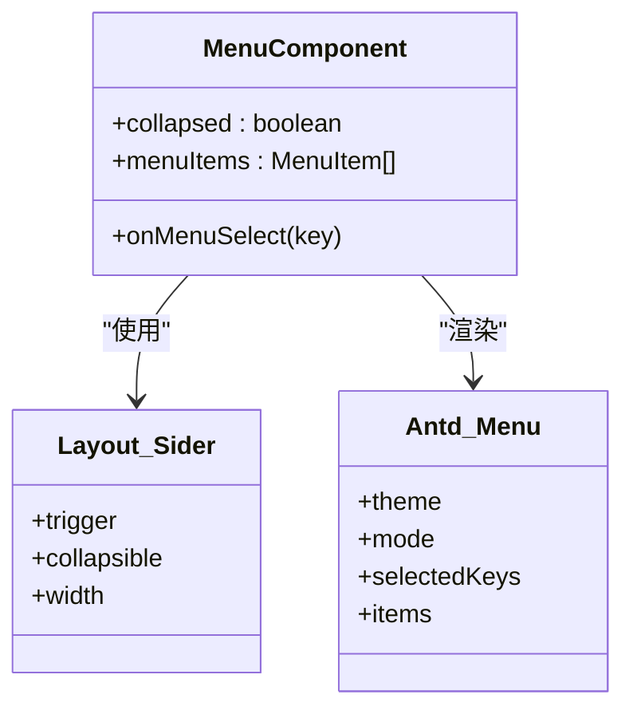
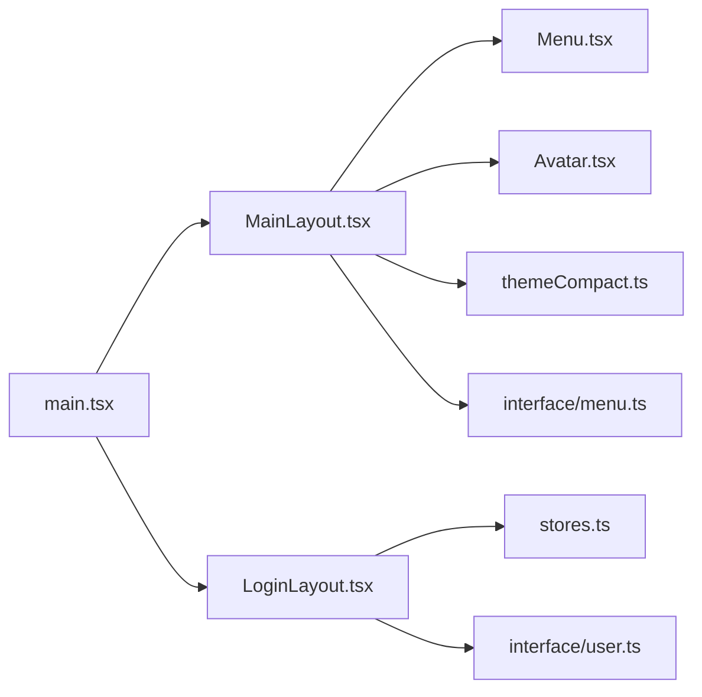

# 布局系统

<cite>
**本文引用的文件**
- [MainLayout.tsx](file://apps/demo/src/layouts/main/MainLayout.tsx)
- [LoginLayout.tsx](file://apps/demo/src/layouts/login/LoginLayout.tsx)
- [Menu.tsx](file://apps/demo/src/layouts/main/comp/Menu.tsx)
- [Avatar.tsx](file://apps/demo/src/layouts/main/comp/Avatar.tsx)
- [styles.less（主布局）](file://apps/demo/src/layouts/main/styles.less)
- [Menu.less（菜单样式）](file://apps/demo/src/layouts/main/comp/Menu.less)
- [styles.less（登录布局）](file://apps/demo/src/layouts/login/styles.less)
- [themeDefault.ts](file://apps/demo/src/theme/themeDefault.ts)
- [themeCompact.ts](file://apps/demo/src/theme/themeCompact.ts)
- [main.tsx](file://apps/demo/src/main.tsx)
- [menu.ts](file://apps/demo/src/interface/menu.ts)
- [user.ts](file://apps/demo/src/interface/user.ts)
- [init.ts](file://apps/demo/src/init/init.ts)
- [stores.ts](file://apps/demo/src/init/stores.ts)
</cite>

## 目录
1. [简介](#简介)
2. [项目结构](#项目结构)
3. [核心组件](#核心组件)
4. [架构总览](#架构总览)
5. [详细组件分析](#详细组件分析)
6. [依赖关系分析](#依赖关系分析)
7. [性能考量](#性能考量)
8. [故障排查指南](#故障排查指南)
9. [结论](#结论)
10. [附录](#附录)

## 简介
本文件面向“布局系统”的完整说明，覆盖主布局 MainLayout 与登录布局 LoginLayout 的实现原理、嵌套结构与响应式设计；详解菜单组件、用户头像等子组件的开发与定制方法；提供自定义布局组件开发指南（样式定制与主题适配），并给出布局生命周期管理与性能优化建议。目标是帮助开发者快速理解、扩展和落地布局能力。

## 项目结构
布局相关代码集中在 apps/demo/src/layouts 下，分为 main（主布局）与 login（登录布局）两个子目录，并通过路由在应用入口进行挂载。

图表来源
- [main.tsx:11-21](file://apps/demo/src/main.tsx#L11-L21)
- [MainLayout.tsx:14-72](file://apps/demo/src/layouts/main/MainLayout.tsx#L14-L72)
- [LoginLayout.tsx:18-95](file://apps/demo/src/layouts/login/LoginLayout.tsx#L18-L95)
- [Menu.tsx:17-49](file://apps/demo/src/layouts/main/comp/Menu.tsx#L17-L49)
- [Avatar.tsx:8-43](file://apps/demo/src/layouts/main/comp/Avatar.tsx#L8-L43)
- [styles.less（主布局）:2-45](file://apps/demo/src/layouts/main/styles.less#L2-L45)
- [Menu.less:2-31](file://apps/demo/src/layouts/main/comp/Menu.less#L2-L31)
- [styles.less（登录布局）:2-189](file://apps/demo/src/layouts/login/styles.less#L2-L189)
- [themeCompact.ts:1-16](file://apps/demo/src/theme/themeCompact.ts#L1-L16)
- [themeDefault.ts:1-16](file://apps/demo/src/theme/themeDefault.ts#L1-L16)

章节来源
- [main.tsx:11-21](file://apps/demo/src/main.tsx#L11-L21)
- [MainLayout.tsx:14-72](file://apps/demo/src/layouts/main/MainLayout.tsx#L14-L72)
- [LoginLayout.tsx:18-95](file://apps/demo/src/layouts/login/LoginLayout.tsx#L18-L95)

## 核心组件
- 主布局 MainLayout：负责整体页面骨架（侧边栏、顶部导航、内容区）、菜单数据获取、折叠状态管理、路由切换时的菜单刷新、主题色注入以及滚动容器。
- 登录布局 LoginLayout：负责登录表单、校验、登录请求、错误提示与跳转首页。
- 菜单组件 Menu：侧边栏菜单渲染、选中态同步、路由跳转、可折叠与滚动。
- 用户头像 Avatar：通知、设置、全屏按钮与用户下拉菜单（含退出登录）。
- 主题配置：紧凑主题与默认主题，通过 ConfigProvider 全局注入。

章节来源
- [MainLayout.tsx:16-72](file://apps/demo/src/layouts/main/MainLayout.tsx#L16-L72)
- [LoginLayout.tsx:18-95](file://apps/demo/src/layouts/login/LoginLayout.tsx#L18-L95)
- [Menu.tsx:17-49](file://apps/demo/src/layouts/main/comp/Menu.tsx#L17-L49)
- [Avatar.tsx:8-43](file://apps/demo/src/layouts/main/comp/Avatar.tsx#L8-L43)
- [themeCompact.ts:1-16](file://apps/demo/src/theme/themeCompact.ts#L1-L16)
- [themeDefault.ts:1-16](file://apps/demo/src/theme/themeDefault.ts#L1-L16)

## 架构总览
布局系统基于 Ant Design Layout 构建，结合 React Router 实现多布局路由挂载。主布局内嵌侧边栏与头部，内容区使用 Outlet 承载业务页面；登录布局独立于主布局，用于未登录场景。

图表来源
- [main.tsx:11-21](file://apps/demo/src/main.tsx#L11-L21)
- [LoginLayout.tsx:24-49](file://apps/demo/src/layouts/login/LoginLayout.tsx#L24-L49)
- [MainLayout.tsx:21-39](file://apps/demo/src/layouts/main/MainLayout.tsx#L21-L39)

## 详细组件分析

### 主布局 MainLayout
- 职责
  - 维护侧边栏折叠状态 collapsed。
  - 监听路由变化，触发 token 校验与菜单数据拉取。
  - 通过主题 token 注入背景色，保证 Header 与 Content 风格一致。
  - 使用 SimpleBar 为内容区提供滚动条。
- 关键流程
  - 初始化时调用 NetUtils.checkToken() 与 fetchMenuData()。
  - 路由路径变化时重新执行上述逻辑，确保权限与菜单一致性。
  - 点击折叠按钮切换 collapsed，驱动 Menu 组件收起/展开。
- 数据流
  - 菜单数据来自后端接口，成功后写入 menuItems，传递给 Menu 组件。
  - 选中项由 Menu 内部 selectedKey 控制，配合路由跳转。

图表来源
- [MainLayout.tsx:21-39](file://apps/demo/src/layouts/main/MainLayout.tsx#L21-L39)
- [MainLayout.tsx:45-72](file://apps/demo/src/layouts/main/MainLayout.tsx#L45-L72)

章节来源
- [MainLayout.tsx:16-72](file://apps/demo/src/layouts/main/MainLayout.tsx#L16-L72)

### 登录布局 LoginLayout
- 职责
  - 表单输入与校验（用户名、密码）。
  - 调用登录接口，处理成功/失败分支。
  - 成功后将用户信息写入 Store，并跳转到主页。
- 交互细节
  - 使用 message API 反馈登录结果。
  - 加载态控制按钮 loading。
  - 初始值预填便于演示。

图表来源
- [LoginLayout.tsx:24-49](file://apps/demo/src/layouts/login/LoginLayout.tsx#L24-L49)
- [stores.ts:5-8](file://apps/demo/src/init/stores.ts#L5-L8)

章节来源
- [LoginLayout.tsx:18-95](file://apps/demo/src/layouts/login/LoginLayout.tsx#L18-L95)
- [stores.ts:5-8](file://apps/demo/src/init/stores.ts#L5-L8)

### 菜单组件 Menu
- 职责
  - 渲染侧边栏 Logo 与菜单列表。
  - 支持折叠与滚动，保持菜单高度自适应。
  - 选中项与路由联动，点击后跳转对应路径。
- 特性
  - 使用 SimpleBar 包裹菜单，避免溢出。
  - 通过 props 接收 collapsed 与 menuItems，解耦主布局。

图表来源
- [Menu.tsx:17-49](file://apps/demo/src/layouts/main/comp/Menu.tsx#L17-L49)
- [Menu.less:2-31](file://apps/demo/src/layouts/main/comp/Menu.less#L2-L31)

章节来源
- [Menu.tsx:17-49](file://apps/demo/src/layouts/main/comp/Menu.tsx#L17-L49)
- [Menu.less:2-31](file://apps/demo/src/layouts/main/comp/Menu.less#L2-L31)

### 用户头像 Avatar
- 职责
  - 提供通知、设置、全屏快捷操作。
  - 用户下拉菜单包含个人中心、设置、退出登录。
  - 退出登录调用统一鉴权处理函数。
- 扩展点
  - 可通过替换 userMenuItems 或 onClick 行为定制菜单功能。

章节来源
- [Avatar.tsx:8-43](file://apps/demo/src/layouts/main/comp/Avatar.tsx#L8-L43)

### 样式与响应式
- 主布局样式
  - 整体高度限制与溢出隐藏，Header 固定高度与弹性布局，内容区最小高度与滚动条样式定制。
- 菜单样式
  - 侧边栏高度与 Logo 区域样式，菜单滚动条主题适配。
- 登录样式
  - 渐变背景、卡片毛玻璃效果、表单与按钮动效。
  - 移动端媒体查询调整间距与字号，提升小屏体验。

章节来源
- [styles.less（主布局）:2-45](file://apps/demo/src/layouts/main/styles.less#L2-L45)
- [Menu.less:2-31](file://apps/demo/src/layouts/main/comp/Menu.less#L2-L31)
- [styles.less（登录布局）:2-189](file://apps/demo/src/layouts/login/styles.less#L2-L189)

### 主题与配置
- 主题注入
  - 应用根节点通过 ConfigProvider 注入紧凑主题，影响全局组件外观。
  - 主布局通过 theme.useToken 获取背景色，保证 Header/Content 与主题一致。
- 主题文件
  - 提供默认主题与紧凑主题两种预设，可按需扩展。

章节来源
- [main.tsx:23-30](file://apps/demo/src/main.tsx#L23-L30)
- [themeCompact.ts:1-16](file://apps/demo/src/theme/themeCompact.ts#L1-L16)
- [themeDefault.ts:1-16](file://apps/demo/src/theme/themeDefault.ts#L1-L16)
- [MainLayout.tsx:41-43](file://apps/demo/src/layouts/main/MainLayout.tsx#L41-L43)

## 依赖关系分析
- 路由与布局
  - 应用入口定义两条路由：登录页与主布局及其子路由。
- 网络与状态
  - 登录与菜单数据均通过 NetUtils 发起请求。
  - 用户信息通过 Store 持久化到内存状态。
- 类型定义
  - 菜单项与用户模型分别定义在 interface 中，保证类型安全。

图表来源
- [main.tsx:11-21](file://apps/demo/src/main.tsx#L11-L21)
- [MainLayout.tsx:16-72](file://apps/demo/src/layouts/main/MainLayout.tsx#L16-L72)
- [LoginLayout.tsx:18-95](file://apps/demo/src/layouts/login/LoginLayout.tsx#L18-L95)
- [Menu.tsx:17-49](file://apps/demo/src/layouts/main/comp/Menu.tsx#L17-L49)
- [Avatar.tsx:8-43](file://apps/demo/src/layouts/main/comp/Avatar.tsx#L8-L43)
- [themeCompact.ts:1-16](file://apps/demo/src/theme/themeCompact.ts#L1-L16)
- [stores.ts:5-8](file://apps/demo/src/init/stores.ts#L5-L8)
- [menu.ts:1-6](file://apps/demo/src/interface/menu.ts#L1-L6)
- [user.ts:1-9](file://apps/demo/src/interface/user.ts#L1-L9)

章节来源
- [main.tsx:11-21](file://apps/demo/src/main.tsx#L11-L21)
- [stores.ts:5-8](file://apps/demo/src/init/stores.ts#L5-L8)
- [menu.ts:1-6](file://apps/demo/src/interface/menu.ts#L1-L6)
- [user.ts:1-9](file://apps/demo/src/interface/user.ts#L1-L9)

## 性能考量
- 菜单数据缓存与按需刷新
  - 当前在路由变化时拉取菜单，若菜单不频繁变更，可在首次登录后缓存至 Store，减少重复请求。
- 防抖/节流
  - 对窗口尺寸变化或频繁路由切换可考虑节流，避免不必要的重渲染。
- 滚动性能
  - 内容区使用 SimpleBar，注意避免过深 DOM 层级；长列表建议使用虚拟滚动。
- 主题与样式
  - 尽量复用主题 token，减少内联样式；复杂样式抽离为 CSS 类，利于浏览器缓存。
- 懒加载与 Suspense
  - 已使用 Suspense 包裹路由，可进一步按页面拆分 chunk，降低首屏体积。

[本节为通用性能建议，无需特定文件引用]

## 故障排查指南
- 菜单为空或报错
  - 检查环境变量 VITE_API_MENU 是否正确配置。
  - 确认 NetUtils.get 返回结构与 code === 200 的判断逻辑。
- 登录失败
  - 检查 NetUtils.login 接口地址与参数格式。
  - 查看 message 提示定位具体错误原因。
- 路由跳转异常
  - 确认 routesWithRedirect 配置正确，登录页与主布局路径匹配。
- 主题不一致
  - 确认 ConfigProvider 已包裹根节点，且主布局通过 theme.useToken 获取背景色。

章节来源
- [MainLayout.tsx:21-39](file://apps/demo/src/layouts/main/MainLayout.tsx#L21-L39)
- [LoginLayout.tsx:24-49](file://apps/demo/src/layouts/login/LoginLayout.tsx#L24-L49)
- [main.tsx:11-21](file://apps/demo/src/main.tsx#L11-L21)

## 结论
本布局系统以 MainLayout 与 LoginLayout 为核心，结合 Ant Design 与 React Router 实现了清晰的页面骨架、灵活的菜单与用户区、完善的主题与响应式支持。通过模块化拆分与类型约束，具备良好的可扩展性与可维护性。建议在生产环境中引入菜单缓存、懒加载与更细粒度的性能监控，进一步提升用户体验。

[本节为总结性内容，无需特定文件引用]

## 附录

### 自定义布局组件开发指南
- 新建布局组件
  - 在 layouts 目录下新增文件夹与组件文件，遵循现有命名约定。
  - 在 main.tsx 的路由数组中添加新布局与对应路径。
- 样式定制
  - 为布局组件创建独立的 .less 文件，复用主题 token，避免硬编码颜色。
  - 使用媒体查询实现响应式适配。
- 主题适配
  - 通过 theme.useToken 获取 colorBgContainer、colorTextPrimary 等变量，保证与全局主题一致。
  - 如需切换主题算法，可在 ConfigProvider 中动态更换主题配置。
- 生命周期与副作用
  - 使用 useEffect 管理数据获取与事件订阅，注意清理副作用。
  - 路由变化时通过 useLocation/useNavigate 触发必要刷新。
- 性能优化
  - 对重型子组件使用 React.lazy 与 Suspense 懒加载。
  - 列表与菜单使用虚拟滚动或分页加载。
  - 避免在高频回调中进行昂贵计算，必要时使用 useMemo/useCallback。

[本节为通用开发指南，无需特定文件引用]