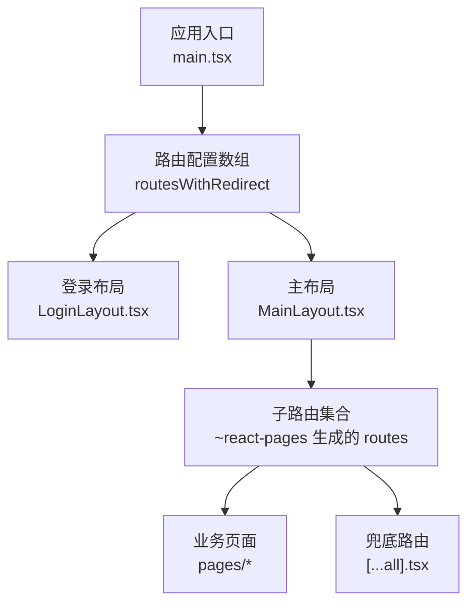
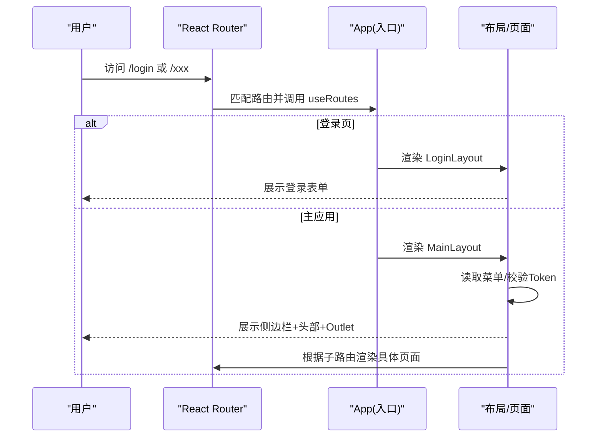
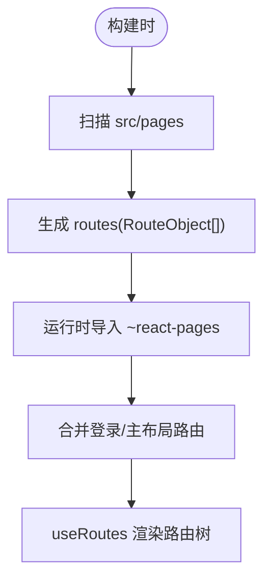
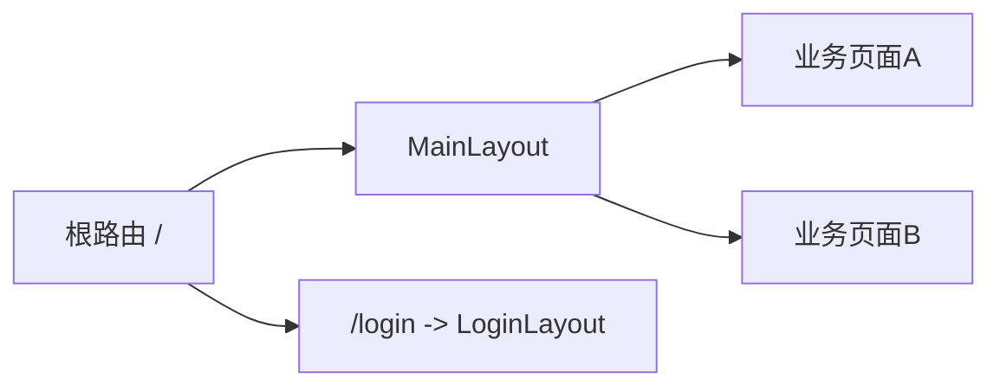
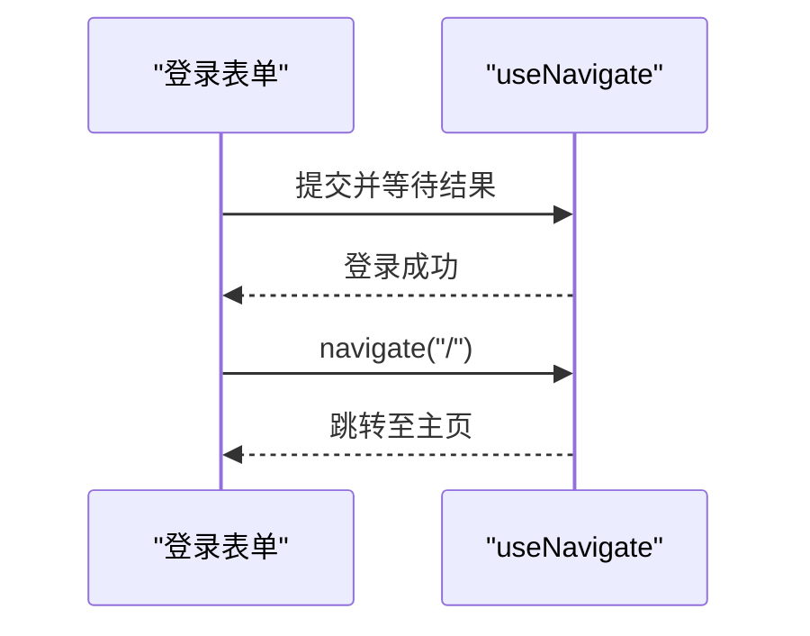
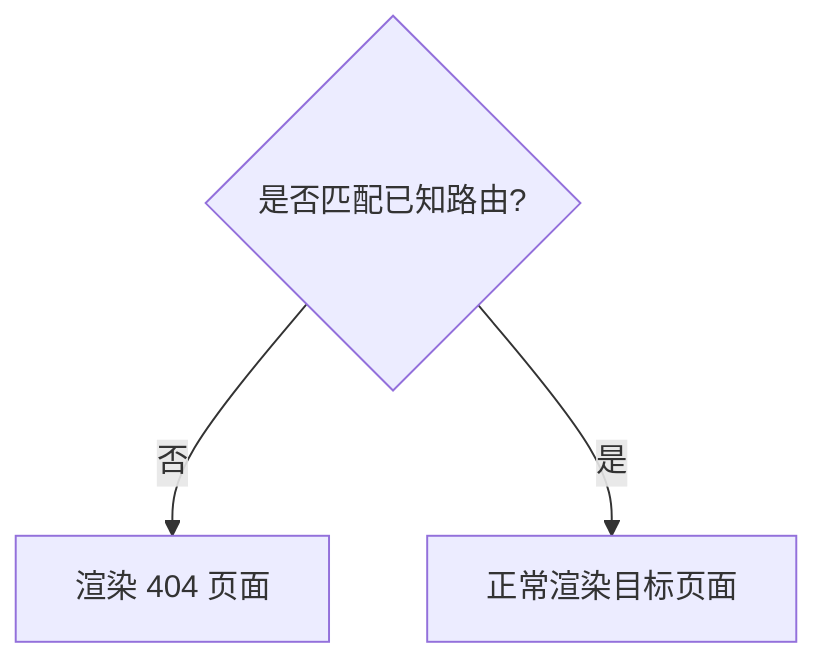
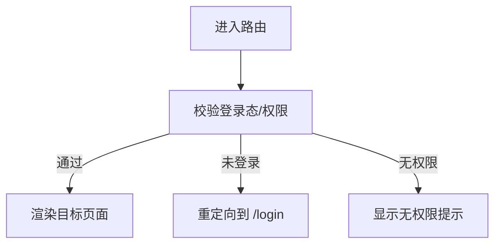
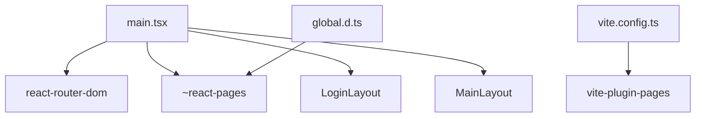

# 路由与导航

<cite>
**本文引用的文件**
- [main.tsx](file://apps/demo/src/main.tsx)
- [vite.config.ts](file://apps/demo/vite.config.ts)
- [global.d.ts](file://apps/demo/src/types/global.d.ts)
- [LoginLayout.tsx](file://apps/demo/src/layouts/login/LoginLayout.tsx)
- [MainLayout.tsx](file://apps/demo/src/layouts/main/MainLayout.tsx)
- [index.tsx（首页）](file://apps/demo/src/pages/index.tsx)
- [index.tsx（Home）](file://apps/demo/src/pages/home/index.tsx)
- [...all].tsx（404页面）](file://apps/demo/src/pages/[...all].tsx)
</cite>

## 目录
1. [简介](#简介)
2. [项目结构](#项目结构)
3. [核心组件](#核心组件)
4. [架构总览](#架构总览)
5. [详细组件分析](#详细组件分析)
6. [依赖关系分析](#依赖关系分析)
7. [性能考虑](#性能考虑)
8. [故障排查指南](#故障排查指南)
9. [结论](#结论)
10. [附录](#附录)

## 简介
本章节面向使用 React Router 的项目，结合当前代码库的路由实现，系统说明：
- 基于文件系统的路由生成与配置方式
- 嵌套路由与布局组合
- 页面跳转与参数传递
- 404 错误路由处理
- 路由守卫与权限控制方案
- 懒加载与性能优化实践

## 项目结构
本项目采用“文件系统即路由”的方式，通过 Vite 插件自动生成路由表，并在应用入口中注入到 React Router。根级路由包含登录页与主布局，主布局下挂载所有业务页面。

图表来源
- [main.tsx:11-21](file://apps/demo/src/main.tsx#L11-L21)
- [vite.config.ts:14-18](file://apps/demo/vite.config.ts#L14-L18)
- [global.d.ts:1-5](file://apps/demo/src/types/global.d.ts#L1-L5)

章节来源
- [main.tsx:1-52](file://apps/demo/src/main.tsx#L1-L52)
- [vite.config.ts:1-36](file://apps/demo/vite.config.ts#L1-L36)
- [global.d.ts:1-12](file://apps/demo/src/types/global.d.ts#L1-L12)

## 核心组件
- 应用入口与路由装配：在应用根节点包裹 BrowserRouter，并通过 useRoutes 将路由表渲染为元素树。
- 登录布局：负责登录流程、成功后跳转到主页。
- 主布局：提供侧边栏、头部与内容区，使用 Outlet 渲染子路由页面。
- 404 兜底：通过 catch-all 路由捕获未匹配路径。

章节来源
- [main.tsx:23-31](file://apps/demo/src/main.tsx#L23-L31)
- [LoginLayout.tsx:18-49](file://apps/demo/src/layouts/login/LoginLayout.tsx#L18-L49)
- [MainLayout.tsx:16-74](file://apps/demo/src/layouts/main/MainLayout.tsx#L16-L74)
- [...all].tsx:1-15](file://apps/demo/src/pages/[...all].tsx#L1-L15)

## 架构总览
下图展示了从浏览器访问到页面渲染的完整链路，包括路由生成、布局嵌套与页面渲染。

图表来源
- [main.tsx:11-24](file://apps/demo/src/main.tsx#L11-L24)
- [MainLayout.tsx:21-39](file://apps/demo/src/layouts/main/MainLayout.tsx#L21-L39)

## 详细组件分析

### 路由配置与生成
- 通过 vite-plugin-pages 扫描 src/pages 目录，按文件结构生成路由表，并以异步 importMode 实现按需加载。
- 在类型声明中，将 ~react-pages 模块导出为 RouteObject[]，便于在入口中使用。
- 入口将登录路由与主布局路由组合成最终路由表，并使用 useRoutes 渲染。

图表来源
- [vite.config.ts:14-18](file://apps/demo/vite.config.ts#L14-L18)
- [global.d.ts:1-5](file://apps/demo/src/types/global.d.ts#L1-L5)
- [main.tsx:11-24](file://apps/demo/src/main.tsx#L11-L24)

章节来源
- [vite.config.ts:1-36](file://apps/demo/vite.config.ts#L1-L36)
- [global.d.ts:1-12](file://apps/demo/src/types/global.d.ts#L1-L12)
- [main.tsx:1-52](file://apps/demo/src/main.tsx#L1-L52)

### 嵌套路由与布局
- 主布局 MainLayout 作为父路由容器，内部通过 Outlet 渲染子路由页面。
- 登录布局 LoginLayout 独立于主布局，用于认证流程。
- 这种设计天然支持多级嵌套：主布局可继续嵌套更多子布局或页面。

图表来源
- [main.tsx:11-21](file://apps/demo/src/main.tsx#L11-L21)
- [MainLayout.tsx:65-70](file://apps/demo/src/layouts/main/MainLayout.tsx#L65-L70)

章节来源
- [MainLayout.tsx:16-74](file://apps/demo/src/layouts/main/MainLayout.tsx#L16-L74)
- [main.tsx:11-21](file://apps/demo/src/main.tsx#L11-L21)

### 页面跳转与参数传递
- 页面内跳转：使用 react-router-dom 提供的 useNavigate 进行编程式导航。
- 登录后跳转：在登录成功回调中调用 navigate('/') 进入主页。
- 参数传递建议：
  - 查询参数：通过 URL 查询串传递轻量数据（如搜索条件）。
  - 动态路由：通过文件名或路由定义中的占位符传递标识类参数（如 id）。
  - 状态共享：复杂对象可通过全局状态管理或视图上下文传递。

图表来源
- [LoginLayout.tsx:18-49](file://apps/demo/src/layouts/login/LoginLayout.tsx#L18-L49)

章节来源
- [LoginLayout.tsx:18-49](file://apps/demo/src/layouts/login/LoginLayout.tsx#L18-L49)

### 404 与错误路由
- 通过 catch-all 路由文件 [ ...all ].tsx 捕获未匹配路径，统一展示错误提示。
- 该文件位于 pages 目录下，会被自动识别为兜底路由。

图表来源
- [...all].tsx:1-15](file://apps/demo/src/pages/[...all].tsx#L1-L15)

章节来源
- [...all].tsx:1-15](file://apps/demo/src/pages/[...all].tsx#L1-L15)

### 路由守卫与权限控制
当前代码未内置全局路由守卫，但可在现有基础上以最小改动实现：
- 方案一：在 App 层增加鉴权逻辑
  - 在 useRoutes 之前判断 Token 有效性，若未登录且非登录页则重定向到登录页。
- 方案二：在布局层做细粒度控制
  - 在 MainLayout 中检查 Token 与菜单权限，必要时阻止渲染或跳转。
- 方案三：在页面组件内做局部守卫
  - 在页面组件初始化时校验权限，不满足则返回或跳转。

图表来源
- [main.tsx:23-31](file://apps/demo/src/main.tsx#L23-L31)
- [MainLayout.tsx:21-39](file://apps/demo/src/layouts/main/MainLayout.tsx#L21-L39)

章节来源
- [main.tsx:23-31](file://apps/demo/src/main.tsx#L23-L31)
- [MainLayout.tsx:21-39](file://apps/demo/src/layouts/main/MainLayout.tsx#L21-L39)

### 懒加载与性能优化
- 文件即路由 + 异步导入：vite-plugin-pages 已开启 importMode: 'async'，每个页面按需加载，减少首屏体积。
- Suspense 包裹：在 App 层使用 Suspense 提供加载占位，提升用户体验。
- 路由级拆分：将大页面拆分为更小的路由，进一步降低单包大小。
- 预取策略：对高频访问页面可使用 link prefetch 或路由预取策略（视框架扩展能力而定）。

图表来源
- [vite.config.ts:14-18](file://apps/demo/vite.config.ts#L14-L18)
- [main.tsx:26-30](file://apps/demo/src/main.tsx#L26-L30)

章节来源
- [vite.config.ts:14-18](file://apps/demo/vite.config.ts#L14-L18)
- [main.tsx:26-30](file://apps/demo/src/main.tsx#L26-L30)

## 依赖关系分析
- 入口 main.tsx 依赖：
  - react-router-dom：BrowserRouter、useRoutes
  - ~react-pages：自动生成的路由表
  - 布局组件：LoginLayout、MainLayout
- 构建期依赖：
  - vite-plugin-pages：扫描 pages 目录生成路由
  - @vitejs/plugin-react-swc：React 支持
- 类型声明：
  - global.d.ts 声明 ~react-pages 模块类型为 RouteObject[]

图表来源
- [main.tsx:1-10](file://apps/demo/src/main.tsx#L1-L10)
- [vite.config.ts:1-18](file://apps/demo/vite.config.ts#L1-L18)
- [global.d.ts:1-5](file://apps/demo/src/types/global.d.ts#L1-L5)

章节来源
- [main.tsx:1-52](file://apps/demo/src/main.tsx#L1-L52)
- [vite.config.ts:1-36](file://apps/demo/vite.config.ts#L1-L36)
- [global.d.ts:1-12](file://apps/demo/src/types/global.d.ts#L1-L12)

## 性能考虑
- 首屏优化：利用异步路由与 Suspense 降低首屏资源体积与渲染时间。
- 路由拆分：将大型页面拆分为多个路由，按需加载。
- 资源复用：公共布局与组件抽离，避免重复打包。
- 缓存策略：合理设置静态资源缓存与 CDN 策略。
- 监控与度量：接入性能埋点，关注首屏时间、路由切换耗时等指标。

## 故障排查指南
- 路由不生效
  - 检查 vite-plugin-pages 配置是否正确，确认 pages 目录结构与文件命名。
  - 确认 ~react-pages 类型声明存在且正确。
- 404 页面始终出现
  - 检查是否有 catch-all 路由覆盖其他路由，确保其放在最后。
- 登录后无法跳转
  - 检查 useNavigate 调用时机与参数，确认目标路由是否存在。
- 菜单/权限异常
  - 检查 Token 校验与菜单接口返回，确认路由与菜单映射一致。

章节来源
- [vite.config.ts:14-18](file://apps/demo/vite.config.ts#L14-L18)
- [global.d.ts:1-5](file://apps/demo/src/types/global.d.ts#L1-L5)
- [LoginLayout.tsx:18-49](file://apps/demo/src/layouts/login/LoginLayout.tsx#L18-L49)
- [MainLayout.tsx:21-39](file://apps/demo/src/layouts/main/MainLayout.tsx#L21-L39)

## 结论
本项目通过文件系统路由与 React Router 的组合，实现了清晰的路由组织与良好的可扩展性。借助 vite-plugin-pages 的异步导入与 Suspense，具备较好的性能基础。在此基础上，可按需添加全局路由守卫与权限控制，以满足不同场景下的安全需求。

## 附录
- 环境变量参考：登录路径、API 地址等可通过环境变量配置，便于多环境部署。
- 示例页面：首页与 Home 页面可作为新页面的模板，快速搭建业务路由。

章节来源
- [index.tsx（首页）:1-9](file://apps/demo/src/pages/index.tsx#L1-L9)
- [index.tsx（Home）:1-9](file://apps/demo/src/pages/home/index.tsx#L1-L9)
- [1.运行与构建.md:20-62](file://docs/1.运行与构建.md#L20-L62)