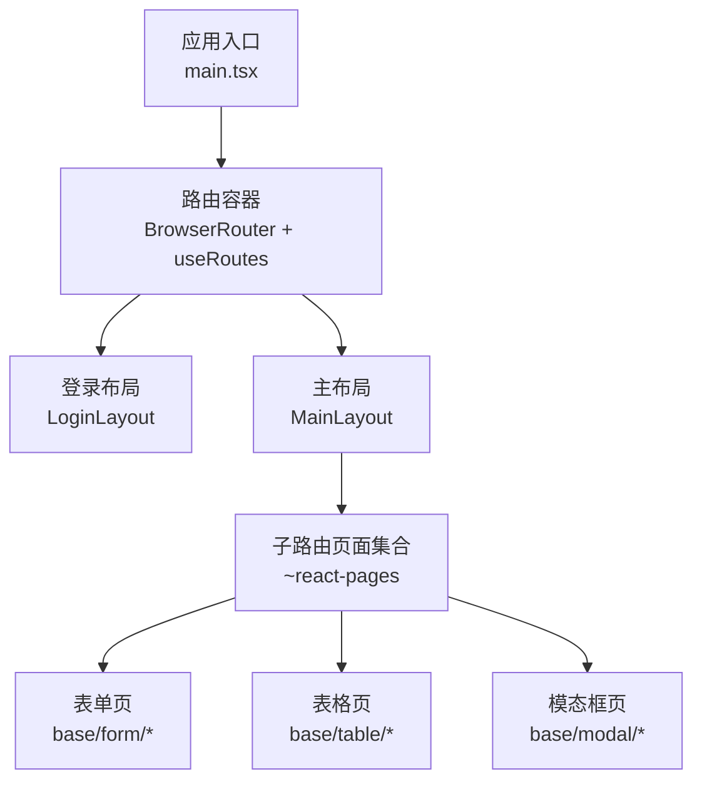
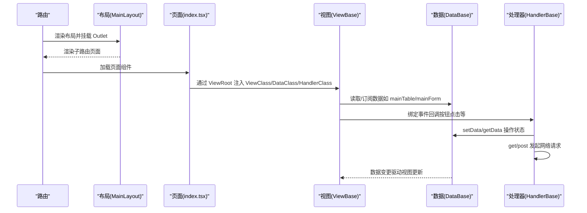
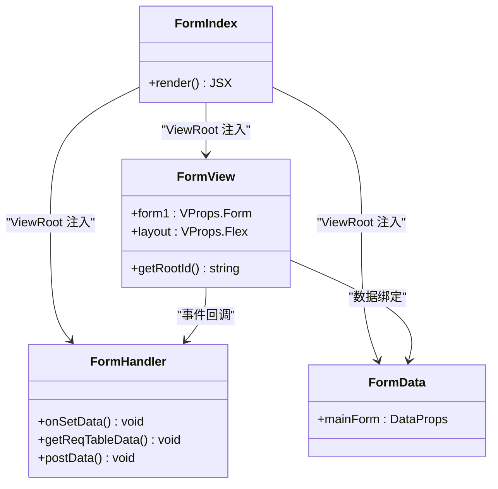
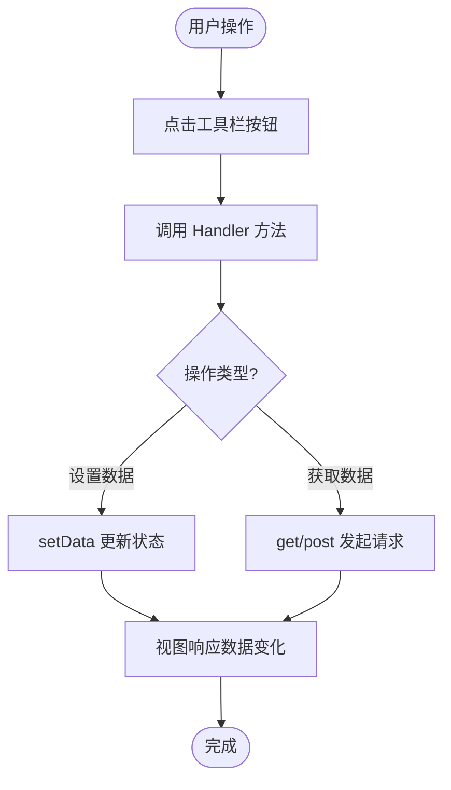
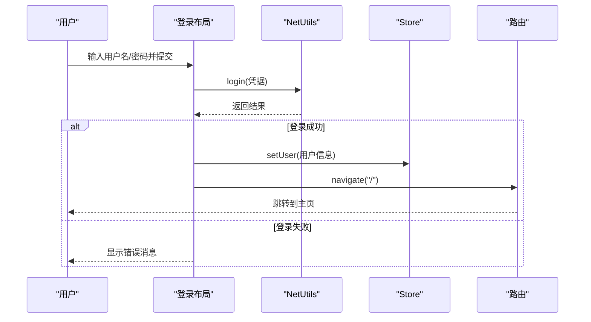
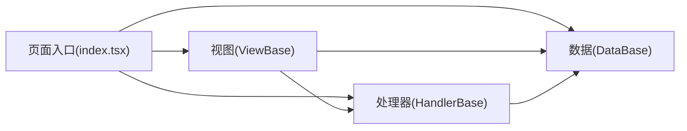

# 页面开发

<cite>
**本文引用的文件**
- [main.tsx](file://apps/demo/src/main.tsx)
- [MainLayout.tsx](file://apps/demo/src/layouts/main/MainLayout.tsx)
- [LoginLayout.tsx](file://apps/demo/src/layouts/login/LoginLayout.tsx)
- [form/index.tsx](file://apps/demo/src/pages/base/form/index.tsx)
- [form/data.tsx](file://apps/demo/src/pages/base/form/data.tsx)
- [form/handler.ts](file://apps/demo/src/pages/base/form/handler.ts)
- [form/view.tsx](file://apps/demo/src/pages/base/form/view.tsx)
- [table/index.tsx](file://apps/demo/src/pages/base/table/index.tsx)
- [table/data.tsx](file://apps/demo/src/pages/base/table/data.tsx)
- [table/handler.ts](file://apps/demo/src/pages/base/table/handler.ts)
- [table/view.tsx](file://apps/demo/src/pages/base/table/view.tsx)
- [modal/index.tsx](file://apps/demo/src/pages/base/modal/index.tsx)
- [modal/data.tsx](file://apps/demo/src/pages/base/modal/data.tsx)
- [pages/index.tsx](file://apps/demo/src/pages/index.tsx)
</cite>

## 目录
1. [简介](#简介)
2. [项目结构](#项目结构)
3. [核心组件](#核心组件)
4. [架构总览](#架构总览)
5. [详细组件分析](#详细组件分析)
6. [依赖关系分析](#依赖关系分析)
7. [性能考虑](#性能考虑)
8. [故障排查指南](#故障排查指南)
9. [结论](#结论)
10. [附录](#附录)

## 简介
本指南面向使用该仓库进行页面开发的工程师，系统说明页面组织结构规范与最佳实践。重点包括：
- 在页面层面应用 MVC 模式（data.tsx、handler.ts、index.tsx、view.tsx）的职责划分与协作方式
- 布局系统的使用方法，含主布局与登录布局的实现与定制要点
- 路由配置与页面导航机制
- 页面生命周期管理最佳实践（数据加载、状态管理、资源清理）
- 常见页面类型开发示例（表单页、表格页、模态框页）
- 页面间通信机制与数据传递方式

## 项目结构
本项目采用“按功能域组织”的目录结构，页面位于 apps/demo/src/pages 下，每个页面遵循统一的 MVC 四件套：
- index.tsx：页面入口，使用框架提供的 ViewRoot 装配视图、数据、处理器
- data.tsx：数据层，定义 DataProps、数据源 URL、字段映射等
- handler.ts：处理层，封装业务逻辑、网络请求、状态更新
- view.tsx：视图层，声明式 UI 描述，绑定控件与事件

布局位于 layouts 目录，包含主布局 MainLayout 与登录布局 LoginLayout，分别承载应用主体与认证流程。

图表来源
- [main.tsx:11-21](file://apps/demo/src/main.tsx#L11-L21)
- [MainLayout.tsx:45-72](file://apps/demo/src/layouts/main/MainLayout.tsx#L45-L72)

章节来源
- [main.tsx:1-53](file://apps/demo/src/main.tsx#L1-L53)
- [MainLayout.tsx:1-77](file://apps/demo/src/layouts/main/MainLayout.tsx#L1-L77)
- [LoginLayout.tsx:1-99](file://apps/demo/src/layouts/login/LoginLayout.tsx#L1-L99)

## 核心组件
- ViewRoot：页面装配器，接收 ViewClass、DataClass、HandlerClass，负责将三者组合为可渲染页面实例
- DataBase：数据基类，提供 DataProps 配置、路径化数据存取、自动请求管理等能力
- HandlerBase：处理基类，提供 get/post 请求、setData/getData、统计打印等通用方法
- ViewBase：视图基类，提供 VType/Ctrl 声明式 UI 构建、根节点 ID 获取、与数据/处理器联动

这些组件共同构成页面级 MVC 的核心骨架，使页面代码保持高内聚、低耦合。

章节来源
- [form/index.tsx:1-10](file://apps/demo/src/pages/base/form/index.tsx#L1-L10)
- [table/index.tsx:1-10](file://apps/demo/src/pages/base/table/index.tsx#L1-L10)
- [modal/index.tsx:1-9](file://apps/demo/src/pages/base/modal/index.tsx#L1-L9)

## 架构总览
下图展示了从路由到具体页面的调用链，以及页面内部 MVC 三层的交互关系。

图表来源
- [main.tsx:11-21](file://apps/demo/src/main.tsx#L11-L21)
- [MainLayout.tsx:45-72](file://apps/demo/src/layouts/main/MainLayout.tsx#L45-L72)
- [form/index.tsx:1-10](file://apps/demo/src/pages/base/form/index.tsx#L1-L10)
- [table/index.tsx:1-10](file://apps/demo/src/pages/base/table/index.tsx#L1-L10)

## 详细组件分析

### 表单页面（base/form）
- 职责分工
  - index.tsx：使用 ViewRoot 装配 View/Data/Handler
  - data.tsx：定义 mainForm 的数据源与标识
  - handler.ts：封装设置表单数据、触发 GET/POST 请求等逻辑
  - view.tsx：声明表单控件、工具栏按钮及布局容器
- 关键实现要点
  - 表单项通过 items 数组声明，支持多种控件类型（文本、选择、开关、日期、上传等）
  - 工具栏 toolList 中的按钮通过 onClick 绑定到 handler 的方法
  - 布局以 Flex 容器组织表单区域

图表来源
- [form/index.tsx:1-10](file://apps/demo/src/pages/base/form/index.tsx#L1-L10)
- [form/view.tsx:1-99](file://apps/demo/src/pages/base/form/view.tsx#L1-L99)
- [form/data.tsx:1-10](file://apps/demo/src/pages/base/form/data.tsx#L1-L10)
- [form/handler.ts:1-18](file://apps/demo/src/pages/base/form/handler.ts#L1-L18)

章节来源
- [form/index.tsx:1-10](file://apps/demo/src/pages/base/form/index.tsx#L1-L10)
- [form/data.tsx:1-10](file://apps/demo/src/pages/base/form/data.tsx#L1-L10)
- [form/handler.ts:1-18](file://apps/demo/src/pages/base/form/handler.ts#L1-L18)
- [form/view.tsx:1-99](file://apps/demo/src/pages/base/form/view.tsx#L1-L99)

### 表格页面（base/table）
- 职责分工
  - index.tsx：装配 View/Data/Handler
  - data.tsx：定义 mainTable、mainForm、mainFormData 及其关联路径
  - handler.ts：提供打印数据、设置数据、GET/POST 请求、统计数据等方法
  - view.tsx：声明表格列、搜索项、工具栏按钮，并以 Flex 布局组合表单与表格
- 关键实现要点
  - 表格通过 items 定义列，searchItems 定义查询条件
  - 表单与表格通过 dataId 关联不同数据段，便于独立管理与复用
  - 工具栏按钮统一绑定到 handler 方法，便于集中处理业务逻辑

图表来源
- [table/handler.ts:1-30](file://apps/demo/src/pages/base/table/handler.ts#L1-L30)
- [table/view.tsx:1-86](file://apps/demo/src/pages/base/table/view.tsx#L1-L86)

章节来源
- [table/index.tsx:1-10](file://apps/demo/src/pages/base/table/index.tsx#L1-L10)
- [table/data.tsx:1-22](file://apps/demo/src/pages/base/table/data.tsx#L1-L22)
- [table/handler.ts:1-30](file://apps/demo/src/pages/base/table/handler.ts#L1-L30)
- [table/view.tsx:1-86](file://apps/demo/src/pages/base/table/view.tsx#L1-L86)

### 模态框页面（base/modal）
- 职责分工
  - index.tsx：装配 View/Data/Handler
  - data.tsx：定义 mainForm 数据源
  - handler.ts：处理模态框相关逻辑（如打开/关闭、提交等）
  - view.tsx：定义模态框内的表单或内容展示
- 关键实现要点
  - 复用表单数据模型，便于在不同场景（抽屉、模态框）中共享
  - 通过 ViewRoot 统一装配，减少样板代码

章节来源
- [modal/index.tsx:1-9](file://apps/demo/src/pages/base/modal/index.tsx#L1-L9)
- [modal/data.tsx:1-10](file://apps/demo/src/pages/base/modal/data.tsx#L1-L10)

### 布局系统
- 主布局（MainLayout）
  - 负责侧边菜单折叠、头部信息区、标签页区域占位、内容区滚动容器
  - 使用 Outlet 渲染子路由页面
  - 初始化时检查 Token 并拉取菜单数据，监听路由变化刷新菜单
- 登录布局（LoginLayout）
  - 提供登录表单，调用 NetUtils.login 进行认证
  - 成功后写入用户信息并跳转至首页
  - 失败时给出错误提示

图表来源
- [LoginLayout.tsx:24-49](file://apps/demo/src/layouts/login/LoginLayout.tsx#L24-L49)
- [LoginLayout.tsx:51-99](file://apps/demo/src/layouts/login/LoginLayout.tsx#L51-L99)

章节来源
- [MainLayout.tsx:16-77](file://apps/demo/src/layouts/main/MainLayout.tsx#L16-L77)
- [LoginLayout.tsx:1-99](file://apps/demo/src/layouts/login/LoginLayout.tsx#L1-L99)

### 路由配置与页面导航
- 应用入口 main.tsx 使用 BrowserRouter 包裹全局路由
- 通过 useRoutes 动态组装 routesWithRedirect，包含登录页与主布局下的子路由
- 子路由由 ~react-pages 自动生成，页面文件即路由入口
- 页面内导航使用 react-router-dom 的 useNavigate

章节来源
- [main.tsx:1-53](file://apps/demo/src/main.tsx#L1-L53)
- [pages/index.tsx:1-9](file://apps/demo/src/pages/index.tsx#L1-L9)

### 页面生命周期管理最佳实践
- 数据加载
  - 在 handler 中封装 get/post 请求，通过 setData/getData 管理局部状态
  - 表格页可通过 searchItems 触发查询，结合 PathKey 精准定位数据段
- 状态管理
  - 使用 DataBase 的路径化数据模型，避免跨层级传参
  - 表单与表格分离数据段，降低耦合度
- 资源清理
  - 在布局层进行 Token 校验与菜单数据拉取，避免重复请求
  - 利用 React 副作用钩子在必要时执行清理（如取消未完成的请求）

章节来源
- [table/handler.ts:1-30](file://apps/demo/src/pages/base/table/handler.ts#L1-L30)
- [MainLayout.tsx:21-39](file://apps/demo/src/layouts/main/MainLayout.tsx#L21-L39)

### 页面间通信机制与数据传递
- 通过 DataBase 的路径化数据段进行解耦通信
  - 例如表格页的 formData 通过 path 指向 active 表格行，实现行编辑
- 通过 Handler 暴露方法供视图层事件绑定，实现跨组件行为协调
- 布局层通过 Store 管理全局用户信息，供各页面读取与更新

章节来源
- [table/data.tsx:10-18](file://apps/demo/src/pages/base/table/data.tsx#L10-L18)
- [LoginLayout.tsx:22-43](file://apps/demo/src/layouts/login/LoginLayout.tsx#L22-L43)

## 依赖关系分析
页面级 MVC 的依赖关系如下：
- index.tsx 作为装配层，依赖 View/Data/Handler
- ViewBase 依赖 VType/Ctrl 声明 UI，并通过 this.data/this.handler 访问数据与处理器
- DataBase 提供数据段与请求能力
- HandlerBase 提供网络请求与状态操作方法

图表来源
- [form/index.tsx:1-10](file://apps/demo/src/pages/base/form/index.tsx#L1-L10)
- [table/index.tsx:1-10](file://apps/demo/src/pages/base/table/index.tsx#L1-L10)
- [modal/index.tsx:1-9](file://apps/demo/src/pages/base/modal/index.tsx#L1-L9)

章节来源
- [form/index.tsx:1-10](file://apps/demo/src/pages/base/form/index.tsx#L1-L10)
- [table/index.tsx:1-10](file://apps/demo/src/pages/base/table/index.tsx#L1-L10)
- [modal/index.tsx:1-9](file://apps/demo/src/pages/base/modal/index.tsx#L1-L9)

## 性能考虑
- 列表与表单数据分离：通过多个 DataProps 管理不同数据段，减少不必要的重渲染
- 按需加载与懒加载：路由与组件可使用 Suspense 包裹，提升首屏性能
- 请求优化：在 handler 中合并重复请求，避免频繁触发；合理使用缓存策略
- 布局层统一校验：在 MainLayout 中集中进行 Token 校验与菜单数据拉取，减少重复开销

## 故障排查指南
- 登录失败
  - 检查 NetUtils.login 返回值与 message 提示
  - 确认用户信息是否正确写入 Store
- 菜单数据为空
  - 检查 NetUtils.get 返回码与数据结构
  - 查看环境变量 VITE_API_MENU 是否配置正确
- 表格数据不更新
  - 确认 handler 中 get/post 是否成功
  - 检查 setData/getData 路径是否与 data.tsx 中定义一致
- 表单控件无响应
  - 检查 toolList 中按钮的 onClick 是否绑定到 handler 方法
  - 确认 items 的 field 与数据段字段匹配

章节来源
- [LoginLayout.tsx:24-49](file://apps/demo/src/layouts/login/LoginLayout.tsx#L24-L49)
- [MainLayout.tsx:21-39](file://apps/demo/src/layouts/main/MainLayout.tsx#L21-L39)
- [table/handler.ts:20-26](file://apps/demo/src/pages/base/table/handler.ts#L20-L26)
- [form/view.tsx:70-86](file://apps/demo/src/pages/base/form/view.tsx#L70-L86)

## 结论
本项目通过页面级 MVC 模式与布局系统，实现了清晰的职责划分与良好的可扩展性。借助框架提供的 ViewRoot、DataBase、HandlerBase、ViewBase，开发者可以专注于业务逻辑与界面描述，快速构建表单、表格、模态框等常见页面类型。配合路由与导航机制，可实现灵活的页面流转与状态管理。遵循本文的最佳实践，有助于提升代码质量与开发效率。

## 附录
- 常用控件类型参考：VType 与 Ctrl 枚举用于声明表单与布局元素
- 数据段路径：通过 DataBase.active 与 PathKey 精确访问与更新数据
- 主题与样式：通过 ConfigProvider 与 Less 文件统一管理主题与布局样式