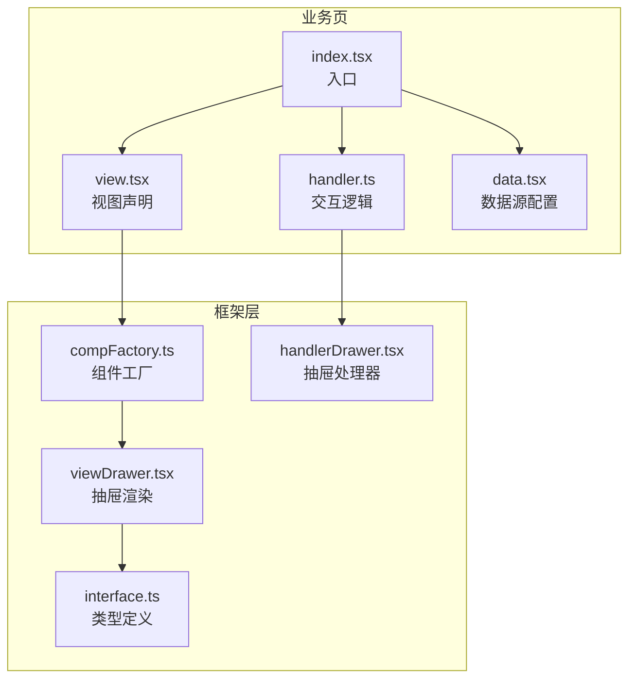
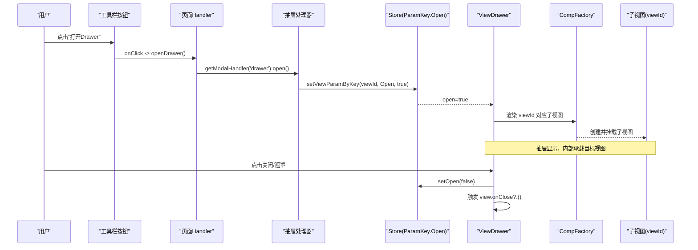
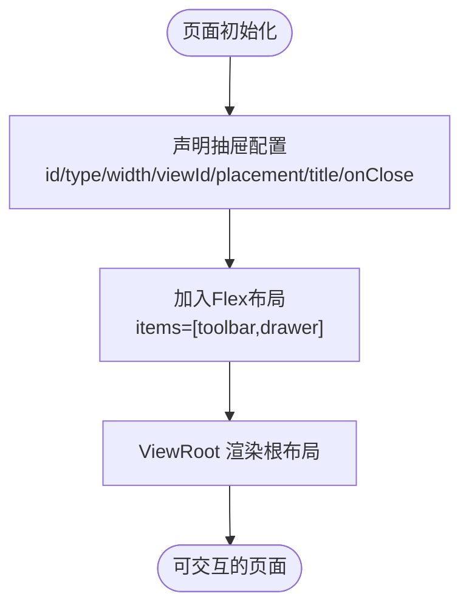
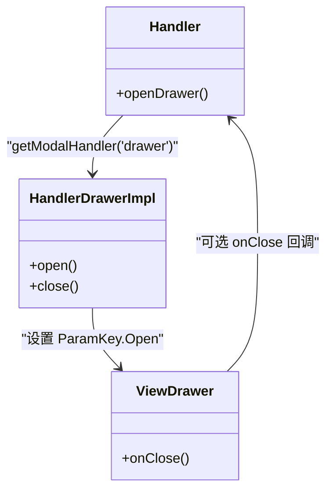
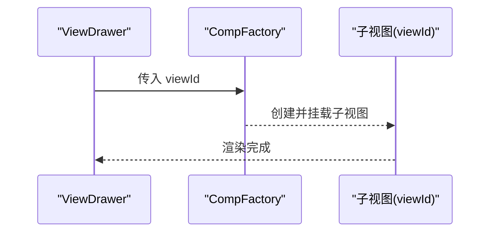
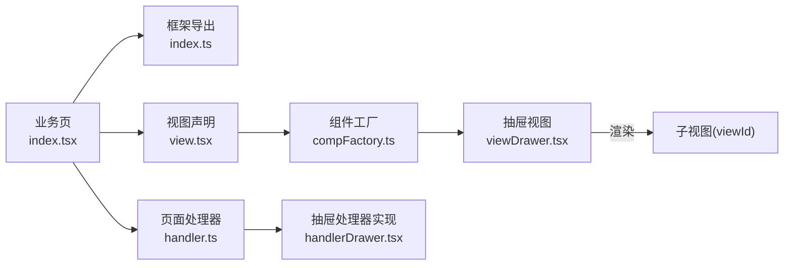

# 抽屉页面

<cite>
**本文引用的文件**
- [apps/demo/src/pages/base/drawer/index.tsx](file://apps/demo/src/pages/base/drawer/index.tsx)
- [apps/demo/src/pages/base/drawer/view.tsx](file://apps/demo/src/pages/base/drawer/view.tsx)
- [apps/demo/src/pages/base/drawer/handler.ts](file://apps/demo/src/pages/base/drawer/handler.ts)
- [apps/demo/src/pages/base/drawer/data.tsx](file://apps/demo/src/pages/base/drawer/data.tsx)
- [packages/framework/src/comp/view/drawer/interface.ts](file://packages/framework/src/comp/view/drawer/interface.ts)
- [packages/framework/src/comp/view/drawer/viewDrawer.tsx](file://packages/framework/src/comp/view/drawer/viewDrawer.tsx)
- [packages/framework/src/comp/view/drawer/handler/handlerDrawer.tsx](file://packages/framework/src/comp/view/drawer/handler/handlerDrawer.tsx)
- [packages/framework/src/comp/compFactory.ts](file://packages/framework/src/comp/compFactory.ts)
- [packages/framework/src/handler/handlerViewBase.ts](file://packages/framework/src/handler/handlerViewBase.ts)
- [packages/framework/src/comp/viewBase.ts](file://packages/framework/src/comp/viewBase.ts)
- [packages/framework/src/index.ts](file://packages/framework/src/index.ts)
</cite>

## 目录
1. [简介](#简介)
2. [项目结构](#项目结构)
3. [核心组件](#核心组件)
4. [架构总览](#架构总览)
5. [详细组件分析](#详细组件分析)
6. [依赖关系分析](#依赖关系分析)
7. [性能与响应式建议](#性能与响应式建议)
8. [故障排查指南](#故障排查指南)
9. [结论](#结论)
10. [附录](#附录)

## 简介
本文件面向使用框架内置“抽屉”（LayoutDrawer）能力的开发者，系统说明如何配置抽屉的位置、宽度、标题、关闭回调等属性；解释打开/关闭逻辑、数据同步机制以及与主页面的通信方式。并提供侧边栏场景的完整示例路径与最佳实践，涵盖复杂操作处理、与其他组件集成模式、性能优化与响应式设计建议。

## 项目结构
- 业务页：位于 apps/demo/src/pages/base/drawer，采用 View/Handler/Data 三段式组织，通过 ViewRoot 装配。
- 框架实现：位于 packages/framework/src/comp/view/drawer，提供抽屉视图渲染、处理器与类型定义，并通过 CompFactory 注册到视图工厂。

**图表来源**
- [apps/demo/src/pages/base/drawer/index.tsx:1-9](file://apps/demo/src/pages/base/drawer/index.tsx#L1-L9)
- [apps/demo/src/pages/base/drawer/view.tsx:1-46](file://apps/demo/src/pages/base/drawer/view.tsx#L1-L46)
- [apps/demo/src/pages/base/drawer/handler.ts:1-10](file://apps/demo/src/pages/base/drawer/handler.ts#L1-L10)
- [packages/framework/src/comp/compFactory.ts:33-59](file://packages/framework/src/comp/compFactory.ts#L33-L59)
- [packages/framework/src/comp/view/drawer/viewDrawer.tsx:1-32](file://packages/framework/src/comp/view/drawer/viewDrawer.tsx#L1-L32)
- [packages/framework/src/comp/view/drawer/handler/handlerDrawer.tsx:1-18](file://packages/framework/src/comp/view/drawer/handler/handlerDrawer.tsx#L1-L18)
- [packages/framework/src/comp/view/drawer/interface.ts:1-20](file://packages/framework/src/comp/view/drawer/interface.ts#L1-L20)

**章节来源**
- [apps/demo/src/pages/base/drawer/index.tsx:1-9](file://apps/demo/src/pages/base/drawer/index.tsx#L1-L9)
- [packages/framework/src/comp/compFactory.ts:33-59](file://packages/framework/src/comp/compFactory.ts#L33-L59)

## 核心组件
- 视图声明（View）：在 view.tsx 中定义抽屉配置项，包括 id、type、width、viewId 等，并将其加入布局容器。
- 交互处理器（Handler）：在 handler.ts 中获取抽屉处理器并调用 open() 打开抽屉。
- 数据源（Data）：在 data.tsx 中声明主表单的数据源 URL，供抽屉内嵌的表单视图加载数据。
- 框架抽屉视图（ViewDrawer）：读取抽屉配置，绑定 open 状态，渲染 Ant Design Drawer，并通过 CompFactory 动态加载 viewId 指向的子视图。
- 框架抽屉处理器（HandlerDrawerImpl）：通过 store 设置 ParamKey.Open 控制抽屉开合。
- 类型与导出（interface.ts、index.ts）：定义 LayoutDrawerProps 并在框架出口暴露 VProps.Drawer 类型。

**章节来源**
- [apps/demo/src/pages/base/drawer/view.tsx:18-41](file://apps/demo/src/pages/base/drawer/view.tsx#L18-L41)
- [apps/demo/src/pages/base/drawer/handler.ts:3-7](file://apps/demo/src/pages/base/drawer/handler.ts#L3-L7)
- [apps/demo/src/pages/base/drawer/data.tsx:3-7](file://apps/demo/src/pages/base/drawer/data.tsx#L3-L7)
- [packages/framework/src/comp/view/drawer/viewDrawer.tsx:10-29](file://packages/framework/src/comp/view/drawer/viewDrawer.tsx#L10-L29)
- [packages/framework/src/comp/view/drawer/handler/handlerDrawer.tsx:9-16](file://packages/framework/src/comp/view/drawer/handler/handlerDrawer.tsx#L9-L16)
- [packages/framework/src/comp/view/drawer/interface.ts:3-20](file://packages/framework/src/comp/view/drawer/interface.ts#L3-L20)
- [packages/framework/src/index.ts:34-64](file://packages/framework/src/index.ts#L34-L64)

## 架构总览
下图展示了从用户点击按钮到抽屉打开、内容渲染的完整调用链，以及关闭时的回调流程。

**图表来源**
- [apps/demo/src/pages/base/drawer/view.tsx:25-35](file://apps/demo/src/pages/base/drawer/view.tsx#L25-L35)
- [apps/demo/src/pages/base/drawer/handler.ts:3-7](file://apps/demo/src/pages/base/drawer/handler.ts#L3-L7)
- [packages/framework/src/comp/view/drawer/handler/handlerDrawer.tsx:9-16](file://packages/framework/src/comp/view/drawer/handler/handlerDrawer.tsx#L9-L16)
- [packages/framework/src/comp/view/drawer/viewDrawer.tsx:10-29](file://packages/framework/src/comp/view/drawer/viewDrawer.tsx#L10-L29)
- [packages/framework/src/comp/compFactory.ts:42-57](file://packages/framework/src/comp/compFactory.ts#L42-L57)

## 详细组件分析

### 视图配置与布局（View）
- 抽屉属性
  - id：唯一标识，用于定位处理器与参数存储。
  - type：固定为 LayoutDrawer。
  - width：数值型宽度，直接映射到 Ant Design Drawer 的 size。
  - placement：可选 left/right/top/bottom，默认 right。
  - title：可选标题。
  - viewId：必填，指定抽屉内要渲染的子视图 ID。
  - onClose：可选关闭回调，在点击关闭时执行。
- 布局组织
  - 将 toolbar 与 drawer 放入 Flex 布局，确保两者同层级共存。
  - getRootId 返回根布局 ID，由 ViewRoot 渲染。

**图表来源**
- [apps/demo/src/pages/base/drawer/view.tsx:18-43](file://apps/demo/src/pages/base/drawer/view.tsx#L18-L43)

**章节来源**
- [apps/demo/src/pages/base/drawer/view.tsx:18-43](file://apps/demo/src/pages/base/drawer/view.tsx#L18-L43)

### 打开/关闭逻辑（Handler + HandlerDrawerImpl）
- 打开流程
  - 页面 Handler 通过 getModalHandler('drawer') 获取抽屉处理器实例。
  - 调用 open() 将 ParamKey.Open 设为 true，驱动 ViewDrawer 显示。
- 关闭流程
  - ViewDrawer 内部监听关闭事件，将 ParamKey.Open 设为 false。
  - 若配置了 onClose，则在关闭后执行自定义逻辑。

**图表来源**
- [apps/demo/src/pages/base/drawer/handler.ts:3-7](file://apps/demo/src/pages/base/drawer/handler.ts#L3-L7)
- [packages/framework/src/comp/view/drawer/handler/handlerDrawer.tsx:9-16](file://packages/framework/src/comp/view/drawer/handler/handlerDrawer.tsx#L9-L16)
- [packages/framework/src/comp/view/drawer/viewDrawer.tsx:14-17](file://packages/framework/src/comp/view/drawer/viewDrawer.tsx#L14-L17)

**章节来源**
- [apps/demo/src/pages/base/drawer/handler.ts:3-7](file://apps/demo/src/pages/base/drawer/handler.ts#L3-L7)
- [packages/framework/src/comp/view/drawer/handler/handlerDrawer.tsx:9-16](file://packages/framework/src/comp/view/drawer/handler/handlerDrawer.tsx#L9-L16)
- [packages/framework/src/comp/view/drawer/viewDrawer.tsx:14-17](file://packages/framework/src/comp/view/drawer/viewDrawer.tsx#L14-L17)

### 数据同步与子视图加载（Data + CompFactory）
- Data 层声明主表单数据源 URL，供抽屉内嵌的表单视图使用。
- 当抽屉打开时，ViewDrawer 通过 CompFactory 根据 viewId 动态创建并挂载子视图，实现“抽屉即容器”的能力。
- 子视图可通过框架提供的数据/处理器能力进行独立的数据请求与交互，与主页面解耦。

**图表来源**
- [apps/demo/src/pages/base/drawer/data.tsx:3-7](file://apps/demo/src/pages/base/drawer/data.tsx#L3-L7)
- [packages/framework/src/comp/compFactory.ts:42-57](file://packages/framework/src/comp/compFactory.ts#L42-L57)
- [packages/framework/src/comp/view/drawer/viewDrawer.tsx:20-28](file://packages/framework/src/comp/view/drawer/viewDrawer.tsx#L20-L28)

**章节来源**
- [apps/demo/src/pages/base/drawer/data.tsx:3-7](file://apps/demo/src/pages/base/drawer/data.tsx#L3-L7)
- [packages/framework/src/comp/compFactory.ts:42-57](file://packages/framework/src/comp/compFactory.ts#L42-L57)
- [packages/framework/src/comp/view/drawer/viewDrawer.tsx:20-28](file://packages/framework/src/comp/view/drawer/viewDrawer.tsx#L20-L28)

### 类型系统与导出（interface.ts、index.ts）
- interface.ts 定义了 LayoutDrawerProps，包含 type、viewId、title、placement、width、onClose 等字段。
- index.ts 将 LayoutDrawerProps 以 VProps.Drawer 形式对外暴露，便于业务层使用类型提示。

**章节来源**
- [packages/framework/src/comp/view/drawer/interface.ts:3-20](file://packages/framework/src/comp/view/drawer/interface.ts#L3-L20)
- [packages/framework/src/index.ts:34-64](file://packages/framework/src/index.ts#L34-L64)

## 依赖关系分析
- 业务页依赖框架导出的 ViewRoot、VType、Ctrl、VProps.Drawer 等。
- 框架内部通过 CompFactory 将 ViewType.LayoutDrawer 映射到 ViewDrawer 与 HandlerDrawerImpl。
- ViewDrawer 依赖 useView/useParamByKey 读取配置与开关状态，并使用 antd Drawer 渲染。
- HandlerDrawerImpl 继承自 HandlerViewBase，通过 store 读写 ParamKey.Open。

**图表来源**
- [apps/demo/src/pages/base/drawer/index.tsx:1-9](file://apps/demo/src/pages/base/drawer/index.tsx#L1-L9)
- [packages/framework/src/index.ts:13-64](file://packages/framework/src/index.ts#L13-L64)
- [packages/framework/src/comp/compFactory.ts:22-59](file://packages/framework/src/comp/compFactory.ts#L22-L59)
- [packages/framework/src/comp/view/drawer/viewDrawer.tsx:10-29](file://packages/framework/src/comp/view/drawer/viewDrawer.tsx#L10-L29)
- [packages/framework/src/comp/view/drawer/handler/handlerDrawer.tsx:9-16](file://packages/framework/src/comp/view/drawer/handler/handlerDrawer.tsx#L9-L16)

**章节来源**
- [packages/framework/src/comp/compFactory.ts:22-59](file://packages/framework/src/comp/compFactory.ts#L22-L59)
- [packages/framework/src/index.ts:13-64](file://packages/framework/src/index.ts#L13-L64)

## 性能与响应式建议
- 延迟加载子视图
  - 利用 CompFactory 按需创建 viewId 对应子视图，避免不必要的初始渲染开销。
- 合理设置 width 与 placement
  - 移动端建议使用 top/bottom 或较小 width，减少重排与绘制成本。
- 复用与缓存
  - 对频繁打开的抽屉，可在子视图中缓存已加载数据，减少重复请求。
- 动画与过渡
  - 保持默认动画即可；如需自定义，优先通过外层容器样式调整，避免侵入框架内部。
- 事件节流
  - 对高频操作（如滚动、输入）在子视图中做节流/防抖，降低渲染压力。
- 响应式适配
  - 结合媒体查询或框架主题 token，在不同尺寸下切换 placement/width，保证可用性。

[本节为通用建议，不直接引用具体文件]

## 故障排查指南
- 抽屉无法打开
  - 检查 view.tsx 中抽屉的 id 是否与 handler 中 getModalHandler('drawer') 一致。
  - 确认 CompFactory 已将 LayoutDrawer 正确映射到 ViewDrawer。
- 打开后无内容
  - 核对 viewId 是否指向有效的子视图，且该子视图已在路由或模块中注册。
- 关闭不生效
  - 检查是否覆盖了 onClose 但未调用 setOpen(false)，或 store 写入失败。
- 类型报错
  - 确认使用 VProps.Drawer 类型，并确保 placement/width 等字段符合接口定义。

**章节来源**
- [apps/demo/src/pages/base/drawer/handler.ts:3-7](file://apps/demo/src/pages/base/drawer/handler.ts#L3-L7)
- [packages/framework/src/comp/compFactory.ts:22-59](file://packages/framework/src/comp/compFactory.ts#L22-L59)
- [packages/framework/src/comp/view/drawer/viewDrawer.tsx:14-17](file://packages/framework/src/comp/view/drawer/viewDrawer.tsx#L14-L17)
- [packages/framework/src/comp/view/drawer/interface.ts:3-20](file://packages/framework/src/comp/view/drawer/interface.ts#L3-L20)

## 结论
本仓库通过声明式视图配置与统一的工厂/处理器机制，提供了开箱即用且可扩展的抽屉能力。开发者只需在 view.tsx 中声明抽屉属性，在 handler.ts 中调用 open/close，即可实现位置、宽度、标题、关闭回调等灵活配置；配合 CompFactory 的动态子视图加载，可将任意页面作为抽屉内容，满足复杂业务场景。遵循本文的性能与响应式建议，可获得更优的用户体验与维护性。

## 附录
- 快速上手步骤
  - 在 view.tsx 中声明抽屉配置，并将 viewId 指向目标子视图。
  - 在 handler.ts 中通过 getModalHandler('drawer').open() 打开抽屉。
  - 在 data.tsx 中配置子视图所需的数据源 URL。
- 参考路径
  - 示例页面入口：[apps/demo/src/pages/base/drawer/index.tsx](file://apps/demo/src/pages/base/drawer/index.tsx)
  - 视图声明：[apps/demo/src/pages/base/drawer/view.tsx](file://apps/demo/src/pages/base/drawer/view.tsx)
  - 处理器：[apps/demo/src/pages/base/drawer/handler.ts](file://apps/demo/src/pages/base/drawer/handler.ts)
  - 数据源：[apps/demo/src/pages/base/drawer/data.tsx](file://apps/demo/src/pages/base/drawer/data.tsx)
  - 框架实现：
    - 类型定义：[packages/framework/src/comp/view/drawer/interface.ts](file://packages/framework/src/comp/view/drawer/interface.ts)
    - 视图渲染：[packages/framework/src/comp/view/drawer/viewDrawer.tsx](file://packages/framework/src/comp/view/drawer/viewDrawer.tsx)
    - 处理器实现：[packages/framework/src/comp/view/drawer/handler/handlerDrawer.tsx](file://packages/framework/src/comp/view/drawer/handler/handlerDrawer.tsx)
    - 组件工厂：[packages/framework/src/comp/compFactory.ts](file://packages/framework/src/comp/compFactory.ts)
    - 基类与导出：[packages/framework/src/handler/handlerViewBase.ts](file://packages/framework/src/handler/handlerViewBase.ts)、[packages/framework/src/comp/viewBase.ts](file://packages/framework/src/comp/viewBase.ts)、[packages/framework/src/index.ts](file://packages/framework/src/index.ts)