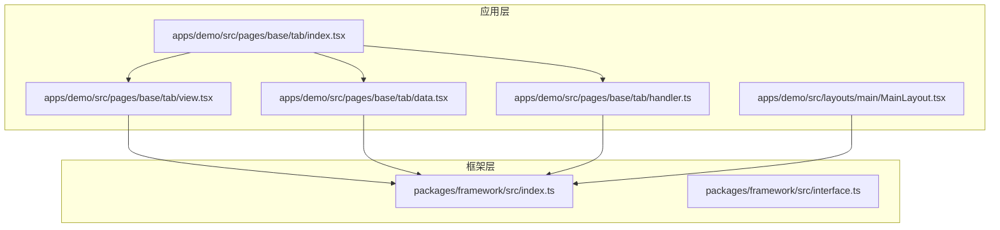
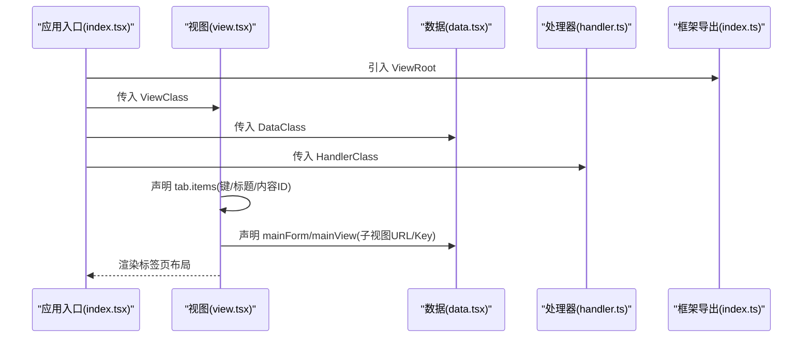
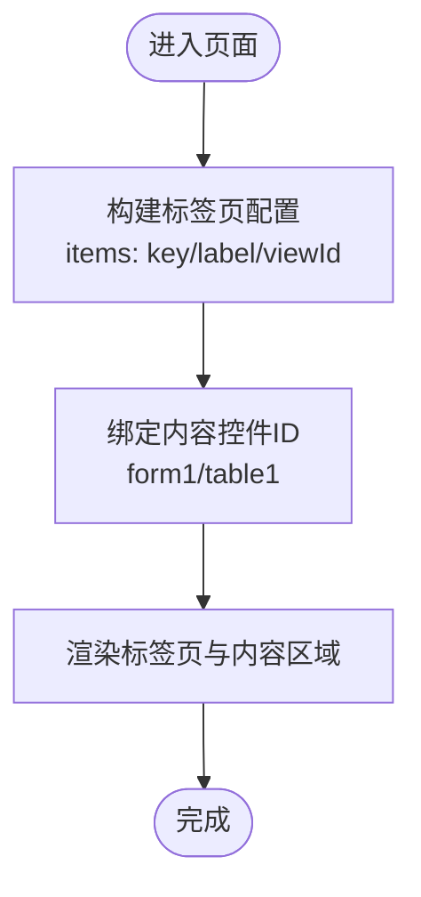
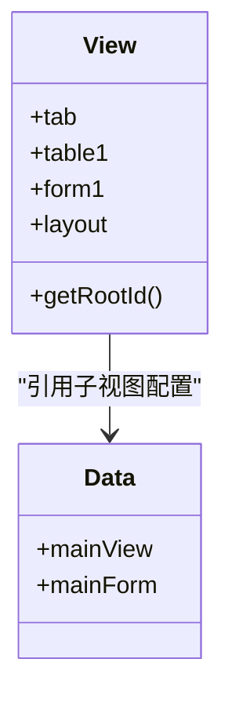
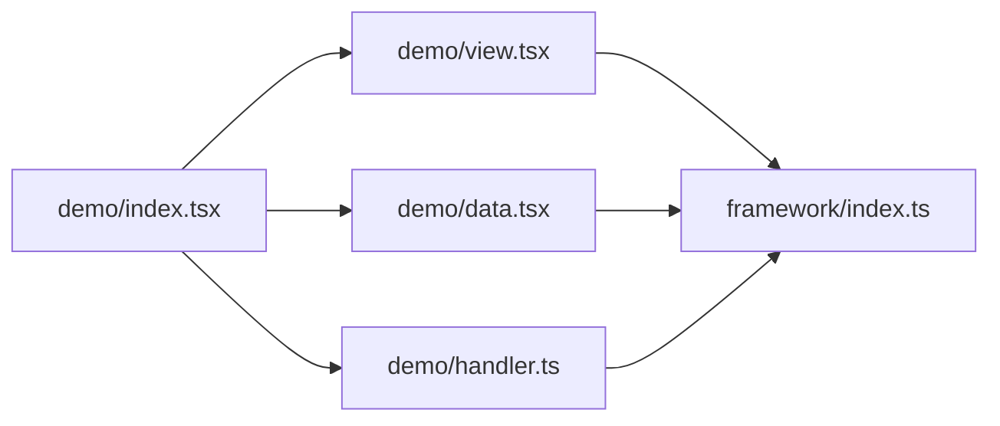

# 标签页页面

<cite>
**本文引用的文件**
- [apps/demo/src/pages/base/tab/index.tsx](file://apps/demo/src/pages/base/tab/index.tsx)
- [apps/demo/src/pages/base/tab/view.tsx](file://apps/demo/src/pages/base/tab/view.tsx)
- [apps/demo/src/pages/base/tab/data.tsx](file://apps/demo/src/pages/base/tab/data.tsx)
- [apps/demo/src/pages/base/tab/handler.ts](file://apps/demo/src/pages/base/tab/handler.ts)
- [packages/framework/src/index.ts](file://packages/framework/src/index.ts)
- [packages/framework/src/interface.ts](file://packages/framework/src/interface.ts)
- [apps/demo/src/layouts/main/MainLayout.tsx](file://apps/demo/src/layouts/main/MainLayout.tsx)
</cite>

## 目录
1. [简介](#简介)
2. [项目结构](#项目结构)
3. [核心组件](#核心组件)
4. [架构总览](#架构总览)
5. [详细组件分析](#详细组件分析)
6. [依赖分析](#依赖分析)
7. [性能考虑](#性能考虑)
8. [故障排查指南](#故障排查指南)
9. [结论](#结论)
10. [附录](#附录)

## 简介
本文件面向“标签页页面”的开发与使用，聚焦以下目标：
- 如何配置多个标签页的内容、标题、图标等属性
- 标签页切换逻辑、懒加载机制与状态保持策略
- 在标签页中嵌入不同组件与内容的完整示例路径
- 标签页间的数据共享与通信方式
- 动态添加/删除标签页的能力与实现思路
- 复杂业务场景下的应用模式与最佳实践

## 项目结构
当前仓库采用“应用 + 框架包”的分层组织。标签页能力由框架提供，示例应用在 demo 应用中通过声明式视图进行组合。

图表来源
- [apps/demo/src/pages/base/tab/index.tsx:1-9](file://apps/demo/src/pages/base/tab/index.tsx#L1-L9)
- [apps/demo/src/pages/base/tab/view.tsx:1-60](file://apps/demo/src/pages/base/tab/view.tsx#L1-L60)
- [apps/demo/src/pages/base/tab/data.tsx:1-16](file://apps/demo/src/pages/base/tab/data.tsx#L1-L16)
- [apps/demo/src/pages/base/tab/handler.ts:1-7](file://apps/demo/src/pages/base/tab/handler.ts#L1-L7)
- [packages/framework/src/index.ts:1-69](file://packages/framework/src/index.ts#L1-L69)
- [packages/framework/src/interface.ts:1-35](file://packages/framework/src/interface.ts#L1-L35)
- [apps/demo/src/layouts/main/MainLayout.tsx:1-77](file://apps/demo/src/layouts/main/MainLayout.tsx#L1-L77)

章节来源
- [apps/demo/src/pages/base/tab/index.tsx:1-9](file://apps/demo/src/pages/base/tab/index.tsx#L1-L9)
- [apps/demo/src/pages/base/tab/view.tsx:1-60](file://apps/demo/src/pages/base/tab/view.tsx#L1-L60)
- [apps/demo/src/pages/base/tab/data.tsx:1-16](file://apps/demo/src/pages/base/tab/data.tsx#L1-L16)
- [apps/demo/src/pages/base/tab/handler.ts:1-7](file://apps/demo/src/pages/base/tab/handler.ts#L1-L7)
- [packages/framework/src/index.ts:1-69](file://packages/framework/src/index.ts#L1-L69)
- [packages/framework/src/interface.ts:1-35](file://packages/framework/src/interface.ts#L1-L35)
- [apps/demo/src/layouts/main/MainLayout.tsx:1-77](file://apps/demo/src/layouts/main/MainLayout.tsx#L1-L77)

## 核心组件
- ViewRoot：入口容器，负责将 View/Data/Handler 装配并渲染页面。
- ViewBase：视图基类，用于声明式定义布局与控件（表单、表格、标签页、布局等）。
- DataBase：数据基类，用于声明子视图或数据源（如嵌套的表单/表格页面）。
- HandlerBase：事件处理基类，承载交互逻辑。
- VProps.Tab：标签页控件的类型定义，包含 key、label、viewId 等字段，用于描述标签项与内容映射。

章节来源
- [packages/framework/src/index.ts:12-30](file://packages/framework/src/index.ts#L12-L30)
- [packages/framework/src/index.ts:40-65](file://packages/framework/src/index.ts#L40-L65)
- [apps/demo/src/pages/base/tab/view.tsx:33-48](file://apps/demo/src/pages/base/tab/view.tsx#L33-L48)
- [apps/demo/src/pages/base/tab/data.tsx:3-14](file://apps/demo/src/pages/base/tab/data.tsx#L3-L14)

## 架构总览
标签页在示例应用中通过声明式方式组合：View 中定义 Tab 控件，并通过 items 将每个标签的 key、label 与对应 viewId 关联；Data 中可声明子视图（如表单/表格）作为标签内容；Handler 用于扩展交互。

图表来源
- [apps/demo/src/pages/base/tab/index.tsx:1-9](file://apps/demo/src/pages/base/tab/index.tsx#L1-L9)
- [apps/demo/src/pages/base/tab/view.tsx:33-56](file://apps/demo/src/pages/base/tab/view.tsx#L33-L56)
- [apps/demo/src/pages/base/tab/data.tsx:3-14](file://apps/demo/src/pages/base/tab/data.tsx#L3-L14)
- [packages/framework/src/index.ts:12-30](file://packages/framework/src/index.ts#L12-L30)

## 详细组件分析

### 标签页配置与渲染
- 在 View 中通过 VType.LayoutTab 创建标签页控件，并在 items 中为每个标签设置：
  - key：唯一标识
  - label：显示标题
  - viewId：指向该标签对应的内容控件 ID（例如表单或表格）
- 使用 Flex 布局将标签页放入根布局，并通过 getRootId 指定根节点。

图表来源
- [apps/demo/src/pages/base/tab/view.tsx:33-56](file://apps/demo/src/pages/base/tab/view.tsx#L33-L56)

章节来源
- [apps/demo/src/pages/base/tab/view.tsx:1-60](file://apps/demo/src/pages/base/tab/view.tsx#L1-L60)

### 标签页内容与数据源
- 在 Data 中可通过 mainForm/mainView 声明子视图，支持 url 与 keyAttr 等属性，便于后续路由或数据加载。
- 标签页的每个标签通过 viewId 与 View 中的具体控件关联，从而实现“标签-内容”的解耦。

图表来源
- [apps/demo/src/pages/base/tab/data.tsx:3-14](file://apps/demo/src/pages/base/tab/data.tsx#L3-L14)
- [apps/demo/src/pages/base/tab/view.tsx:6-56](file://apps/demo/src/pages/base/tab/view.tsx#L6-L56)

章节来源
- [apps/demo/src/pages/base/tab/data.tsx:1-16](file://apps/demo/src/pages/base/tab/data.tsx#L1-L16)
- [apps/demo/src/pages/base/tab/view.tsx:1-60](file://apps/demo/src/pages/base/tab/view.tsx#L1-L60)

### 事件处理与扩展点
- Handler 继承自 HandlerBase，可用于扩展标签切换、新增/关闭标签等业务逻辑。当前示例未实现特殊事件处理，表明基础切换由框架内部完成。

章节来源
- [apps/demo/src/pages/base/tab/handler.ts:1-7](file://apps/demo/src/pages/base/tab/handler.ts#L1-L7)
- [packages/framework/src/index.ts:15-19](file://packages/framework/src/index.ts#L15-L19)

### 主布局中的标签页区域
- MainLayout 预留了“Tab 标签页区域”，可用于全局级标签页（如多页签导航），与页面内局部标签页形成互补。

章节来源
- [apps/demo/src/layouts/main/MainLayout.tsx:58-60](file://apps/demo/src/layouts/main/MainLayout.tsx#L58-L60)

## 依赖分析
- 应用层通过 ViewRoot 将 View/Data/Handler 注入框架，框架统一导出类型与基类，保证一致的结构化开发体验。
- 标签页控件类型来自框架导出的 VProps.Tab，确保类型安全与智能提示。

图表来源
- [apps/demo/src/pages/base/tab/index.tsx:1-9](file://apps/demo/src/pages/base/tab/index.tsx#L1-L9)
- [packages/framework/src/index.ts:12-30](file://packages/framework/src/index.ts#L12-L30)

章节来源
- [apps/demo/src/pages/base/tab/index.tsx:1-9](file://apps/demo/src/pages/base/tab/index.tsx#L1-L9)
- [packages/framework/src/index.ts:1-69](file://packages/framework/src/index.ts#L1-L69)

## 性能考虑
- 懒加载建议：将标签页内容拆分为独立模块，按需加载以减少首屏体积。可在 Data 中通过 url 指向独立页面，结合路由懒加载实现。
- 状态保持：对需要保留状态的标签页，避免频繁销毁重建；可使用框架提供的状态管理或本地缓存策略。
- 列表优化：表格/表单等大组件应启用分页、虚拟滚动等特性，减少 DOM 压力。
- 资源复用：相同配置的标签项尽量复用实例，避免重复初始化。

[本节为通用指导，不直接分析具体文件]

## 故障排查指南
- 标签无法切换：检查 View 中 tab.items 的 viewId 是否与对应控件 id 一致；确认布局已将 tab 加入 items。
- 内容未渲染：确认 Data 中 mainForm/mainView 的 url/keyAttr 配置正确；检查路由是否可达。
- 事件无效：如需自定义行为，请在 Handler 中重写相关方法；参考框架导出的 HandlerBase 接口。
- 主布局标签区无响应：MainLayout 仅预留占位，需自行接入全局标签页逻辑或使用框架的全局标签能力。

章节来源
- [apps/demo/src/pages/base/tab/view.tsx:33-56](file://apps/demo/src/pages/base/tab/view.tsx#L33-L56)
- [apps/demo/src/pages/base/tab/data.tsx:3-14](file://apps/demo/src/pages/base/tab/data.tsx#L3-L14)
- [apps/demo/src/layouts/main/MainLayout.tsx:58-60](file://apps/demo/src/layouts/main/MainLayout.tsx#L58-L60)

## 结论
- 标签页通过声明式配置即可快速搭建，key/label/viewId 三要素清晰表达“标签-内容”关系。
- 借助 Data 的子视图声明，可实现标签页内容的模块化与懒加载。
- 通过 Handler 可扩展切换、新增、关闭等高级行为；主布局预留区域可用于全局多页签场景。
- 遵循性能与状态保持的最佳实践，可获得更流畅的用户体验。

[本节为总结性内容，不直接分析具体文件]

## 附录

### 配置要点速查
- 标签页配置位置：View 中 tab.items
- 关键属性：key（唯一）、label（标题）、viewId（内容控件ID）
- 内容来源：Data 中 mainForm/mainView 的 url/keyAttr
- 扩展点：HandlerBase 的事件处理

章节来源
- [apps/demo/src/pages/base/tab/view.tsx:33-48](file://apps/demo/src/pages/base/tab/view.tsx#L33-L48)
- [apps/demo/src/pages/base/tab/data.tsx:3-14](file://apps/demo/src/pages/base/tab/data.tsx#L3-L14)
- [packages/framework/src/index.ts:15-30](file://packages/framework/src/index.ts#L15-L30)