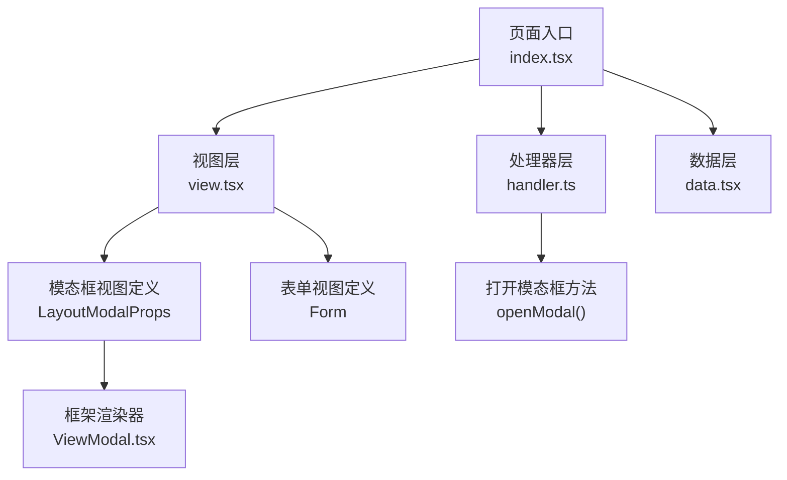
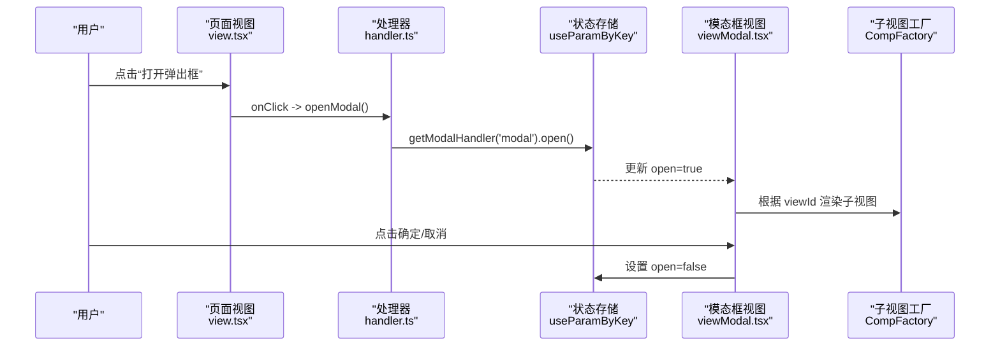
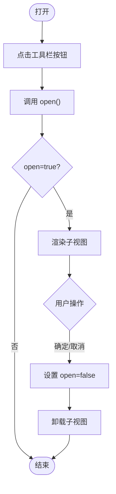
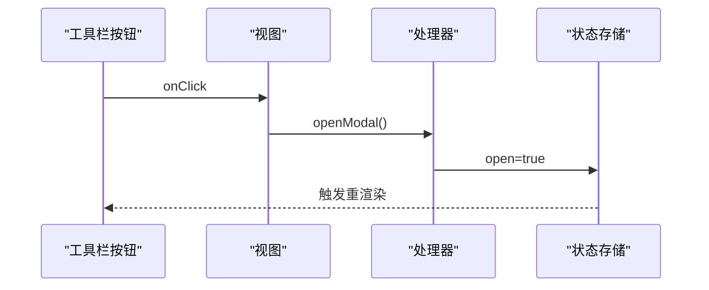
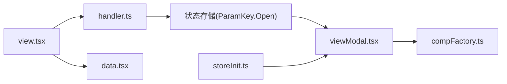

# 模态框页面

<cite>
**本文引用的文件**
- [apps/demo/src/pages/base/modal/index.tsx](file://apps/demo/src/pages/base/modal/index.tsx)
- [apps/demo/src/pages/base/modal/view.tsx](file://apps/demo/src/pages/base/modal/view.tsx)
- [apps/demo/src/pages/base/modal/handler.ts](file://apps/demo/src/pages/base/modal/handler.ts)
- [apps/demo/src/pages/base/modal/data.tsx](file://apps/demo/src/pages/base/modal/data.tsx)
- [packages/framework/src/comp/view/modal/interface.ts](file://packages/framework/src/comp/view/modal/interface.ts)
- [packages/framework/src/comp/view/modal/viewModal.tsx](file://packages/framework/src/comp/view/modal/viewModal.tsx)
- [packages/framework/src/comp/compFactory.ts](file://packages/framework/src/comp/compFactory.ts)
- [packages/framework/src/stores/store/utils/storeInit.ts](file://packages/framework/src/stores/store/utils/storeInit.ts)
- [apps/demo/src/pages/base/form/view.tsx](file://apps/demo/src/pages/base/form/view.tsx)
- [apps/demo/src/pages/base/table/view.tsx](file://apps/demo/src/pages/base/table/view.tsx)
</cite>

## 目录
1. [简介](#简介)
2. [项目结构](#项目结构)
3. [核心组件](#核心组件)
4. [架构总览](#架构总览)
5. [详细组件分析](#详细组件分析)
6. [依赖关系分析](#依赖关系分析)
7. [性能考虑](#性能考虑)
8. [故障排查指南](#故障排查指南)
9. [结论](#结论)
10. [附录](#附录)

## 简介
本文件面向使用框架内置模态框能力的开发者，系统说明如何在主页面中配置并调用模态框，如何管理其生命周期、传递数据与处理事件，以及如何与表单、表格等组件协同工作。文档同时给出性能优化与用户体验建议，帮助你在实际项目中稳定高效地使用模态框。

## 项目结构
该示例位于 demo 应用的 base 模块下，采用“视图-处理器-数据”的三段式组织：
- index.tsx：页面入口，通过 ViewRoot 装配 View、Handler、Data。
- view.tsx：声明布局、工具栏、模态框以及关联的表单视图。
- handler.ts：提供打开模态框等交互逻辑。
- data.tsx：声明页面所需的数据源（如表单数据）。

图表来源
- [apps/demo/src/pages/base/modal/index.tsx:1-9](file://apps/demo/src/pages/base/modal/index.tsx#L1-L9)
- [apps/demo/src/pages/base/modal/view.tsx:1-46](file://apps/demo/src/pages/base/modal/view.tsx#L1-L46)
- [apps/demo/src/pages/base/modal/handler.ts:1-10](file://apps/demo/src/pages/base/modal/handler.ts#L1-L10)
- [apps/demo/src/pages/base/modal/data.tsx:1-10](file://apps/demo/src/pages/base/modal/data.tsx#L1-L10)
- [packages/framework/src/comp/view/modal/interface.ts:1-12](file://packages/framework/src/comp/view/modal/interface.ts#L1-L12)
- [packages/framework/src/comp/view/modal/viewModal.tsx:1-34](file://packages/framework/src/comp/view/modal/viewModal.tsx#L1-L34)

章节来源
- [apps/demo/src/pages/base/modal/index.tsx:1-9](file://apps/demo/src/pages/base/modal/index.tsx#L1-L9)
- [apps/demo/src/pages/base/modal/view.tsx:1-46](file://apps/demo/src/pages/base/modal/view.tsx#L1-L46)
- [apps/demo/src/pages/base/modal/handler.ts:1-10](file://apps/demo/src/pages/base/modal/handler.ts#L1-L10)
- [apps/demo/src/pages/base/modal/data.tsx:1-10](file://apps/demo/src/pages/base/modal/data.tsx#L1-L10)

## 核心组件
- 页面入口 ViewRoot：将 View、Handler、Data 组合为可运行页面。
- 视图 View：声明工具栏按钮、模态框配置（包含 viewId），以及布局容器。
- 处理器 Handler：通过 getModalHandler('modal').open() 触发模态框显示。
- 数据 Data：声明页面使用的数据源（例如表单数据）。
- 框架模态框实现：基于 antd Modal，通过 useParamByKey 控制 open 状态，并使用 CompFactory 渲染 viewId 指向的子视图。

章节来源
- [apps/demo/src/pages/base/modal/index.tsx:1-9](file://apps/demo/src/pages/base/modal/index.tsx#L1-L9)
- [apps/demo/src/pages/base/modal/view.tsx:1-46](file://apps/demo/src/pages/base/modal/view.tsx#L1-L46)
- [apps/demo/src/pages/base/modal/handler.ts:1-10](file://apps/demo/src/pages/base/modal/handler.ts#L1-L10)
- [apps/demo/src/pages/base/modal/data.tsx:1-10](file://apps/demo/src/pages/base/modal/data.tsx#L1-L10)
- [packages/framework/src/comp/view/modal/viewModal.tsx:1-34](file://packages/framework/src/comp/view/modal/viewModal.tsx#L1-L34)

## 架构总览
下图展示了从用户点击到模态框渲染的完整流程，包括状态存储与子视图渲染。

图表来源
- [apps/demo/src/pages/base/modal/view.tsx:24-34](file://apps/demo/src/pages/base/modal/view.tsx#L24-L34)
- [apps/demo/src/pages/base/modal/handler.ts:3-7](file://apps/demo/src/pages/base/modal/handler.ts#L3-L7)
- [packages/framework/src/comp/view/modal/viewModal.tsx:10-29](file://packages/framework/src/comp/view/modal/viewModal.tsx#L10-L29)
- [packages/framework/src/comp/compFactory.ts:21-32](file://packages/framework/src/comp/compFactory.ts#L21-L32)

## 详细组件分析

### 模态框配置与属性
- 类型与必需字段
  - type: 固定为 LayoutModal。
  - viewId: 指定要渲染的子视图 ID。
  - onOk: 可选回调，用于确认操作（当前默认行为是关闭弹窗）。
- 显示/隐藏
  - 通过处理器调用 getModalHandler('modal').open() 打开；在 viewModal 内部通过 useParamByKey 读取并设置 open 参数来控制显隐。
- 尺寸与遮罩层样式
  - 当前实现直接透传至 antd Modal，未暴露额外配置项。若需自定义尺寸或遮罩样式，可在上层封装或使用主题/样式覆盖方案。
- 生命周期
  - 打开：由外部触发 open，状态置为 true，子视图随 viewId 渲染。
  - 关闭：点击确定/取消时，状态置为 false，子视图卸载。

章节来源
- [packages/framework/src/comp/view/modal/interface.ts:1-12](file://packages/framework/src/comp/view/modal/interface.ts#L1-L12)
- [packages/framework/src/comp/view/modal/viewModal.tsx:10-29](file://packages/framework/src/comp/view/modal/viewModal.tsx#L10-L29)
- [apps/demo/src/pages/base/modal/view.tsx:18-22](file://apps/demo/src/pages/base/modal/view.tsx#L18-L22)
- [apps/demo/src/pages/base/modal/handler.ts:3-7](file://apps/demo/src/pages/base/modal/handler.ts#L3-L7)

### 生命周期管理与数据流
- 打开流程
  - 用户在工具栏点击按钮，触发 handler.openModal。
  - 处理器通过 modalHandler.open() 将 open 状态设为 true。
  - 模态框视图读取 open 为 true，渲染子视图。
- 关闭流程
  - 用户点击确定/取消，viewModal 将 open 设为 false，子视图卸载。
- 数据传递机制
  - 子视图通过 viewId 注入，可在子视图中访问共享数据或表单实例。
  - 父页面可通过数据层（Data）维护全局或页面级数据，子视图读取后完成提交或展示。

图表来源
- [apps/demo/src/pages/base/modal/handler.ts:3-7](file://apps/demo/src/pages/base/modal/handler.ts#L3-L7)
- [packages/framework/src/comp/view/modal/viewModal.tsx:10-29](file://packages/framework/src/comp/view/modal/viewModal.tsx#L10-L29)

章节来源
- [apps/demo/src/pages/base/modal/handler.ts:3-7](file://apps/demo/src/pages/base/modal/handler.ts#L3-L7)
- [packages/framework/src/comp/view/modal/viewModal.tsx:10-29](file://packages/framework/src/comp/view/modal/viewModal.tsx#L10-L29)

### 事件处理流程
- 工具栏按钮绑定 onClick 到 handler.openModal。
- 处理器获取对应模态框处理器并调用 open。
- 模态框视图内部对确定/取消事件统一设置为关闭弹窗。

图表来源
- [apps/demo/src/pages/base/modal/view.tsx:24-34](file://apps/demo/src/pages/base/modal/view.tsx#L24-L34)
- [apps/demo/src/pages/base/modal/handler.ts:3-7](file://apps/demo/src/pages/base/modal/handler.ts#L3-L7)

章节来源
- [apps/demo/src/pages/base/modal/view.tsx:24-34](file://apps/demo/src/pages/base/modal/view.tsx#L24-L34)
- [apps/demo/src/pages/base/modal/handler.ts:3-7](file://apps/demo/src/pages/base/modal/handler.ts#L3-L7)

### 与表单、表格的结合使用
- 与表单结合
  - 在模态框中嵌入表单视图，通过 viewId 指向表单视图，实现新增/编辑场景。
  - 表单工具栏可触发保存、重置等操作，完成后关闭模态框并刷新父页面数据。
- 与表格结合
  - 表格行操作（如编辑）可打开模态框，并将选中行数据预填到表单。
  - 提交成功后，通过刷新表格数据或局部更新行状态保持界面一致。

章节来源
- [apps/demo/src/pages/base/modal/view.tsx:6-22](file://apps/demo/src/pages/base/modal/view.tsx#L6-L22)
- [apps/demo/src/pages/base/form/view.tsx:11-87](file://apps/demo/src/pages/base/form/view.tsx#L11-L87)
- [apps/demo/src/pages/base/table/view.tsx:5-80](file://apps/demo/src/pages/base/table/view.tsx#L5-L80)

### 代码示例路径（不直接展示代码）
- 页面入口装配：[apps/demo/src/pages/base/modal/index.tsx:1-9](file://apps/demo/src/pages/base/modal/index.tsx#L1-L9)
- 模态框与表单声明：[apps/demo/src/pages/base/modal/view.tsx:6-22](file://apps/demo/src/pages/base/modal/view.tsx#L6-L22)
- 打开模态框处理器：[apps/demo/src/pages/base/modal/handler.ts:3-7](file://apps/demo/src/pages/base/modal/handler.ts#L3-L7)
- 模态框类型定义：[packages/framework/src/comp/view/modal/interface.ts:1-12](file://packages/framework/src/comp/view/modal/interface.ts#L1-L12)
- 模态框渲染实现：[packages/framework/src/comp/view/modal/viewModal.tsx:10-29](file://packages/framework/src/comp/view/modal/viewModal.tsx#L10-L29)

## 依赖关系分析
- 视图层依赖处理器与数据层，并通过 ViewRoot 组装。
- 处理器依赖框架提供的 getModalHandler 能力。
- 模态框视图依赖状态存储（useParamByKey）和子视图工厂（CompFactory）。
- 框架在初始化阶段将 LayoutModal 纳入预渲染类型，确保首次渲染即具备模态能力。

图表来源
- [apps/demo/src/pages/base/modal/view.tsx:1-46](file://apps/demo/src/pages/base/modal/view.tsx#L1-L46)
- [apps/demo/src/pages/base/modal/handler.ts:1-10](file://apps/demo/src/pages/base/modal/handler.ts#L1-L10)
- [packages/framework/src/comp/view/modal/viewModal.tsx:1-34](file://packages/framework/src/comp/view/modal/viewModal.tsx#L1-L34)
- [packages/framework/src/comp/compFactory.ts:21-32](file://packages/framework/src/comp/compFactory.ts#L21-L32)
- [packages/framework/src/stores/store/utils/storeInit.ts:12-12](file://packages/framework/src/stores/store/utils/storeInit.ts#L12-L12)

章节来源
- [packages/framework/src/comp/compFactory.ts:21-32](file://packages/framework/src/comp/compFactory.ts#L21-L32)
- [packages/framework/src/stores/store/utils/storeInit.ts:12-12](file://packages/framework/src/stores/store/utils/storeInit.ts#L12-L12)

## 性能考虑
- 延迟加载子视图：仅在打开时渲染 viewId 指向的子视图，避免首屏负担。
- 最小化重渲染：通过状态开关控制 open，减少不必要的组件更新。
- 表单与表格联动：提交成功后仅刷新必要区域，避免全量刷新导致闪烁。
- 样式与主题：如需自定义遮罩或尺寸，优先通过主题或外层封装，避免频繁 DOM 操作。

## 故障排查指南
- 模态框无法打开
  - 检查工具栏按钮是否正确绑定 onClick 到 handler.openModal。
  - 确认 view 中已正确声明模态框配置且 viewId 指向有效子视图。
- 打开后无内容
  - 确认 viewId 对应的子视图存在且可被 CompFactory 解析。
- 关闭异常
  - 检查 viewModal 中对确定/取消事件的 open 状态设置是否生效。
- 数据不同步
  - 确认父子间数据通过 Data 层或共享状态进行传递，并在提交后刷新相关数据。

章节来源
- [apps/demo/src/pages/base/modal/view.tsx:24-34](file://apps/demo/src/pages/base/modal/view.tsx#L24-L34)
- [apps/demo/src/pages/base/modal/handler.ts:3-7](file://apps/demo/src/pages/base/modal/handler.ts#L3-L7)
- [packages/framework/src/comp/view/modal/viewModal.tsx:10-29](file://packages/framework/src/comp/view/modal/viewModal.tsx#L10-L29)

## 结论
该模态框方案以声明式配置为核心，通过统一的处理器与状态管理实现简洁的生命周期控制。配合表单与表格，可快速构建常见的增删改查交互。建议在复杂场景中通过封装扩展尺寸与遮罩样式，并结合数据层设计保证状态一致性。

## 附录
- 常用配置要点
  - 类型：type=LayoutModal
  - 子视图：viewId=目标视图ID
  - 回调：onOk（可选）
- 推荐实践
  - 将表单置于模态框内，提交后关闭并刷新列表。
  - 表格行编辑时，将选中数据预填到表单，提升体验。
  - 对耗时操作增加加载态与错误提示，保障可用性。