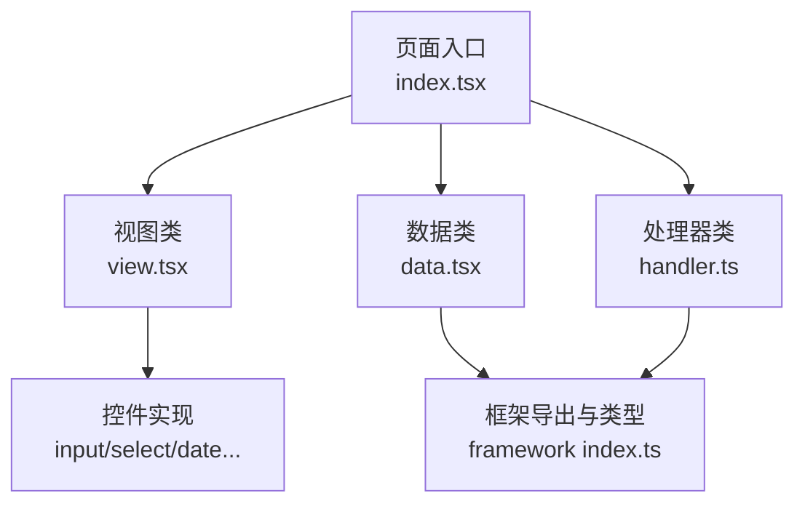
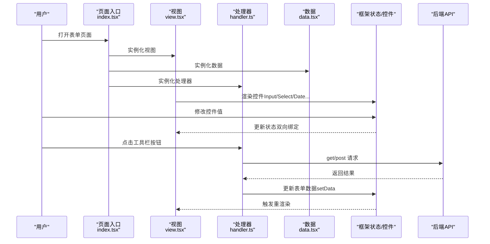
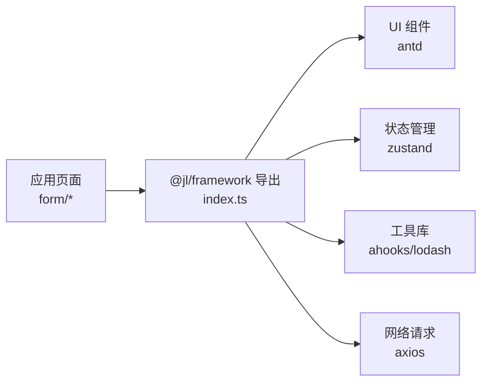

# 表单页面

<cite>
**本文引用的文件**
- [apps/demo/src/pages/base/form/index.tsx](file://apps/demo/src/pages/base/form/index.tsx)
- [apps/demo/src/pages/base/form/view.tsx](file://apps/demo/src/pages/base/form/view.tsx)
- [apps/demo/src/pages/base/form/handler.ts](file://apps/demo/src/pages/base/form/handler.ts)
- [apps/demo/src/pages/base/form/data.tsx](file://apps/demo/src/pages/base/form/data.tsx)
- [apps/demo/src/pages/composite/formAndTable/index.tsx](file://apps/demo/src/pages/composite/formAndTable/index.tsx)
- [packages/framework/src/index.ts](file://packages/framework/src/index.ts)
- [packages/framework/src/interface.ts](file://packages/framework/src/interface.ts)
- [packages/framework/src/comp/control/input/ctrlInput.tsx](file://packages/framework/src/comp/control/input/ctrlInput.tsx)
- [packages/framework/src/comp/control/select/ctrlSelect.tsx](file://packages/framework/src/comp/control/select/ctrlSelect.tsx)
- [packages/framework/src/comp/control/date/ctrlDate.tsx](file://packages/framework/src/comp/control/date/ctrlDate.tsx)
- [docs/2.组件用法.md](file://docs/2.组件用法.md)
</cite>

## 目录
1. [简介](#简介)
2. [项目结构](#项目结构)
3. [核心组件](#核心组件)
4. [架构总览](#架构总览)
5. [详细组件分析](#详细组件分析)
6. [依赖分析](#依赖分析)
7. [性能考虑](#性能考虑)
8. [故障排查指南](#故障排查指南)
9. [结论](#结论)
10. [附录](#附录)

## 简介
本文件面向使用本项目框架开发“表单页面”的工程师与产品实现人员，系统性说明如何配置各类表单字段（输入框、选择器、日期选择器等），包括字段验证规则、必填项设置、动态显示控制等；并详细说明表单数据的获取、提交、重置等操作方式。同时提供复杂表单的实现思路（嵌套表单、动态表单、表单联动）以及前后端 API 集成与错误处理机制，最后给出性能优化与用户体验改进的最佳实践。

## 项目结构
本项目采用“视图-数据-处理器”三层分离的组织方式：
- 视图层（View）：声明式配置表单结构与控件类型，定义工具栏按钮与布局。
- 数据层（Data）：声明表单的数据源与接口地址，供框架自动拉取与绑定。
- 处理器层（Handler）：封装业务事件（如设置数据、发起 GET/POST 请求）。
- 入口层（Index）：通过 ViewRoot 将三者装配为可运行的页面。

图表来源
- [apps/demo/src/pages/base/form/index.tsx:1-10](file://apps/demo/src/pages/base/form/index.tsx#L1-L10)
- [apps/demo/src/pages/base/form/view.tsx:1-99](file://apps/demo/src/pages/base/form/view.tsx#L1-L99)
- [apps/demo/src/pages/base/form/data.tsx:1-10](file://apps/demo/src/pages/base/form/data.tsx#L1-L10)
- [apps/demo/src/pages/base/form/handler.ts:1-18](file://apps/demo/src/pages/base/form/handler.ts#L1-L18)
- [packages/framework/src/index.ts:1-69](file://packages/framework/src/index.ts#L1-L69)

章节来源
- [apps/demo/src/pages/base/form/index.tsx:1-10](file://apps/demo/src/pages/base/form/index.tsx#L1-L10)
- [apps/demo/src/pages/base/form/view.tsx:1-99](file://apps/demo/src/pages/base/form/view.tsx#L1-L99)
- [apps/demo/src/pages/base/form/data.tsx:1-10](file://apps/demo/src/pages/base/form/data.tsx#L1-L10)
- [apps/demo/src/pages/base/form/handler.ts:1-18](file://apps/demo/src/pages/base/form/handler.ts#L1-L18)
- [packages/framework/src/index.ts:1-69](file://packages/framework/src/index.ts#L1-L69)

## 核心组件
- 视图基类与类型：通过 ViewBase 与 VProps.Form 声明表单结构，items 数组描述每个字段的标题、字段名与控件类型。
- 控件工厂与具体控件：框架提供统一控件枚举 Ctrl，具体控件如 Input、Select、Date 等由框架内部实现，负责与状态管理对接。
- 数据基类：DataBase 用于声明 mainForm 的 id 与 url，框架据此进行数据绑定与网络请求。
- 处理器基类：HandlerBase 提供 setData、get、post 等方法，便于在事件中操作表单数据或发起请求。

章节来源
- [packages/framework/src/index.ts:1-69](file://packages/framework/src/index.ts#L1-L69)
- [packages/framework/src/interface.ts:1-35](file://packages/framework/src/interface.ts#L1-L35)
- [apps/demo/src/pages/base/form/view.tsx:1-99](file://apps/demo/src/pages/base/form/view.tsx#L1-L99)
- [apps/demo/src/pages/base/form/data.tsx:1-10](file://apps/demo/src/pages/base/form/data.tsx#L1-L10)
- [apps/demo/src/pages/base/form/handler.ts:1-18](file://apps/demo/src/pages/base/form/handler.ts#L1-L18)

## 架构总览
下图展示了从页面入口到控件渲染与数据绑定的整体流程，以及处理器与后端 API 的交互路径。

图表来源
- [apps/demo/src/pages/base/form/index.tsx:1-10](file://apps/demo/src/pages/base/form/index.tsx#L1-L10)
- [apps/demo/src/pages/base/form/view.tsx:1-99](file://apps/demo/src/pages/base/form/view.tsx#L1-L99)
- [apps/demo/src/pages/base/form/handler.ts:1-18](file://apps/demo/src/pages/base/form/handler.ts#L1-L18)
- [apps/demo/src/pages/base/form/data.tsx:1-10](file://apps/demo/src/pages/base/form/data.tsx#L1-L10)
- [packages/framework/src/index.ts:1-69](file://packages/framework/src/index.ts#L1-L69)

## 详细组件分析

### 表单字段配置与控件映射
- 文本与输入：通过 items 中的 field 与 ctrl.type=Ctrl.Text/Ctrl.Input 配置，默认行为即绑定到对应字段。
- 选择器：ctrl.type=Ctrl.Select，并通过 items 传入选项列表。
- 开关与单选/多选：分别使用 Ctrl.Switch、Ctrl.Radio、Ctrl.Checkbox，其中 Radio/Checkbox 支持 items 选项。
- 日期与时间：Ctrl.Date、Ctrl.DateRange、Ctrl.Time、Ctrl.TimeRange，支持 format、showTime、placeholder、disabled 等属性。
- 链接与上传：Ctrl.Link 支持跳转目标；Ctrl.Upload 用于文件上传。
- 工具栏按钮：toolList 中可添加 Button，绑定处理器方法以执行设置数据、发起请求等操作。

章节来源
- [apps/demo/src/pages/base/form/view.tsx:1-99](file://apps/demo/src/pages/base/form/view.tsx#L1-L99)
- [docs/2.组件用法.md:86-278](file://docs/2.组件用法.md#L86-L278)

### 字段验证规则与必填项设置
- 当前示例未显式展示校验规则配置。通常可在以下位置扩展：
  - 控件层：在具体控件实现中增加校验逻辑（如必填、格式校验），并在 UI 上反馈错误信息。
  - 视图层：在提交前对表单数据进行校验，再决定是否调用 post/get。
  - 处理器层：在数据处理阶段集中校验，结合错误提示与回滚策略。
- 建议做法：
  - 将校验规则与字段元数据解耦，便于复用与维护。
  - 对异步校验（如唯一性检查）进行防抖与缓存，避免频繁请求。
  - 对错误信息进行本地化与友好提示。

[本节为通用指导，不直接分析具体文件]

### 动态显示控制与表单联动
- 动态显示：可通过条件渲染或控件的 disabled/visible 等属性实现。建议在视图中根据状态计算是否显示某字段。
- 表单联动：当某个字段变化时，通过处理器更新相关字段的状态，从而驱动其他控件的值或可见性变化。
- 推荐模式：
  - 使用统一的 state 管理所有字段值，变更一处即可联动多处。
  - 将联动逻辑集中在处理器中，保持视图简洁。

[本节为通用指导，不直接分析具体文件]

### 表单数据的获取、提交与重置
- 数据获取：
  - 在 data.tsx 中声明 mainForm 的 id 与 url，框架会基于该配置进行数据绑定与请求。
  - 也可通过 handler.get(url, params) 主动拉取数据并写入表单。
- 数据提交：
  - 使用 handler.post(url, payload) 提交表单数据。
  - 提交前可在处理器中进行数据组装与校验。
- 数据重置：
  - 可使用 setData 将指定路径的值设置为初始值或空值。
  - 对于复杂表单，建议维护一份“初始快照”，在重置时恢复。

章节来源
- [apps/demo/src/pages/base/form/data.tsx:1-10](file://apps/demo/src/pages/base/form/data.tsx#L1-L10)
- [apps/demo/src/pages/base/form/handler.ts:1-18](file://apps/demo/src/pages/base/form/handler.ts#L1-L18)

### 复杂表单实现（嵌套、动态、联动）
- 嵌套表单：
  - 通过 path 将不同表单区域的数据隔离到不同的命名空间，避免冲突。
  - 在 view 中为每个子表单定义独立的 items 与 toolList。
- 动态表单：
  - 根据运行时条件生成 items 列表，实现按需渲染。
  - 结合选择器的联动，动态增减字段。
- 表单联动：
  - 在一个字段 onChange 中调用 setData 更新关联字段。
  - 将联动规则集中管理，便于测试与维护。

[本节为通用指导，不直接分析具体文件]

### 与后端 API 的集成与错误处理
- 集成方式：
  - 使用 handler.get/post 发起请求，参数与路径按约定配置。
  - 在 data.tsx 中声明 mainForm.url，框架可自动绑定数据。
- 错误处理：
  - 在处理器中对请求异常进行捕获，统一提示。
  - 对部分失败场景进行局部回滚或重试。
  - 结合 UI 反馈（如消息提示、禁用提交按钮）提升体验。

章节来源
- [apps/demo/src/pages/base/form/handler.ts:1-18](file://apps/demo/src/pages/base/form/handler.ts#L1-L18)
- [apps/demo/src/pages/base/form/data.tsx:1-10](file://apps/demo/src/pages/base/form/data.tsx#L1-L10)

### 控件实现细节与数据绑定
- 输入框控件：
  - 通过 useDataState 读取与设置值，onChange 中更新状态。
  - 在表格上下文中自动调整对齐方式。
- 选择器控件：
  - 绑定 value 与 options，onChange 更新选中值。
- 日期控件：
  - 支持 format、showTime、placeholder、disabled 等属性，onChange 将字符串值写入状态。

章节来源
- [packages/framework/src/comp/control/input/ctrlInput.tsx:1-25](file://packages/framework/src/comp/control/input/ctrlInput.tsx#L1-L25)
- [packages/framework/src/comp/control/select/ctrlSelect.tsx:1-23](file://packages/framework/src/comp/control/select/ctrlSelect.tsx#L1-L23)
- [packages/framework/src/comp/control/date/ctrlDate.tsx:1-33](file://packages/framework/src/comp/control/date/ctrlDate.tsx#L1-L33)

### 视图装配与根节点
- 页面入口通过 ViewRoot 将 ViewClass、DataClass、HandlerClass 装配在一起，形成完整页面。
- 视图类中定义 layout 与 getRootId，作为根容器标识。

章节来源
- [apps/demo/src/pages/base/form/index.tsx:1-10](file://apps/demo/src/pages/base/form/index.tsx#L1-L10)
- [apps/demo/src/pages/base/form/view.tsx:89-99](file://apps/demo/src/pages/base/form/view.tsx#L89-L99)

## 依赖分析
- 框架导出：
  - ViewRoot、HandlerBase、DataBase、VType、Ctrl、VProps 等核心能力由框架统一导出。
- 应用侧依赖：
  - 页面仅关注视图配置、数据处理与事件编排，降低耦合度。
- 外部依赖：
  - 框架依赖 antd、ahooks、zustand、axios 等库，提供 UI 组件、状态管理与网络请求能力。

图表来源
- [packages/framework/src/index.ts:1-69](file://packages/framework/src/index.ts#L1-L69)
- [packages/framework/package.json:25-34](file://packages/framework/package.json#L25-L34)

章节来源
- [packages/framework/src/index.ts:1-69](file://packages/framework/src/index.ts#L1-L69)
- [packages/framework/package.json:1-52](file://packages/framework/package.json#L1-L52)

## 性能考虑
- 减少不必要的重渲染：
  - 仅在必要时更新状态，避免大范围刷新。
  - 对大列表或复杂控件进行虚拟化或懒加载。
- 优化网络请求：
  - 对重复请求进行缓存与去抖。
  - 合并多次提交为一次批量请求。
- 提升交互响应：
  - 使用 useMemoizedFn 包裹回调，避免重复创建函数。
  - 对长耗时操作进行异步处理与进度反馈。
- 资源与样式：
  - 按需引入控件与样式，减少包体积。
  - 合理使用 CSS-in-JS 或静态样式，避免运行时开销。

[本节为通用指导，不直接分析具体文件]

## 故障排查指南
- 常见问题定位：
  - 字段值未更新：检查 path 是否正确、useDataState 绑定是否生效。
  - 选择器无选项：确认 items 数据结构是否符合 {label, value}。
  - 日期格式异常：核对 format 配置与后端期望格式一致。
  - 请求失败：查看 handler.get/post 的路径与参数，检查后端接口与跨域配置。
- 调试建议：
  - 在处理器中打印关键状态与请求参数。
  - 使用浏览器开发者工具观察网络请求与状态树变化。
  - 逐步缩小问题范围，先复现最小用例。

[本节为通用指导，不直接分析具体文件]

## 结论
本项目通过声明式视图配置与统一控件体系，显著降低了表单页面的开发复杂度。借助框架提供的数据绑定、处理器方法与控件实现，可以快速构建包含多种字段类型的复杂表单，并实现与后端的稳定集成。遵循本文档的配置规范与最佳实践，可有效提升开发效率与用户体验。

[本节为总结性内容，不直接分析具体文件]

## 附录
- 参考文档：
  - 组件用法文档提供了各控件的使用示例与布局组合方式，可作为快速上手参考。
- 复合页面：
  - 表单与表格联合页面可作为复杂业务场景的起点，结合导航与路由实现多模块协作。

章节来源
- [docs/2.组件用法.md:1-455](file://docs/2.组件用法.md#L1-L455)
- [apps/demo/src/pages/composite/formAndTable/index.tsx:1-10](file://apps/demo/src/pages/composite/formAndTable/index.tsx#L1-L10)