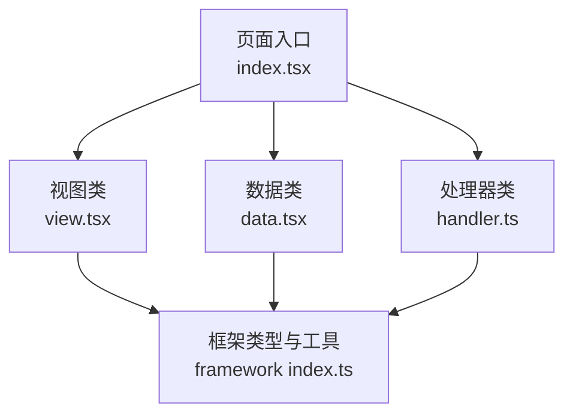
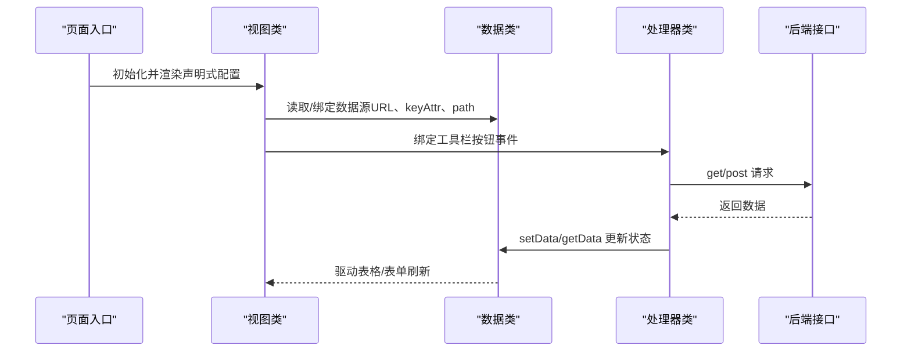
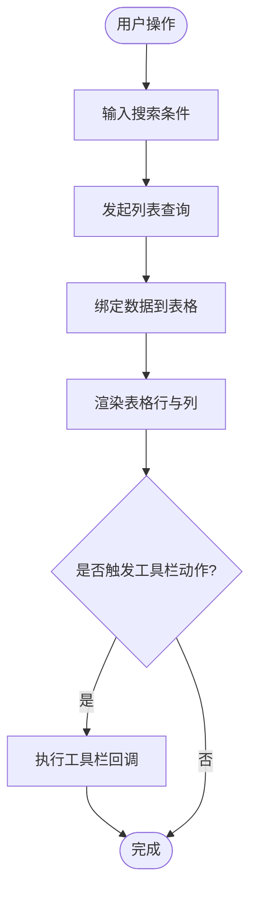
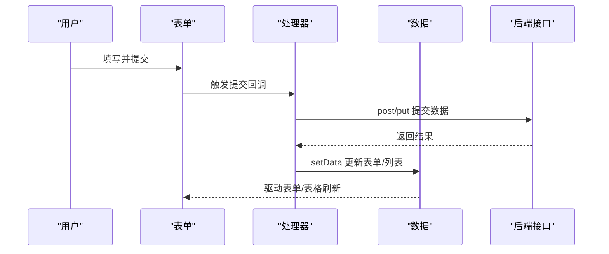
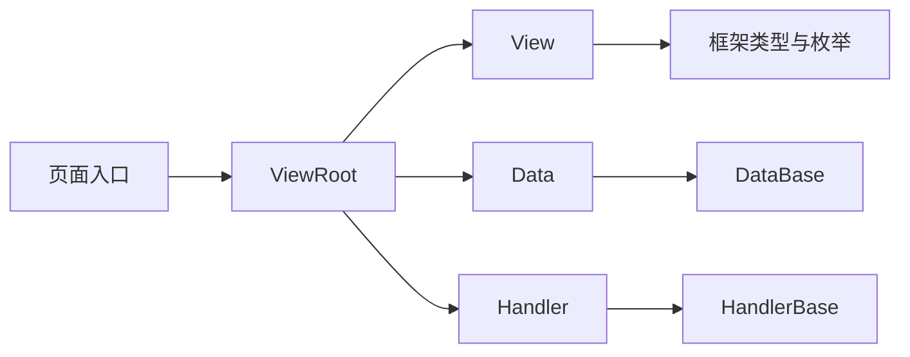

# 表格页面

<cite>
**本文引用的文件**
- [apps/demo/src/pages/base/table/index.tsx](file://apps/demo/src/pages/base/table/index.tsx)
- [apps/demo/src/pages/base/table/view.tsx](file://apps/demo/src/pages/base/table/view.tsx)
- [apps/demo/src/pages/base/table/data.tsx](file://apps/demo/src/pages/base/table/data.tsx)
- [apps/demo/src/pages/base/table/handler.ts](file://apps/demo/src/pages/base/table/handler.ts)
- [packages/framework/src/index.ts](file://packages/framework/src/index.ts)
- [packages/framework/src/interface.ts](file://packages/framework/src/interface.ts)
- [docs/2.组件用法.md](file://docs/2.组件用法.md)
</cite>

## 目录
1. [简介](#简介)
2. [项目结构](#项目结构)
3. [核心组件](#核心组件)
4. [架构总览](#架构总览)
5. [详细组件分析](#详细组件分析)
6. [依赖关系分析](#依赖关系分析)
7. [性能考虑](#性能考虑)
8. [故障排查指南](#故障排查指南)
9. [结论](#结论)
10. [附录](#附录)

## 简介
本章节面向使用声明式配置构建复杂表格页面的开发者，聚焦以下目标：
- 如何使用声明式配置创建包含搜索条件、列定义、工具栏按钮的表格界面
- 表格的数据绑定机制、分页处理、排序筛选能力
- 基于框架的 CRUD 操作、批量操作与数据导出模式
- 表格与表单的组合使用方式，以及复杂数据交互场景的处理
- 性能优化技巧与最佳实践

## 项目结构
该示例采用“视图-数据-处理器”三段式组织：
- 入口页通过 ViewRoot 装配 View、Data、Handler
- View 负责声明式配置（表格、表单、布局）
- Data 管理数据源与路径绑定
- Handler 处理事件、请求与数据读写

图表来源
- [apps/demo/src/pages/base/table/index.tsx:1-10](file://apps/demo/src/pages/base/table/index.tsx#L1-L10)
- [packages/framework/src/index.ts:12-30](file://packages/framework/src/index.ts#L12-L30)

章节来源
- [apps/demo/src/pages/base/table/index.tsx:1-10](file://apps/demo/src/pages/base/table/index.tsx#L1-L10)
- [packages/framework/src/index.ts:12-30](file://packages/framework/src/index.ts#L12-L30)

## 核心组件
- 视图层（ViewBase）：以声明式配置描述 UI，包括 Table、Form、LayoutFlex 等
- 数据层（DataBase）：集中管理数据源 URL、键属性、路径绑定
- 处理器层（HandlerBase）：提供 getData/setData、get/post 请求、统计打印等能力
- 框架出口（@jl/framework）：统一暴露类型、工具与基础类

章节来源
- [apps/demo/src/pages/base/table/view.tsx:1-86](file://apps/demo/src/pages/base/table/view.tsx#L1-L86)
- [apps/demo/src/pages/base/table/data.tsx:1-22](file://apps/demo/src/pages/base/table/data.tsx#L1-L22)
- [apps/demo/src/pages/base/table/handler.ts:1-30](file://apps/demo/src/pages/base/table/handler.ts#L1-L30)
- [packages/framework/src/index.ts:12-30](file://packages/framework/src/index.ts#L12-L30)

## 架构总览
下图展示了从页面到框架的调用链与数据流向。

图表来源
- [apps/demo/src/pages/base/table/index.tsx:1-10](file://apps/demo/src/pages/base/table/index.tsx#L1-L10)
- [apps/demo/src/pages/base/table/view.tsx:1-86](file://apps/demo/src/pages/base/table/view.tsx#L1-L86)
- [apps/demo/src/pages/base/table/data.tsx:1-22](file://apps/demo/src/pages/base/table/data.tsx#L1-L22)
- [apps/demo/src/pages/base/table/handler.ts:1-30](file://apps/demo/src/pages/base/table/handler.ts#L1-L30)

## 详细组件分析

### 表格组件（Table）
- 声明式配置要点
  - id/type：标识与组件类型
  - dataId：关联数据源 ID，用于自动拉取与绑定列表数据
  - searchItems：搜索项集合，支持按字段过滤
  - items：列定义集合，支持标题、字段映射及扩展配置
- 数据绑定
  - 通过 dataId 指向 Data 中定义的 mainTable，自动建立 URL 与 keyAttr 的对应关系
- 交互能力
  - 结合工具栏按钮触发查询、新增、编辑、删除、导出等操作
  - 可配合 Form 进行新增/编辑数据的录入与提交

图表来源
- [apps/demo/src/pages/base/table/view.tsx:6-30](file://apps/demo/src/pages/base/table/view.tsx#L6-L30)
- [apps/demo/src/pages/base/table/data.tsx:3-8](file://apps/demo/src/pages/base/table/data.tsx#L3-L8)

章节来源
- [apps/demo/src/pages/base/table/view.tsx:6-30](file://apps/demo/src/pages/base/table/view.tsx#L6-L30)
- [apps/demo/src/pages/base/table/data.tsx:3-8](file://apps/demo/src/pages/base/table/data.tsx#L3-L8)

### 表单组件（Form）
- 声明式配置要点
  - id/type：标识与组件类型
  - dataId/path：绑定到具体数据节点，如 formData
  - items：表单项集合，支持多种控件类型
  - toolList：工具栏按钮集合，绑定处理器方法
- 与表格联动
  - 可通过 path 将表单数据与表格当前选中行或新建记录关联
  - 提交后刷新表格数据

图表来源
- [apps/demo/src/pages/base/table/view.tsx:32-74](file://apps/demo/src/pages/base/table/view.tsx#L32-L74)
- [apps/demo/src/pages/base/table/handler.ts:1-30](file://apps/demo/src/pages/base/table/handler.ts#L1-L30)
- [apps/demo/src/pages/base/table/data.tsx:15-18](file://apps/demo/src/pages/base/table/data.tsx#L15-L18)

章节来源
- [apps/demo/src/pages/base/table/view.tsx:32-74](file://apps/demo/src/pages/base/table/view.tsx#L32-L74)
- [apps/demo/src/pages/base/table/handler.ts:1-30](file://apps/demo/src/pages/base/table/handler.ts#L1-L30)
- [apps/demo/src/pages/base/table/data.tsx:15-18](file://apps/demo/src/pages/base/table/data.tsx#L15-L18)

### 布局组件（Flex）
- 通过 Flex 将表单与表格并列展示，便于组合使用
- 使用 items 引用子组件 id，实现布局编排

章节来源
- [apps/demo/src/pages/base/table/view.tsx:76-82](file://apps/demo/src/pages/base/table/view.tsx#L76-L82)

### 数据层（Data）
- 管理数据源与路径
  - mainTable：定义列表数据 URL 与 keyAttr
  - mainFormData：通过 path 绑定到 active 表格行的数据上下文
- 与视图联动
  - View 通过 dataId 关联 Data 中的资源，实现自动数据绑定

章节来源
- [apps/demo/src/pages/base/table/data.tsx:3-18](file://apps/demo/src/pages/base/table/data.tsx#L3-L18)

### 处理器（Handler）
- 提供常用能力
  - getData/setData：读取/写入数据节点
  - get/post：发起网络请求
  - printStats/resetStats：性能统计与重置
- 与 UI 联动
  - 工具栏按钮 onClick 直接绑定处理器方法

章节来源
- [apps/demo/src/pages/base/table/handler.ts:1-30](file://apps/demo/src/pages/base/table/handler.ts#L1-L30)
- [packages/framework/src/index.ts:67-69](file://packages/framework/src/index.ts#L67-L69)

## 依赖关系分析
- 页面入口依赖 ViewRoot，传入 View/Data/Handler 三类构造器
- View 依赖框架的类型与控件枚举（VType/Ctrl），并通过 dataId 与 Data 关联
- Data 依赖 DataBase 基类，管理数据源与路径
- Handler 依赖 HandlerBase，提供通用数据与请求能力

图表来源
- [apps/demo/src/pages/base/table/index.tsx:1-10](file://apps/demo/src/pages/base/table/index.tsx#L1-L10)
- [packages/framework/src/index.ts:12-30](file://packages/framework/src/index.ts#L12-L30)
- [packages/framework/src/interface.ts:20-34](file://packages/framework/src/interface.ts#L20-L34)

章节来源
- [apps/demo/src/pages/base/table/index.tsx:1-10](file://apps/demo/src/pages/base/table/index.tsx#L1-L10)
- [packages/framework/src/interface.ts:20-34](file://packages/framework/src/interface.ts#L20-L34)

## 性能考虑
- 合理使用 searchItems 与服务端分页，避免一次性加载过多数据
- 利用 getData/setData 精准更新数据节点，减少不必要的重渲染
- 使用 printStats/resetStats 监控 getData 的使用情况，定位热点路径
- 在列定义中按需启用排序/筛选，避免对全量数据做前端计算
- 对图片/富文本等大体积字段进行懒加载或虚拟滚动

[本节为通用指导，不直接分析具体文件]

## 故障排查指南
- 表格无数据
  - 检查 dataId 是否正确指向 Data 中的 mainTable
  - 确认 URL 与 keyAttr 配置正确
- 表单无法更新表格
  - 检查表单 dataId/path 是否与表格数据节点一致
  - 确保提交后调用 setData 更新相关节点
- 工具栏按钮无效
  - 确认 onClick 已绑定到 Handler 的方法
  - 检查方法内是否有正确的 get/post 与 setData 调用
- 性能问题
  - 使用 printStats 查看 getData 调用次数与耗时
  - 调整 searchItems 与服务端分页策略

章节来源
- [apps/demo/src/pages/base/table/handler.ts:1-30](file://apps/demo/src/pages/base/table/handler.ts#L1-L30)
- [apps/demo/src/pages/base/table/data.tsx:3-18](file://apps/demo/src/pages/base/table/data.tsx#L3-L18)
- [apps/demo/src/pages/base/table/view.tsx:6-74](file://apps/demo/src/pages/base/table/view.tsx#L6-L74)

## 结论
通过声明式配置，可以快速搭建具备搜索、列定义、工具栏的复杂表格界面；借助框架的数据绑定与处理器能力，能够高效实现 CRUD、批量操作与导出等功能。合理设计数据路径与请求策略，并结合性能监控工具，可获得稳定且高效的表格体验。

[本节为总结性内容，不直接分析具体文件]

## 附录

### 声明式配置速查
- 表格
  - id/type/dataId/searchItems/items
- 表单
  - id/type/dataId/path/items/toolList
- 布局
  - Flex/Tab/Modal 等布局容器，通过 items 引用子组件 id

章节来源
- [apps/demo/src/pages/base/table/view.tsx:6-82](file://apps/demo/src/pages/base/table/view.tsx#L6-L82)
- [docs/2.组件用法.md:347-428](file://docs/2.组件用法.md#L347-L428)

### 常见交互流程示例（步骤说明）
- 新增数据
  - 在表单中填写数据 -> 点击提交 -> 调用 post 请求 -> 成功后 setData 更新列表 -> 表格刷新
- 编辑数据
  - 选择表格行 -> 打开表单并填充数据 -> 修改后提交 -> 调用 put 请求 -> 成功后 setData 更新列表 -> 表格刷新
- 删除数据
  - 选择表格行 -> 点击删除 -> 调用 delete 请求 -> 成功后 setData 更新列表 -> 表格刷新
- 批量操作
  - 勾选多行 -> 点击批量按钮 -> 调用批量接口 -> 成功后 setData 更新列表 -> 表格刷新
- 数据导出
  - 点击导出按钮 -> 调用导出接口 -> 下载文件或生成报表

[本节为概念性流程说明，不直接分析具体文件]