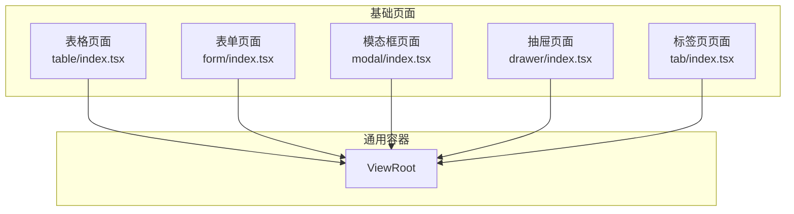
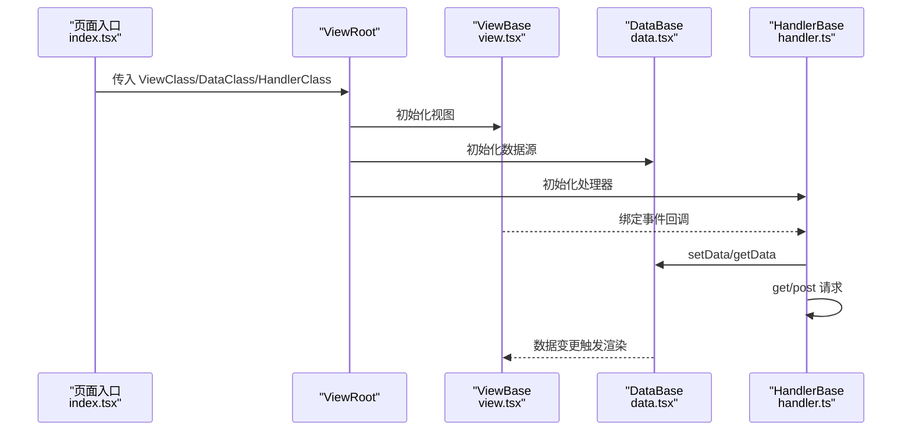
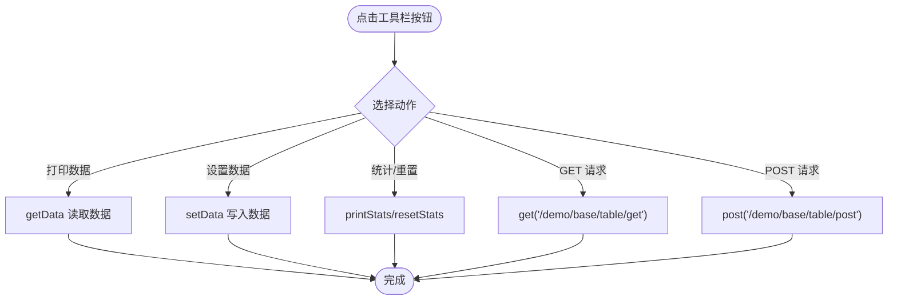
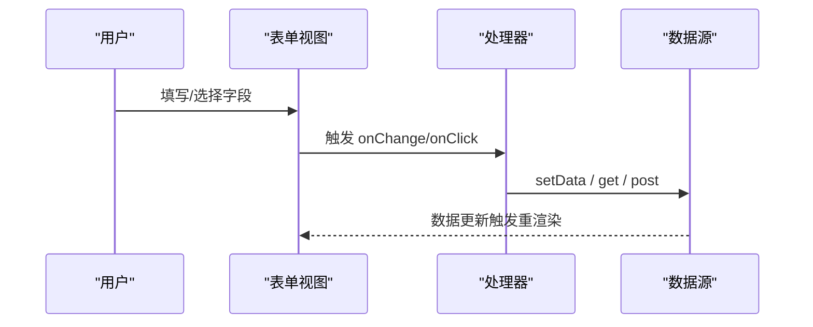
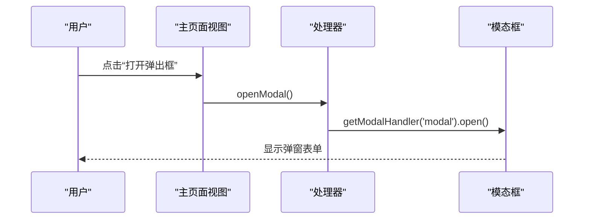
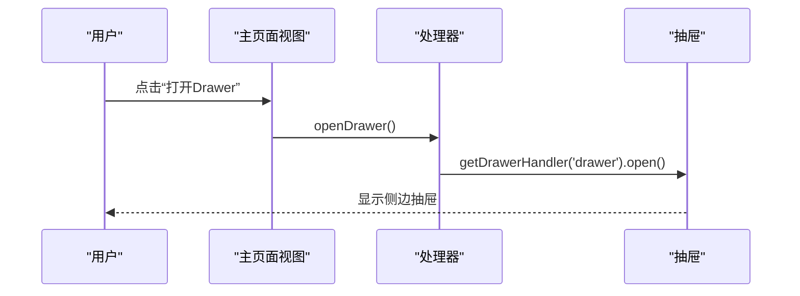
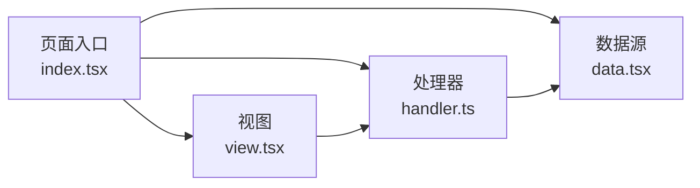

# 页面类型

<cite>
**本文引用的文件**
- [apps/demo/src/pages/base/table/index.tsx](file://apps/demo/src/pages/base/table/index.tsx)
- [apps/demo/src/pages/base/table/view.tsx](file://apps/demo/src/pages/base/table/view.tsx)
- [apps/demo/src/pages/base/table/data.tsx](file://apps/demo/src/pages/base/table/data.tsx)
- [apps/demo/src/pages/base/table/handler.ts](file://apps/demo/src/pages/base/table/handler.ts)
- [apps/demo/src/pages/base/form/index.tsx](file://apps/demo/src/pages/base/form/index.tsx)
- [apps/demo/src/pages/base/form/view.tsx](file://apps/demo/src/pages/base/form/view.tsx)
- [apps/demo/src/pages/base/form/data.tsx](file://apps/demo/src/pages/base/form/data.tsx)
- [apps/demo/src/pages/base/form/handler.ts](file://apps/demo/src/pages/base/form/handler.ts)
- [apps/demo/src/pages/base/modal/index.tsx](file://apps/demo/src/pages/base/modal/index.tsx)
- [apps/demo/src/pages/base/modal/view.tsx](file://apps/demo/src/pages/base/modal/view.tsx)
- [apps/demo/src/pages/base/modal/data.tsx](file://apps/demo/src/pages/base/modal/data.tsx)
- [apps/demo/src/pages/base/modal/handler.ts](file://apps/demo/src/pages/base/modal/handler.ts)
- [apps/demo/src/pages/base/drawer/index.tsx](file://apps/demo/src/pages/base/drawer/index.tsx)
- [apps/demo/src/pages/base/drawer/view.tsx](file://apps/demo/src/pages/base/drawer/view.tsx)
- [apps/demo/src/pages/base/tab/index.tsx](file://apps/demo/src/pages/base/tab/index.tsx)
</cite>

## 目录
1. [简介](#简介)
2. [项目结构](#项目结构)
3. [核心组件](#核心组件)
4. [架构总览](#架构总览)
5. [详细组件分析](#详细组件分析)
6. [依赖分析](#依赖分析)
7. [性能考虑](#性能考虑)
8. [故障排查指南](#故障排查指南)
9. [结论](#结论)
10. [附录](#附录)

## 简介
本指南面向使用统一框架的页面开发，覆盖表格、表单、模态框、抽屉与标签页五种常见页面类型。文档基于仓库中的示例实现，总结每种页面的配置项、交互逻辑、数据获取与状态管理方式，并给出页面间通信与组合使用的最佳实践与性能优化建议。读者无需深入源码即可快速上手，同时为进阶开发者提供可追溯的代码路径。

## 项目结构
本项目采用“按功能域组织”的结构：每个基础页面位于 apps/demo/src/pages/base/<类型> 目录下，包含 index.tsx（页面入口）、view.tsx（视图配置）、data.tsx（数据源配置）、handler.ts（事件与业务处理）。所有页面通过统一的 ViewRoot 容器挂载，内部由框架提供的 ViewBase/HandlerBase/DataBase 抽象类驱动。

图表来源
- [apps/demo/src/pages/base/table/index.tsx:1-10](file://apps/demo/src/pages/base/table/index.tsx#L1-L10)
- [apps/demo/src/pages/base/form/index.tsx:1-10](file://apps/demo/src/pages/base/form/index.tsx#L1-L10)
- [apps/demo/src/pages/base/modal/index.tsx:1-9](file://apps/demo/src/pages/base/modal/index.tsx#L1-L9)
- [apps/demo/src/pages/base/drawer/index.tsx:1-10](file://apps/demo/src/pages/base/drawer/index.tsx#L1-L10)
- [apps/demo/src/pages/base/tab/index.tsx:1-9](file://apps/demo/src/pages/base/tab/index.tsx#L1-L9)

章节来源
- [apps/demo/src/pages/base/table/index.tsx:1-10](file://apps/demo/src/pages/base/table/index.tsx#L1-L10)
- [apps/demo/src/pages/base/form/index.tsx:1-10](file://apps/demo/src/pages/base/form/index.tsx#L1-L10)
- [apps/demo/src/pages/base/modal/index.tsx:1-9](file://apps/demo/src/pages/base/modal/index.tsx#L1-L9)
- [apps/demo/src/pages/base/drawer/index.tsx:1-10](file://apps/demo/src/pages/base/drawer/index.tsx#L1-L10)
- [apps/demo/src/pages/base/tab/index.tsx:1-9](file://apps/demo/src/pages/base/tab/index.tsx#L1-L9)

## 核心组件
- ViewRoot：页面容器，接收 ViewClass、DataClass、HandlerClass，负责将三者装配到运行时。
- ViewBase：视图基类，用于声明式定义布局、控件与组件关系，导出 getRootId 指定根节点。
- HandlerBase：处理器基类，提供 getData/setData、get/post 请求、openModal/getModalHandler 等能力。
- DataBase：数据源基类，声明数据模型、URL、键字段、路径绑定等。

这些抽象类在各类页面中复用，确保一致的交互与数据流。

章节来源
- [apps/demo/src/pages/base/table/view.tsx:1-86](file://apps/demo/src/pages/base/table/view.tsx#L1-L86)
- [apps/demo/src/pages/base/table/handler.ts:1-30](file://apps/demo/src/pages/base/table/handler.ts#L1-L30)
- [apps/demo/src/pages/base/table/data.tsx:1-22](file://apps/demo/src/pages/base/table/data.tsx#L1-L22)
- [apps/demo/src/pages/base/form/view.tsx:1-99](file://apps/demo/src/pages/base/form/view.tsx#L1-L99)
- [apps/demo/src/pages/base/form/handler.ts:1-18](file://apps/demo/src/pages/base/form/handler.ts#L1-L18)
- [apps/demo/src/pages/base/form/data.tsx:1-10](file://apps/demo/src/pages/base/form/data.tsx#L1-L10)
- [apps/demo/src/pages/base/modal/view.tsx:1-46](file://apps/demo/src/pages/base/modal/view.tsx#L1-L46)
- [apps/demo/src/pages/base/modal/handler.ts:1-10](file://apps/demo/src/pages/base/modal/handler.ts#L1-L10)
- [apps/demo/src/pages/base/modal/data.tsx:1-10](file://apps/demo/src/pages/base/modal/data.tsx#L1-L10)
- [apps/demo/src/pages/base/drawer/view.tsx:1-47](file://apps/demo/src/pages/base/drawer/view.tsx#L1-L47)

## 架构总览
下图展示一个典型页面的运行流程：页面入口通过 ViewRoot 注入视图、数据与处理器；视图声明布局与控件；处理器响应事件并读写数据或发起网络请求；数据层根据配置自动拉取或更新数据。

图表来源
- [apps/demo/src/pages/base/table/index.tsx:1-10](file://apps/demo/src/pages/base/table/index.tsx#L1-L10)
- [apps/demo/src/pages/base/table/view.tsx:1-86](file://apps/demo/src/pages/base/table/view.tsx#L1-L86)
- [apps/demo/src/pages/base/table/data.tsx:1-22](file://apps/demo/src/pages/base/table/data.tsx#L1-L22)
- [apps/demo/src/pages/base/table/handler.ts:1-30](file://apps/demo/src/pages/base/table/handler.ts#L1-L30)

## 详细组件分析

### 表格页面（Table）
- 目标：展示列表数据，支持搜索、列配置、工具栏操作与数据联动。
- 关键配置
  - 表格实例：id、type、dataId 指向数据源；searchItems 定义搜索项；items 定义列。
  - 表单实例：与表格共享数据路径，便于编辑后回写。
  - 布局：Flex 容器将表单与表格并列。
- 数据与请求
  - 数据源声明 URL、keyAttr 等；表单数据通过 path 绑定到表格当前行。
  - 处理器提供打印数据、设置数据、统计与重置、GET/POST 请求等方法。
- 交互要点
  - 工具栏按钮调用处理器方法，完成数据读取/写入与网络请求。
  - 通过 PathKey 与 getData/setData 精准定位数据路径。

图表来源
- [apps/demo/src/pages/base/table/handler.ts:1-30](file://apps/demo/src/pages/base/table/handler.ts#L1-L30)
- [apps/demo/src/pages/base/table/view.tsx:1-86](file://apps/demo/src/pages/base/table/view.tsx#L1-L86)
- [apps/demo/src/pages/base/table/data.tsx:1-22](file://apps/demo/src/pages/base/table/data.tsx#L1-L22)

章节来源
- [apps/demo/src/pages/base/table/view.tsx:1-86](file://apps/demo/src/pages/base/table/view.tsx#L1-L86)
- [apps/demo/src/pages/base/table/data.tsx:1-22](file://apps/demo/src/pages/base/table/data.tsx#L1-L22)
- [apps/demo/src/pages/base/table/handler.ts:1-30](file://apps/demo/src/pages/base/table/handler.ts#L1-L30)

### 表单页面（Form）
- 目标：构建复杂表单，支持多种控件、工具栏操作与数据提交。
- 关键配置
  - 表单实例：path 绑定数据路径；items 定义字段与控件类型（文本、输入、选择、开关、单选、复选、日期、时间、链接、上传等）。
  - 工具栏：提供设置数据、POST/GET 请求等操作。
- 数据与请求
  - 数据源声明 URL；处理器通过 setData/getData 与 get/post 进行数据交互。
- 交互要点
  - 表单字段与数据路径一一对应，修改即更新；工具栏触发处理器执行副作用。

图表来源
- [apps/demo/src/pages/base/form/view.tsx:1-99](file://apps/demo/src/pages/base/form/view.tsx#L1-L99)
- [apps/demo/src/pages/base/form/handler.ts:1-18](file://apps/demo/src/pages/base/form/handler.ts#L1-L18)
- [apps/demo/src/pages/base/form/data.tsx:1-10](file://apps/demo/src/pages/base/form/data.tsx#L1-L10)

章节来源
- [apps/demo/src/pages/base/form/view.tsx:1-99](file://apps/demo/src/pages/base/form/view.tsx#L1-L99)
- [apps/demo/src/pages/base/form/handler.ts:1-18](file://apps/demo/src/pages/base/form/handler.ts#L1-L18)
- [apps/demo/src/pages/base/form/data.tsx:1-10](file://apps/demo/src/pages/base/form/data.tsx#L1-L10)

### 模态框页面（Modal）
- 目标：以弹窗形式承载表单或其他内容，支持打开/关闭与数据隔离。
- 关键配置
  - 表单实例：path 绑定数据路径；items 定义字段。
  - 模态框实例：viewId 指向要展示的视图；toolbar 提供打开按钮。
- 交互要点
  - 处理器通过 getModalHandler('modal').open() 打开弹窗；弹窗内表单与主页面数据解耦。

图表来源
- [apps/demo/src/pages/base/modal/view.tsx:1-46](file://apps/demo/src/pages/base/modal/view.tsx#L1-L46)
- [apps/demo/src/pages/base/modal/handler.ts:1-10](file://apps/demo/src/pages/base/modal/handler.ts#L1-L10)

章节来源
- [apps/demo/src/pages/base/modal/view.tsx:1-46](file://apps/demo/src/pages/base/modal/view.tsx#L1-L46)
- [apps/demo/src/pages/base/modal/handler.ts:1-10](file://apps/demo/src/pages/base/modal/handler.ts#L1-L10)
- [apps/demo/src/pages/base/modal/data.tsx:1-10](file://apps/demo/src/pages/base/modal/data.tsx#L1-L10)

### 抽屉页面（Drawer）
- 目标：侧边抽屉承载表单或详情，适合编辑与辅助信息展示。
- 关键配置
  - 表单实例：path 绑定数据路径；items 定义字段。
  - 抽屉实例：width 控制宽度；viewId 指向内容视图；toolbar 提供打开按钮。
- 交互要点
  - 处理器通过 getDrawerHandler('drawer').open() 打开抽屉；内容与主页面数据解耦。

图表来源
- [apps/demo/src/pages/base/drawer/view.tsx:1-47](file://apps/demo/src/pages/base/drawer/view.tsx#L1-L47)

章节来源
- [apps/demo/src/pages/base/drawer/view.tsx:1-47](file://apps/demo/src/pages/base/drawer/view.tsx#L1-L47)

### 标签页页面（Tab）
- 目标：多标签页组织内容，切换时按需加载与缓存。
- 说明：该页面遵循与其他页面相同的 ViewRoot 模式，具体标签配置与内容可在其 view.tsx 中扩展。

章节来源
- [apps/demo/src/pages/base/tab/index.tsx:1-9](file://apps/demo/src/pages/base/tab/index.tsx#L1-L9)

## 依赖分析
- 页面入口仅依赖 ViewRoot 与三个类（View/Data/Handler），保持低耦合。
- 视图依赖框架的类型与枚举（Ctrl、VType、VProps），用于声明式配置。
- 处理器依赖框架的请求与状态工具（HandlerBase、PathKey、printStats/resetStats）。
- 数据源依赖框架的数据抽象（DataBase、DataProps），集中管理 URL、键字段与路径。

图表来源
- [apps/demo/src/pages/base/table/index.tsx:1-10](file://apps/demo/src/pages/base/table/index.tsx#L1-L10)
- [apps/demo/src/pages/base/table/view.tsx:1-86](file://apps/demo/src/pages/base/table/view.tsx#L1-L86)
- [apps/demo/src/pages/base/table/handler.ts:1-30](file://apps/demo/src/pages/base/table/handler.ts#L1-L30)
- [apps/demo/src/pages/base/table/data.tsx:1-22](file://apps/demo/src/pages/base/table/data.tsx#L1-L22)

章节来源
- [apps/demo/src/pages/base/table/index.tsx:1-10](file://apps/demo/src/pages/base/table/index.tsx#L1-L10)
- [apps/demo/src/pages/base/table/view.tsx:1-86](file://apps/demo/src/pages/base/table/view.tsx#L1-L86)
- [apps/demo/src/pages/base/table/handler.ts:1-30](file://apps/demo/src/pages/base/table/handler.ts#L1-L30)
- [apps/demo/src/pages/base/table/data.tsx:1-22](file://apps/demo/src/pages/base/table/data.tsx#L1-L22)

## 性能考虑
- 数据路径最小化：使用精确的 path 与 dataId 减少不必要的全量更新。
- 请求去抖与合并：对频繁触发的查询（如搜索）做防抖；批量提交合并多次 setData。
- 懒加载与缓存：标签页与抽屉/模态框仅在打开时加载内容；利用框架缓存避免重复请求。
- 列表虚拟化：大数据表格启用虚拟滚动（若框架支持）以减少 DOM 压力。
- 统计与监控：使用 printStats/resetStats 观察 getData 使用情况，定位热点路径。

## 故障排查指南
- 数据未更新
  - 检查 path 是否正确绑定到对应字段；确认 setData 的路径与视图一致。
  - 参考：[apps/demo/src/pages/base/form/handler.ts:1-18](file://apps/demo/src/pages/base/form/handler.ts#L1-L18)、[apps/demo/src/pages/base/table/handler.ts:1-30](file://apps/demo/src/pages/base/table/handler.ts#L1-L30)
- 请求失败
  - 核对 URL 与方法；查看控制台错误；必要时先本地 mock 验证接口契约。
  - 参考：[apps/demo/src/pages/base/table/handler.ts:1-30](file://apps/demo/src/pages/base/table/handler.ts#L1-L30)、[apps/demo/src/pages/base/form/handler.ts:1-18](file://apps/demo/src/pages/base/form/handler.ts#L1-L18)
- 弹窗/抽屉无法打开
  - 确认 getModalHandler/getDrawerHandler 的 id 与视图配置一致；检查是否已正确注册。
  - 参考：[apps/demo/src/pages/base/modal/handler.ts:1-10](file://apps/demo/src/pages/base/modal/handler.ts#L1-L10)、[apps/demo/src/pages/base/drawer/view.tsx:1-47](file://apps/demo/src/pages/base/drawer/view.tsx#L1-L47)
- 性能问题
  - 使用 printStats 分析 getData 调用频率；减少不必要的订阅与重渲染。
  - 参考：[apps/demo/src/pages/base/table/handler.ts:1-30](file://apps/demo/src/pages/base/table/handler.ts#L1-L30)

## 结论
通过统一的 ViewRoot + ViewBase/HandlerBase/DataBase 模式，表格、表单、模态框、抽屉与标签页实现了高度一致的页面结构与交互范式。借助声明式配置与集中式数据处理，开发者可以快速搭建复杂页面，并通过路径绑定、请求封装与统计工具保障可维护性与性能。建议在大型项目中继续遵循此模式，结合懒加载、虚拟滚动与缓存策略进一步优化体验。

## 附录
- 页面间数据传递与通信
  - 同页面：通过 path 与 dataId 共享数据上下文，表单与表格可双向联动。
  - 跨页面：通过路由参数、全局状态或事件总线（若框架提供）传递数据；在目标页面 handler 中读取并更新本地数据。
- 复杂页面组合
  - 将表单与表格组合在同一 Flex 布局中，实现“筛选-编辑-展示”一体化。
  - 在模态框/抽屉中嵌入表单，保持主页面简洁，提升用户体验。
- 代码示例路径
  - 表格页面：[apps/demo/src/pages/base/table/view.tsx](file://apps/demo/src/pages/base/table/view.tsx)、[apps/demo/src/pages/base/table/data.tsx](file://apps/demo/src/pages/base/table/data.tsx)、[apps/demo/src/pages/base/table/handler.ts](file://apps/demo/src/pages/base/table/handler.ts)
  - 表单页面：[apps/demo/src/pages/base/form/view.tsx](file://apps/demo/src/pages/base/form/view.tsx)、[apps/demo/src/pages/base/form/data.tsx](file://apps/demo/src/pages/base/form/data.tsx)、[apps/demo/src/pages/base/form/handler.ts](file://apps/demo/src/pages/base/form/handler.ts)
  - 模态框页面：[apps/demo/src/pages/base/modal/view.tsx](file://apps/demo/src/pages/base/modal/view.tsx)、[apps/demo/src/pages/base/modal/handler.ts](file://apps/demo/src/pages/base/modal/handler.ts)
  - 抽屉页面：[apps/demo/src/pages/base/drawer/view.tsx](file://apps/demo/src/pages/base/drawer/view.tsx)
  - 标签页页面：[apps/demo/src/pages/base/tab/index.tsx](file://apps/demo/src/pages/base/tab/index.tsx)