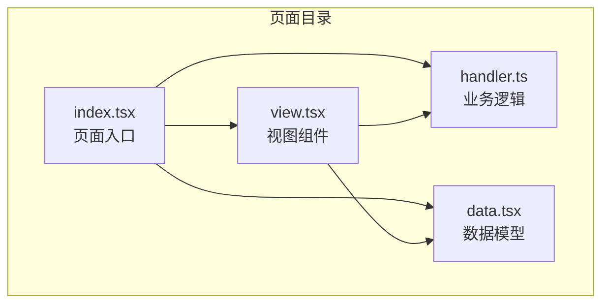
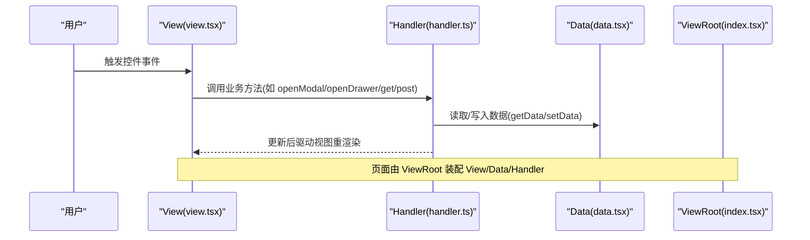
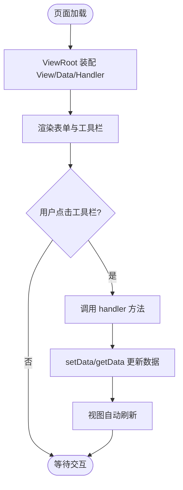
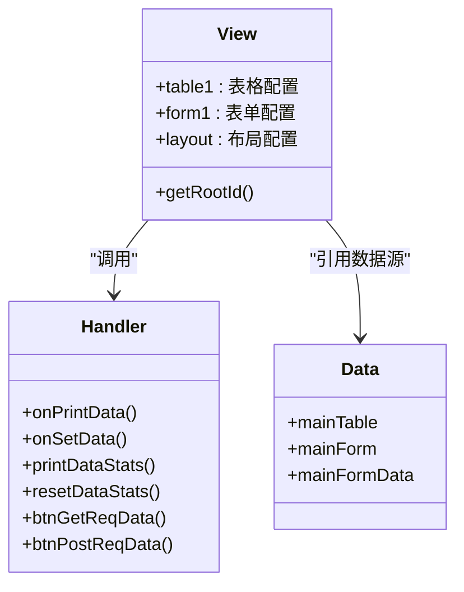
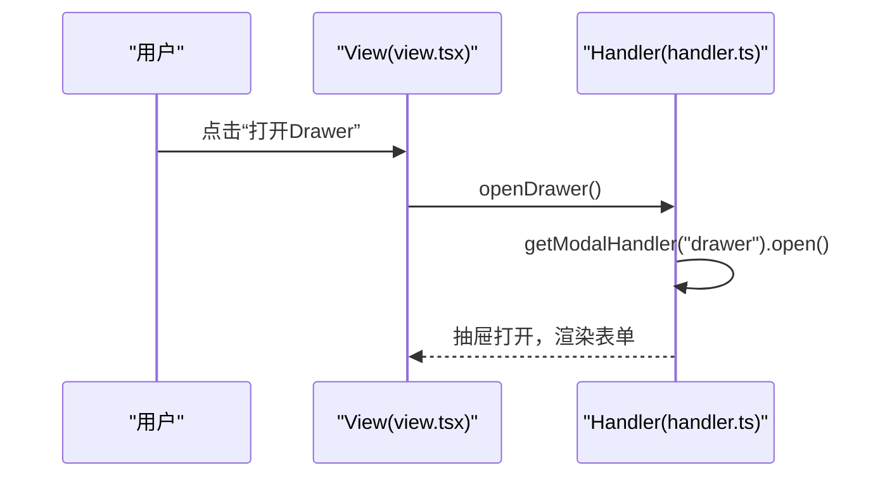
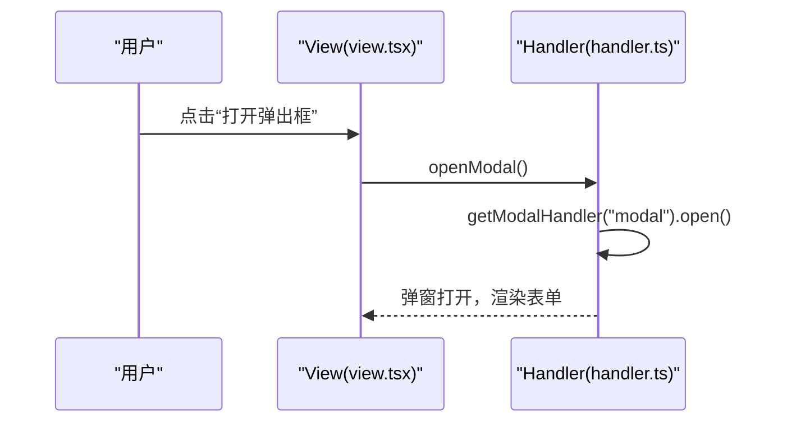
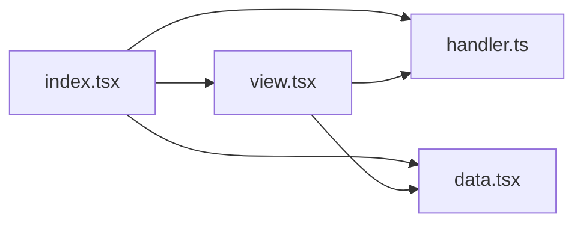

# 页面组织结构

<cite>
**本文引用的文件**
- [apps/demo/src/pages/base/drawer/data.tsx](file://apps/demo/src/pages/base/drawer/data.tsx)
- [apps/demo/src/pages/base/drawer/handler.ts](file://apps/demo/src/pages/base/drawer/handler.ts)
- [apps/demo/src/pages/base/drawer/index.tsx](file://apps/demo/src/pages/base/drawer/index.tsx)
- [apps/demo/src/pages/base/drawer/view.tsx](file://apps/demo/src/pages/base/drawer/view.tsx)
- [apps/demo/src/pages/base/form/data.tsx](file://apps/demo/src/pages/base/form/data.tsx)
- [apps/demo/src/pages/base/form/handler.ts](file://apps/demo/src/pages/base/form/handler.ts)
- [apps/demo/src/pages/base/form/index.tsx](file://apps/demo/src/pages/base/form/index.tsx)
- [apps/demo/src/pages/base/form/view.tsx](file://apps/demo/src/pages/base/form/view.tsx)
- [apps/demo/src/pages/base/table/data.tsx](file://apps/demo/src/pages/base/table/data.tsx)
- [apps/demo/src/pages/base/table/handler.ts](file://apps/demo/src/pages/base/table/handler.ts)
- [apps/demo/src/pages/base/table/index.tsx](file://apps/demo/src/pages/base/table/index.tsx)
- [apps/demo/src/pages/base/table/view.tsx](file://apps/demo/src/pages/base/table/view.tsx)
- [apps/demo/src/pages/base/modal/data.tsx](file://apps/demo/src/pages/base/modal/data.tsx)
- [apps/demo/src/pages/base/modal/handler.ts](file://apps/demo/src/pages/base/modal/handler.ts)
- [apps/demo/src/pages/base/modal/index.tsx](file://apps/demo/src/pages/base/modal/index.tsx)
- [apps/demo/src/pages/base/modal/view.tsx](file://apps/demo/src/pages/base/modal/view.tsx)
</cite>

## 目录
1. [简介](#简介)
2. [项目结构](#项目结构)
3. [核心组件](#核心组件)
4. [架构总览](#架构总览)
5. [详细组件分析](#详细组件分析)
6. [依赖关系分析](#依赖关系分析)
7. [性能考虑](#性能考虑)
8. [故障排查指南](#故障排查指南)
9. [结论](#结论)
10. [附录](#附录)

## 简介
本文件面向“页面级 MVC 模式”的实现与组织方式，围绕 data.tsx（数据模型）、handler.ts（业务逻辑）、index.tsx（页面入口）和 view.tsx（视图组件）的职责分工进行系统化说明。重点解释 ViewRoot 的使用方法与配置选项，展示不同页面类型（表单、表格、抽屉、弹窗）的文件组织范式，并梳理页面初始化流程与数据绑定机制，帮助读者快速掌握在框架中构建可维护页面的最佳实践。

## 项目结构
每个功能页面通常以目录为单位组织，包含四个核心文件：
- index.tsx：页面入口，使用 ViewRoot 装配 View/Data/Handler
- view.tsx：声明式 UI 布局与控件定义，负责渲染与交互事件绑定
- handler.ts：业务逻辑封装，处理用户操作、数据读写与网络请求
- data.tsx：数据模型与数据源配置，声明主表/主表单及其路径或接口地址

图示来源
- [apps/demo/src/pages/base/form/index.tsx:1-10](file://apps/demo/src/pages/base/form/index.tsx#L1-L10)
- [apps/demo/src/pages/base/form/view.tsx:1-99](file://apps/demo/src/pages/base/form/view.tsx#L1-L99)
- [apps/demo/src/pages/base/form/handler.ts:1-18](file://apps/demo/src/pages/base/form/handler.ts#L1-L18)
- [apps/demo/src/pages/base/form/data.tsx:1-10](file://apps/demo/src/pages/base/form/data.tsx#L1-L10)

章节来源
- [apps/demo/src/pages/base/form/index.tsx:1-10](file://apps/demo/src/pages/base/form/index.tsx#L1-L10)
- [apps/demo/src/pages/base/form/view.tsx:1-99](file://apps/demo/src/pages/base/form/view.tsx#L1-L99)
- [apps/demo/src/pages/base/form/handler.ts:1-18](file://apps/demo/src/pages/base/form/handler.ts#L1-L18)
- [apps/demo/src/pages/base/form/data.tsx:1-10](file://apps/demo/src/pages/base/form/data.tsx#L1-L10)

## 核心组件
- ViewRoot：页面容器，接收三个类作为参数完成装配
  - ViewClass：视图类，继承自 ViewBase，声明 UI 结构与控件
  - DataClass：数据类，继承自 DataBase，声明数据源与路径
  - HandlerClass：处理器类，继承自 HandlerBase，实现业务方法
- ViewBase：视图基类，提供控件定义、布局编排、事件绑定与对 handler/data 的访问能力
- HandlerBase：处理器基类，提供 setData/getData、get/post 等通用能力
- DataBase：数据基类，提供 mainTable/mainForm 等数据源声明与路径解析

章节来源
- [apps/demo/src/pages/base/form/index.tsx:1-10](file://apps/demo/src/pages/base/form/index.tsx#L1-L10)
- [apps/demo/src/pages/base/form/view.tsx:1-99](file://apps/demo/src/pages/base/form/view.tsx#L1-L99)
- [apps/demo/src/pages/base/form/handler.ts:1-18](file://apps/demo/src/pages/base/form/handler.ts#L1-L18)
- [apps/demo/src/pages/base/form/data.tsx:1-10](file://apps/demo/src/pages/base/form/data.tsx#L1-L10)

## 架构总览
页面级 MVC 通过 ViewRoot 将三者组合，形成“视图-逻辑-数据”的清晰分层。视图仅关注 UI 描述与事件转发；处理器专注状态变更与网络调用；数据层负责数据源与路径映射。

图示来源
- [apps/demo/src/pages/base/modal/view.tsx:1-46](file://apps/demo/src/pages/base/modal/view.tsx#L1-L46)
- [apps/demo/src/pages/base/modal/handler.ts:1-10](file://apps/demo/src/pages/base/modal/handler.ts#L1-L10)
- [apps/demo/src/pages/base/modal/data.tsx:1-10](file://apps/demo/src/pages/base/modal/data.tsx#L1-L10)
- [apps/demo/src/pages/base/modal/index.tsx:1-9](file://apps/demo/src/pages/base/modal/index.tsx#L1-L9)

## 详细组件分析

### 表单页面（base/form）
- 职责分工
  - data.tsx：声明 mainForm 的数据源与接口地址
  - handler.ts：封装设置数据、发起 GET/POST 请求等方法
  - view.tsx：定义表单字段、工具栏按钮及布局，并将按钮 onClick 绑定到 handler 方法
  - index.tsx：通过 ViewRoot 装配三者
- 数据绑定机制
  - 表单字段通过 path 指向 data 中的某个节点，便于双向绑定与统一取值
  - 工具栏按钮直接调用 handler 方法，实现“视图-逻辑”解耦
- 关键要点
  - 使用 Ctrl/VType 枚举声明控件类型与布局类型
  - getRootId 返回根布局 id，确保渲染挂载点正确

图示来源
- [apps/demo/src/pages/base/form/index.tsx:1-10](file://apps/demo/src/pages/base/form/index.tsx#L1-L10)
- [apps/demo/src/pages/base/form/view.tsx:1-99](file://apps/demo/src/pages/base/form/view.tsx#L1-L99)
- [apps/demo/src/pages/base/form/handler.ts:1-18](file://apps/demo/src/pages/base/form/handler.ts#L1-L18)
- [apps/demo/src/pages/base/form/data.tsx:1-10](file://apps/demo/src/pages/base/form/data.tsx#L1-L10)

章节来源
- [apps/demo/src/pages/base/form/index.tsx:1-10](file://apps/demo/src/pages/base/form/index.tsx#L1-L10)
- [apps/demo/src/pages/base/form/view.tsx:1-99](file://apps/demo/src/pages/base/form/view.tsx#L1-L99)
- [apps/demo/src/pages/base/form/handler.ts:1-18](file://apps/demo/src/pages/base/form/handler.ts#L1-L18)
- [apps/demo/src/pages/base/form/data.tsx:1-10](file://apps/demo/src/pages/base/form/data.tsx#L1-L10)

### 表格页面（base/table）
- 职责分工
  - data.tsx：同时声明 mainTable 与 mainForm，并通过 active(mainTable.id) 建立父子数据关联
  - handler.ts：提供打印数据、设置数据、统计 getData 使用情况以及 GET/POST 请求方法
  - view.tsx：定义表格列、搜索项与表单区域，并在工具栏中绑定 handler 方法
  - index.tsx：装配 ViewRoot
- 数据绑定机制
  - 表格与表单通过 dataId 分别绑定到不同的数据源
  - 表单数据路径基于表格当前选中行，实现联动编辑
- 关键要点
  - 使用 PathKey 与 getData/printStats/resetStats 辅助调试与性能观察
  - 工具栏按钮集中管理，避免在视图中写复杂逻辑

图示来源
- [apps/demo/src/pages/base/table/view.tsx:1-86](file://apps/demo/src/pages/base/table/view.tsx#L1-L86)
- [apps/demo/src/pages/base/table/handler.ts:1-30](file://apps/demo/src/pages/base/table/handler.ts#L1-L30)
- [apps/demo/src/pages/base/table/data.tsx:1-22](file://apps/demo/src/pages/base/table/data.tsx#L1-L22)

章节来源
- [apps/demo/src/pages/base/table/index.tsx:1-10](file://apps/demo/src/pages/base/table/index.tsx#L1-L10)
- [apps/demo/src/pages/base/table/view.tsx:1-86](file://apps/demo/src/pages/base/table/view.tsx#L1-L86)
- [apps/demo/src/pages/base/table/handler.ts:1-30](file://apps/demo/src/pages/base/table/handler.ts#L1-L30)
- [apps/demo/src/pages/base/table/data.tsx:1-22](file://apps/demo/src/pages/base/table/data.tsx#L1-L22)

### 抽屉页面（base/drawer）
- 职责分工
  - data.tsx：声明 mainForm 用于抽屉内嵌表单
  - handler.ts：通过 getModalHandler('drawer') 获取抽屉控制器并打开
  - view.tsx：定义 toolbar 与 drawer，drawer.viewId 指向表单 id
  - index.tsx：装配 ViewRoot
- 关键点
  - 通过 layout 将 toolbar 与 drawer 并列排布
  - 打开抽屉即复用同一套表单视图，减少重复代码

图示来源
- [apps/demo/src/pages/base/drawer/view.tsx:1-47](file://apps/demo/src/pages/base/drawer/view.tsx#L1-L47)
- [apps/demo/src/pages/base/drawer/handler.ts:1-10](file://apps/demo/src/pages/base/drawer/handler.ts#L1-L10)
- [apps/demo/src/pages/base/drawer/data.tsx:1-10](file://apps/demo/src/pages/base/drawer/data.tsx#L1-L10)
- [apps/demo/src/pages/base/drawer/index.tsx:1-10](file://apps/demo/src/pages/base/drawer/index.tsx#L1-L10)

章节来源
- [apps/demo/src/pages/base/drawer/index.tsx:1-10](file://apps/demo/src/pages/base/drawer/index.tsx#L1-L10)
- [apps/demo/src/pages/base/drawer/view.tsx:1-47](file://apps/demo/src/pages/base/drawer/view.tsx#L1-L47)
- [apps/demo/src/pages/base/drawer/handler.ts:1-10](file://apps/demo/src/pages/base/drawer/handler.ts#L1-L10)
- [apps/demo/src/pages/base/drawer/data.tsx:1-10](file://apps/demo/src/pages/base/drawer/data.tsx#L1-L10)

### 弹窗页面（base/modal）
- 职责分工
  - data.tsx：声明 mainForm 用于弹窗内嵌表单
  - handler.ts：通过 getModalHandler('modal') 打开弹窗
  - view.tsx：定义 toolbar 与 modal，modal.viewId 指向表单 id
  - index.tsx：装配 ViewRoot
- 关键点
  - 弹窗与抽屉类似，但通过 LayoutModal 呈现为模态窗口
  - 适合需要临时编辑或确认的场景

图示来源
- [apps/demo/src/pages/base/modal/view.tsx:1-46](file://apps/demo/src/pages/base/modal/view.tsx#L1-L46)
- [apps/demo/src/pages/base/modal/handler.ts:1-10](file://apps/demo/src/pages/base/modal/handler.ts#L1-L10)
- [apps/demo/src/pages/base/modal/data.tsx:1-10](file://apps/demo/src/pages/base/modal/data.tsx#L1-L10)
- [apps/demo/src/pages/base/modal/index.tsx:1-9](file://apps/demo/src/pages/base/modal/index.tsx#L1-L9)

章节来源
- [apps/demo/src/pages/base/modal/index.tsx:1-9](file://apps/demo/src/pages/base/modal/index.tsx#L1-L9)
- [apps/demo/src/pages/base/modal/view.tsx:1-46](file://apps/demo/src/pages/base/modal/view.tsx#L1-L46)
- [apps/demo/src/pages/base/modal/handler.ts:1-10](file://apps/demo/src/pages/base/modal/handler.ts#L1-L10)
- [apps/demo/src/pages/base/modal/data.tsx:1-10](file://apps/demo/src/pages/base/modal/data.tsx#L1-L10)

### ViewRoot 使用方法与配置选项
- 基本用法
  - 在页面入口 index.tsx 中引入 ViewRoot，并传入 ViewClass、DataClass、HandlerClass
- 配置要点
  - ViewClass：必须继承 ViewBase，定义控件与布局，并提供 getRootId
  - DataClass：必须继承 DataBase，声明 mainTable/mainForm 等数据源
  - HandlerClass：必须继承 HandlerBase，实现业务方法并与视图事件绑定
- 典型示例
  - 表单页面：[apps/demo/src/pages/base/form/index.tsx:1-10](file://apps/demo/src/pages/base/form/index.tsx#L1-L10)
  - 表格页面：[apps/demo/src/pages/base/table/index.tsx:1-10](file://apps/demo/src/pages/base/table/index.tsx#L1-L10)
  - 抽屉页面：[apps/demo/src/pages/base/drawer/index.tsx:1-10](file://apps/demo/src/pages/base/drawer/index.tsx#L1-L10)
  - 弹窗页面：[apps/demo/src/pages/base/modal/index.tsx:1-9](file://apps/demo/src/pages/base/modal/index.tsx#L1-L9)

章节来源
- [apps/demo/src/pages/base/form/index.tsx:1-10](file://apps/demo/src/pages/base/form/index.tsx#L1-L10)
- [apps/demo/src/pages/base/table/index.tsx:1-10](file://apps/demo/src/pages/base/table/index.tsx#L1-L10)
- [apps/demo/src/pages/base/drawer/index.tsx:1-10](file://apps/demo/src/pages/base/drawer/index.tsx#L1-L10)
- [apps/demo/src/pages/base/modal/index.tsx:1-9](file://apps/demo/src/pages/base/modal/index.tsx#L1-L9)

## 依赖关系分析
- 页面内部依赖
  - index.tsx 依赖 view.tsx、handler.ts、data.tsx
  - view.tsx 依赖 handler.ts（事件回调）与 data.tsx（数据源 id 引用）
  - handler.ts 依赖框架提供的 HandlerBase 能力
  - data.tsx 依赖框架提供的 DataBase 能力
- 跨页面复用
  - 多个页面可复用相同的表单/表格视图，通过 dataId/path 区分数据源
- 潜在耦合点
  - 视图与处理器通过方法名耦合，建议保持方法语义清晰
  - 数据路径与控件 field 需保持一致，避免运行时错误

图示来源
- [apps/demo/src/pages/base/form/index.tsx:1-10](file://apps/demo/src/pages/base/form/index.tsx#L1-L10)
- [apps/demo/src/pages/base/form/view.tsx:1-99](file://apps/demo/src/pages/base/form/view.tsx#L1-L99)
- [apps/demo/src/pages/base/form/handler.ts:1-18](file://apps/demo/src/pages/base/form/handler.ts#L1-L18)
- [apps/demo/src/pages/base/form/data.tsx:1-10](file://apps/demo/src/pages/base/form/data.tsx#L1-L10)

章节来源
- [apps/demo/src/pages/base/form/index.tsx:1-10](file://apps/demo/src/pages/base/form/index.tsx#L1-L10)
- [apps/demo/src/pages/base/form/view.tsx:1-99](file://apps/demo/src/pages/base/form/view.tsx#L1-L99)
- [apps/demo/src/pages/base/form/handler.ts:1-18](file://apps/demo/src/pages/base/form/handler.ts#L1-L18)
- [apps/demo/src/pages/base/form/data.tsx:1-10](file://apps/demo/src/pages/base/form/data.tsx#L1-L10)

## 性能考虑
- 合理拆分数据源：表格与表单分离，避免单一大对象导致不必要的重渲染
- 控制 getData 调用频率：使用 printStats/resetStats 监控热点路径，减少频繁读取
- 事件最小化：在 handler 中聚合多次 setState，降低视图抖动
- 列表优化：表格分页与懒加载，减少首屏数据量

## 故障排查指南
- 常见问题
  - 视图未渲染：检查 getRootId 是否返回正确的布局 id
  - 数据不更新：确认 data.tsx 中 mainTable/mainForm 的 id 与 view.tsx 中 dataId/path 一致
  - 事件无效：确认 view.tsx 中 onClick 绑定的 handler 方法存在且签名正确
- 定位手段
  - 使用 handler 中的 getData/printStats 输出数据流与调用次数
  - 在浏览器控制台查看网络请求与响应，确认接口地址与方法是否正确

章节来源
- [apps/demo/src/pages/base/table/handler.ts:1-30](file://apps/demo/src/pages/base/table/handler.ts#L1-L30)
- [apps/demo/src/pages/base/form/handler.ts:1-18](file://apps/demo/src/pages/base/form/handler.ts#L1-L18)

## 结论
通过 ViewRoot 将 View/Data/Handler 三者在页面级解耦，实现了清晰的 MVC 分层：视图专注 UI，处理器专注逻辑，数据层专注数据源与路径。借助统一的控件与布局体系，表单、表格、抽屉、弹窗等页面可以快速复用与组合。遵循本文的组织规范与最佳实践，能够显著提升页面可维护性与开发效率。

## 附录
- 页面文件结构示例
  - 表单页面：apps/demo/src/pages/base/form/{index.tsx, view.tsx, handler.ts, data.tsx}
  - 表格页面：apps/demo/src/pages/base/table/{index.tsx, view.tsx, handler.ts, data.tsx}
  - 抽屉页面：apps/demo/src/pages/base/drawer/{index.tsx, view.tsx, handler.ts, data.tsx}
  - 弹窗页面：apps/demo/src/pages/base/modal/{index.tsx, view.tsx, handler.ts, data.tsx}
- 页面初始化流程
  - 路由进入页面 -> 执行 index.tsx -> ViewRoot 装配 View/Data/Handler -> 渲染布局 -> 等待用户交互
- 数据绑定机制
  - 表单字段通过 path 指向 data 节点，支持双向绑定
  - 表格与表单通过 dataId 绑定到对应数据源，支持联动编辑
  - 工具栏按钮调用 handler 方法，实现“视图-逻辑”解耦