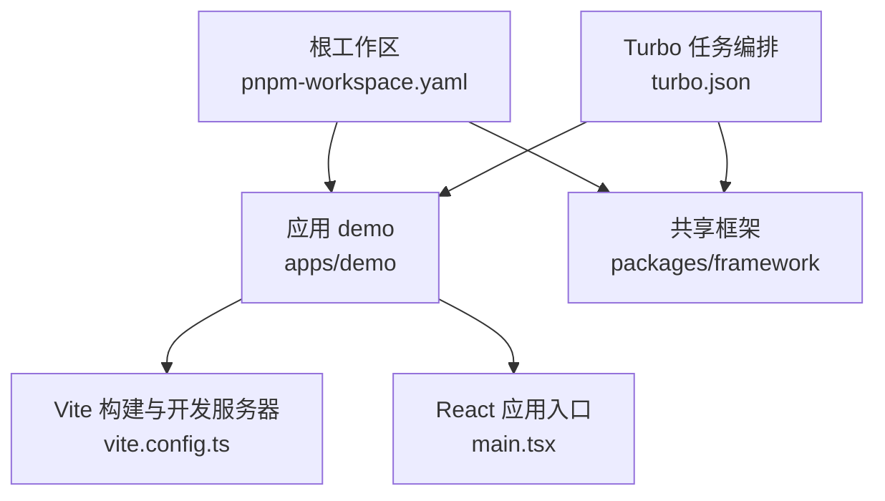
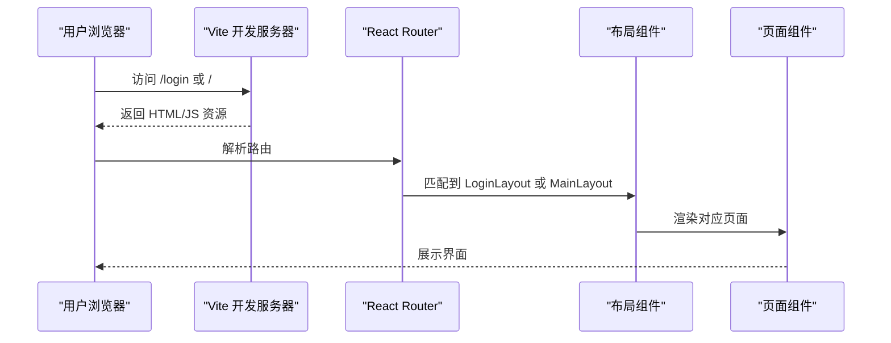

# 快速开始

<cite>
**本文引用的文件**
- [package.json](file://package.json)
- [pnpm-workspace.yaml](file://pnpm-workspace.yaml)
- [turbo.json](file://turbo.json)
- [apps/demo/package.json](file://apps/demo/package.json)
- [apps/demo/vite.config.ts](file://apps/demo/vite.config.ts)
- [apps/demo/src/main.tsx](file://apps/demo/src/main.tsx)
- [apps/demo/src/init/init.ts](file://apps/demo/src/init/init.ts)
- [apps/demo/src/theme/themeCompact.ts](file://apps/demo/src/theme/themeCompact.ts)
- [apps/demo/README.md](file://apps/demo/README.md)
- [docs/1.运行与构建.md](file://docs/1.运行与构建.md)
</cite>

## 目录
1. [简介](#简介)
2. [项目结构](#项目结构)
3. [核心组件](#核心组件)
4. [架构总览](#架构总览)
5. [详细组件分析](#详细组件分析)
6. [依赖分析](#依赖分析)
7. [性能考虑](#性能考虑)
8. [故障排除指南](#故障排除指南)
9. [结论](#结论)
10. [附录](#附录)

## 简介
本指南面向首次接触 WMS Web 前端项目的开发者，目标是帮助你在最短时间内完成环境准备、安装依赖、启动开发服务器、构建生产版本，并理解基本的开发与调试流程。你将学会：
- 使用 pnpm 管理多包工作区
- 通过 Turbo 统一执行 dev/build/lint 等任务
- 在 Vite + React + TypeScript 环境下进行页面开发与调试
- 配置环境变量与本地端口
- 从零创建一个简单页面并路由到首页

## 项目结构
本项目采用 Monorepo 组织方式，根目录通过 pnpm workspace 管理多个应用与共享包，并使用 Turbo 作为任务编排工具。关键要点：
- 根 package.json 提供统一的脚本入口（dev/build/dev:mock/lint），由 Turbo 调度各子包任务
- apps/demo 是实际的前端应用，基于 Vite + React + TypeScript，使用 vite-plugin-pages 实现按目录自动路由
- packages/framework 为共享框架包，应用通过别名映射到源码目录以便开发期联调
- turbo.json 定义了 build/dev/dev:mock/lint 任务的缓存与持久化策略



图表来源
- [pnpm-workspace.yaml:1-5](file://pnpm-workspace.yaml#L1-L5)
- [turbo.json:1-29](file://turbo.json#L1-L29)
- [apps/demo/vite.config.ts:1-36](file://apps/demo/vite.config.ts#L1-L36)
- [apps/demo/src/main.tsx:1-53](file://apps/demo/src/main.tsx#L1-L53)

章节来源
- [package.json:1-19](file://package.json#L1-L19)
- [pnpm-workspace.yaml:1-5](file://pnpm-workspace.yaml#L1-L5)
- [turbo.json:1-29](file://turbo.json#L1-L29)
- [apps/demo/package.json:1-44](file://apps/demo/package.json#L1-L44)
- [apps/demo/vite.config.ts:1-36](file://apps/demo/vite.config.ts#L1-L36)

## 核心组件
- 应用入口与路由
  - main.tsx 负责初始化全局配置、挂载 React 根节点、配置 BrowserRouter 与路由层级，并通过 Suspense 包裹内容以支持懒加载
- 初始化流程
  - init.ts 在应用启动时调用网络相关初始化逻辑，确保后续请求可用
- 主题配置
  - themeCompact.ts 定义 Ant Design 紧凑主题，应用于全局 ConfigProvider
- 构建与开发
  - vite.config.ts 启用 React SWC 插件、Pages 插件（按 src/pages 自动生成路由）、设置开发服务器端口、定义 @jl/framework 的源码别名以及注入 __APP_ENV__

章节来源
- [apps/demo/src/main.tsx:1-53](file://apps/demo/src/main.tsx#L1-L53)
- [apps/demo/src/init/init.ts:1-9](file://apps/demo/src/init/init.ts#L1-L9)
- [apps/demo/src/theme/themeCompact.ts:1-16](file://apps/demo/src/theme/themeCompact.ts#L1-L16)
- [apps/demo/vite.config.ts:1-36](file://apps/demo/vite.config.ts#L1-L36)

## 架构总览
下图展示了从浏览器访问到页面渲染的关键链路，包括 Vite 开发服务器、React 路由、布局与页面组件的协作关系。



图表来源
- [apps/demo/src/main.tsx:11-31](file://apps/demo/src/main.tsx#L11-L31)
- [apps/demo/vite.config.ts:12-22](file://apps/demo/vite.config.ts#L12-L22)

## 详细组件分析

### 环境与脚本
- Node.js 版本
  - 推荐 Node.js 24.11.1（可通过 nvm 切换）
- 包管理器
  - 使用 pnpm@10.13.1（根 package.json 指定）
- 工作区
  - pnpm-workspace.yaml 将 apps/* 与 packages/* 纳入同一工作区
- 统一脚本
  - 根 package.json 提供 dev/build/dev:mock/lint，由 turbo 调度
  - apps/demo 内提供 dev/dev:prod/dev:mock/build/build:dev/preview 等命令

章节来源
- [docs/1.运行与构建.md:7-17](file://docs/1.运行与构建.md#L7-L17)
- [package.json:6-18](file://package.json#L6-L18)
- [pnpm-workspace.yaml:1-5](file://pnpm-workspace.yaml#L1-L5)
- [apps/demo/package.json:6-13](file://apps/demo/package.json#L6-L13)

### 启动与构建
- 安装依赖
  - 在仓库根目录执行 pnpm install
- 启动开发服务器
  - 在根目录执行 pnpm dev（默认模式）
  - 或在根目录执行 pnpm dev:mock（启动 mock 模式）
  - 也可进入 apps/demo 目录执行 npm run dev（等价于 vite --mode dev）
- 构建生产版本
  - 在根目录执行 pnpm build（会先编译类型再构建产物）
  - 或在 apps/demo 目录执行 npm run build

说明
- 根脚本通过 turbo 协调多包任务；apps/demo 的脚本直接调用 vite 与 tsc

章节来源
- [docs/1.运行与构建.md:66-90](file://docs/1.运行与构建.md#L66-L90)
- [package.json:6-18](file://package.json#L6-L18)
- [apps/demo/package.json:6-13](file://apps/demo/package.json#L6-L13)

### 环境变量与端口
- 常用变量
  - VITE_ENV：环境标识（dev/production/mock）
  - VITE_SERVER_PORT：开发服务器端口（默认 3000，可被 .env 覆盖）
  - VITE_BASE_URL：API 基础地址
  - VITE_TITLE：应用标题
  - VITE_LOGIN_URL：登录页路径
  - VITE_AUTH_TOKEN_EXPIRE_TIME：Token 过期时间（毫秒）
  - VITE_API_LOGIN/VITE_API_MENU：接口地址
- 生效位置
  - Vite 通过 loadEnv(mode, process.cwd(), '') 读取环境变量
  - server.port 使用 Number(env.VITE_SERVER_PORT) || 3000
  - define.__APP_ENV__ 注入 __APP_ENV__ 供运行时使用

章节来源
- [docs/1.运行与构建.md:18-63](file://docs/1.运行与构建.md#L18-L63)
- [apps/demo/vite.config.ts:7-33](file://apps/demo/vite.config.ts#L7-L33)

### 路由与页面
- 自动路由
  - 使用 vite-plugin-pages，扫描 src/pages 下的 tsx/jsx/ts/js 文件生成路由
- 路由层级
  - main.tsx 中定义登录页路由与主布局路由，主布局下挂载所有 pages 生成的路由
- 示例页面
  - apps/demo/src/pages/home/index.tsx 是一个最简单的页面示例

章节来源
- [apps/demo/vite.config.ts:12-19](file://apps/demo/vite.config.ts#L12-L19)
- [apps/demo/src/main.tsx:11-31](file://apps/demo/src/main.tsx#L11-L31)
- [apps/demo/src/pages/home/index.tsx:1-9](file://apps/demo/src/pages/home/index.tsx#L1-L9)

### 第一个页面开发示例
目标：新增一个“关于”页面，并在主布局下可见。

步骤
1) 创建页面文件
   - 在 apps/demo/src/pages/about/index.tsx 新建页面组件，导出默认函数式组件
2) 刷新浏览器
   - 由于启用了 Pages 插件，访问 /about 即可看到新页面
3) 如需调整样式
   - 在同级添加 about.less 并在页面中引入
4) 如需复用框架能力
   - 可参考 base/table 页面的 ViewRoot 用法，组合数据、视图与处理器类

提示
- 若需要登录态保护，可在路由层或布局层增加鉴权逻辑
- 若需调用接口，请确保 init.ts 中的网络初始化已执行

章节来源
- [apps/demo/vite.config.ts:12-19](file://apps/demo/vite.config.ts#L12-L19)
- [apps/demo/src/pages/base/table/index.tsx:1-10](file://apps/demo/src/pages/base/table/index.tsx#L1-L10)
- [apps/demo/src/init/init.ts:1-9](file://apps/demo/src/init/init.ts#L1-L9)

## 依赖分析
- 工作区依赖
  - apps/demo 依赖 @jl/framework（workspace:*），通过 vite 别名指向 packages/framework/src，便于开发期联调
- 构建依赖
  - Vite 作为构建与开发服务器
  - @vitejs/plugin-react-swc 提供 React 快速刷新
  - vite-plugin-pages 提供按目录路由
  - TypeScript 用于类型检查与编译
- 运行时依赖
  - React、ReactDOM、Ant Design、Axios、React Router DOM 等

```mermaid
graph LR
subgraph "应用 demo"
D1["apps/demo/package.json"]
D2["apps/demo/vite.config.ts"]
end
subgraph "框架包"
F1["packages/framework/package.json"]
F2["packages/framework/src"]
end
D1 --> |"依赖"@jl/framework
D2 --> |"别名映射"| F2
```

图表来源
- [apps/demo/package.json:15-25](file://apps/demo/package.json#L15-L25)
- [apps/demo/vite.config.ts:23-29](file://apps/demo/vite.config.ts#L23-L29)

章节来源
- [apps/demo/package.json:15-43](file://apps/demo/package.json#L15-L43)
- [apps/demo/vite.config.ts:23-29](file://apps/demo/vite.config.ts#L23-L29)

## 性能考虑
- 开发体验
  - 使用 SWC 插件提升热更新速度
  - 使用 Pages 插件按需异步导入页面，减少首屏体积
- 构建优化
  - 生产构建前执行类型检查（tsc -b），提前发现类型问题
  - 合理拆分页面与组件，利用路由懒加载降低初始包体
- 缓存策略
  - Turbo 对 build/lint 启用缓存，加速重复构建与检查

[本节为通用建议，不直接分析具体文件]

## 故障排除指南
常见问题与解决思路
- 端口冲突
  - 现象：启动时报端口占用
  - 处理：修改 .env 中的 VITE_SERVER_PORT 或关闭占用进程
- 环境变量未生效
  - 现象：__APP_ENV__ 或端口未按预期生效
  - 处理：确认当前 mode 对应的 .env.* 文件存在且键名正确；重启开发服务器
- 依赖安装失败
  - 现象：pnpm install 报错
  - 处理：清理 pnpm 缓存后重试；确认 Node.js 版本符合推荐要求
- 路由不生效
  - 现象：新增页面无法访问
  - 处理：确认文件位于 src/pages 下且文件名规范；检查浏览器 URL 是否与文件路径一致
- 框架包引用错误
  - 现象：@jl/framework 找不到或版本不一致
  - 处理：确认 vite.config.ts 中别名指向 packages/framework/src；重新安装依赖

章节来源
- [apps/demo/vite.config.ts:7-33](file://apps/demo/vite.config.ts#L7-L33)
- [docs/1.运行与构建.md:18-63](file://docs/1.运行与构建.md#L18-L63)

## 结论
通过以上步骤，你可以在几分钟内完成 WMS Web 前端项目的安装、启动与基本开发。建议新手优先掌握：
- 使用 pnpm 与 Turbo 的统一脚本
- 通过环境变量控制行为与端口
- 利用 Pages 插件快速创建页面
- 结合 Ant Design 主题与路由进行界面搭建

## 附录
- 推荐 Node.js 版本：24.11.1（可使用 nvm 切换）
- 包管理器：pnpm@10.13.1
- 常用命令
  - 安装依赖：pnpm install
  - 启动开发：pnpm dev
  - 启动 Mock：pnpm dev:mock
  - 构建生产：pnpm build
  - 预览构建产物：在 apps/demo 目录执行 npm run preview

章节来源
- [docs/1.运行与构建.md:7-17](file://docs/1.运行与构建.md#L7-L17)
- [package.json:6-18](file://package.json#L6-L18)
- [apps/demo/package.json:6-13](file://apps/demo/package.json#L6-L13)