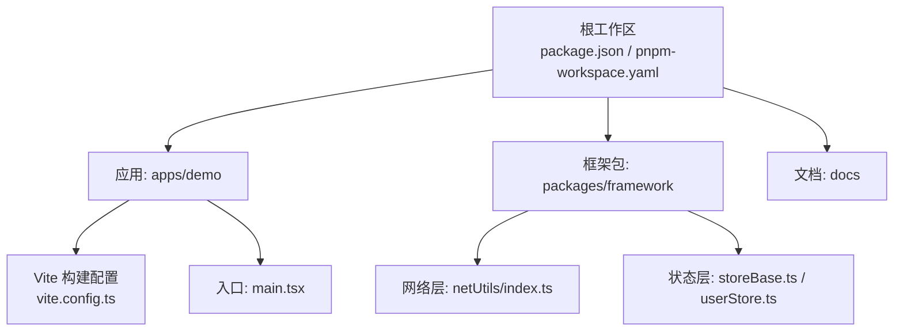
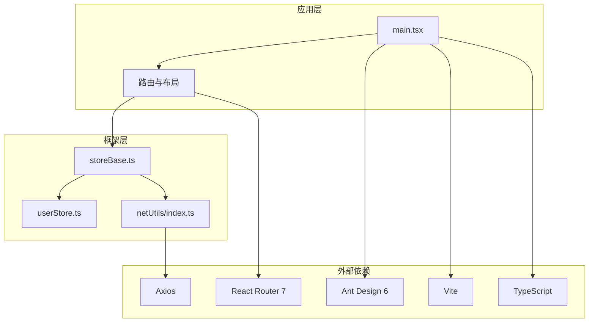
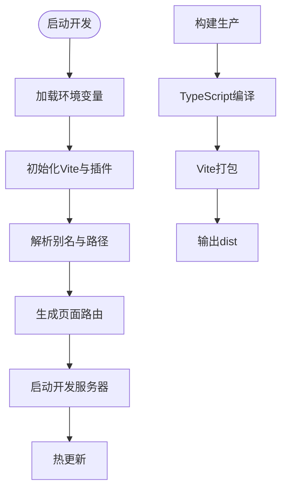
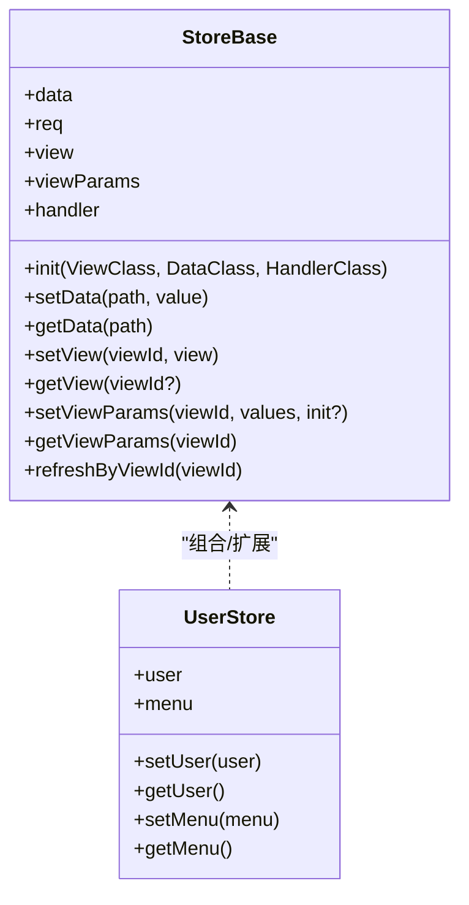
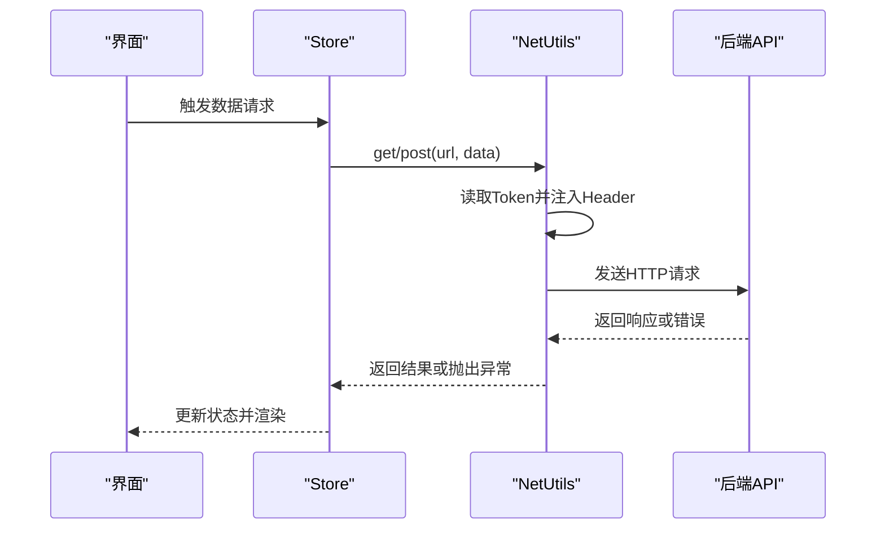
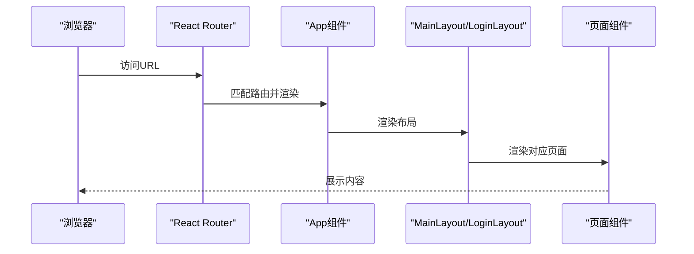
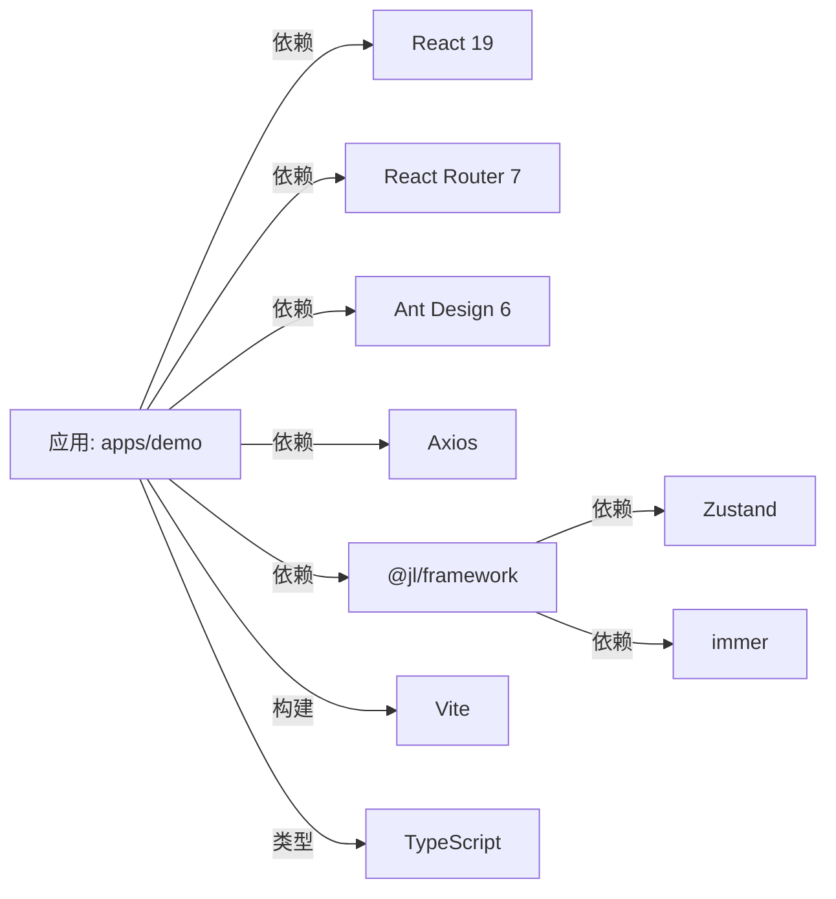

# 技术栈

<cite>
**本文引用的文件**
- [package.json](file://package.json)
- [turbo.json](file://turbo.json)
- [pnpm-workspace.yaml](file://pnpm-workspace.yaml)
- [apps/demo/package.json](file://apps/demo/package.json)
- [apps/demo/vite.config.ts](file://apps/demo/vite.config.ts)
- [apps/demo/src/main.tsx](file://apps/demo/src/main.tsx)
- [packages/framework/package.json](file://packages/framework/package.json)
- [packages/framework/src/utils/netUtils/index.ts](file://packages/framework/src/utils/netUtils/index.ts)
- [packages/framework/src/stores/store/storeBase.ts](file://packages/framework/src/stores/store/storeBase.ts)
- [packages/framework/src/stores/user/userStore.ts](file://packages/framework/src/stores/user/userStore.ts)
- [eslint.config.js](file://eslint.config.js)
- [.prettierrc](file://.prettierrc)
- [docs/1.运行与构建.md](file://docs/1.运行与构建.md)
- [docs/design/framework-design.md](file://docs/design/framework-design.md)
</cite>

## 目录
1. [简介](#简介)
2. [项目结构](#项目结构)
3. [核心组件与技术选型](#核心组件与技术选型)
4. [架构总览](#架构总览)
5. [详细组件分析](#详细组件分析)
6. [依赖关系分析](#依赖关系分析)
7. [性能考量](#性能考量)
8. [故障排查指南](#故障排查指南)
9. [结论](#结论)
10. [附录](#附录)

## 简介
本技术栈文档面向WMS Web前端项目，系统梳理并解释核心技术选型与工程化方案：React 19作为UI框架、TypeScript提供类型安全、Ant Design 6作为UI组件库、Vite作为构建工具、Zustand进行状态管理、React Router 7处理路由、Axios进行网络请求。同时说明Monorepo（pnpm workspace + turbo）的协作优势，以及ESLint、Prettier、Stylelint等开发工具链的配置与作用，帮助开发者理解项目的架构决策与最佳实践。

## 项目结构
本项目采用Monorepo组织方式，通过pnpm workspace统一管理应用与共享包，使用Turbo进行任务编排与缓存加速。根目录包含全局脚本与配置，apps下为具体应用（如demo），packages下为可复用的框架与工具包。

图表来源
- [pnpm-workspace.yaml:1-5](file://pnpm-workspace.yaml#L1-L5)
- [turbo.json:1-29](file://turbo.json#L1-L29)
- [apps/demo/vite.config.ts:1-36](file://apps/demo/vite.config.ts#L1-L36)
- [apps/demo/src/main.tsx:1-53](file://apps/demo/src/main.tsx#L1-L53)
- [packages/framework/src/utils/netUtils/index.ts:1-116](file://packages/framework/src/utils/netUtils/index.ts#L1-L116)
- [packages/framework/src/stores/store/storeBase.ts:1-36](file://packages/framework/src/stores/store/storeBase.ts#L1-L36)
- [packages/framework/src/stores/user/userStore.ts:1-21](file://packages/framework/src/stores/user/userStore.ts#L1-L21)

章节来源
- [pnpm-workspace.yaml:1-5](file://pnpm-workspace.yaml#L1-L5)
- [turbo.json:1-29](file://turbo.json#L1-L29)
- [package.json:1-19](file://package.json#L1-L19)

## 核心组件与技术选型
- React 19：现代UI框架，配合StrictMode与Suspense提升开发体验与稳定性；在应用中通过createRoot挂载根节点，结合路由与主题Provider完成渲染。
- TypeScript：为应用与框架提供强类型支持，配合tsc -b进行多项目编译，确保跨包类型一致性。
- Ant Design 6：企业级UI组件库，通过ConfigProvider注入主题，统一视觉风格与交互规范。
- Vite：极速开发与构建工具，基于SWC插件实现快速HMR与打包；通过环境变量加载与别名解析，集成页面路由插件。
- Zustand：轻量级状态管理，结合immer中间件实现不可变更新；在框架中封装store基类与用户状态模块。
- React Router 7：声明式路由，结合vite-plugin-pages实现基于文件的动态路由，简化页面组织。
- Axios：HTTP客户端，封装NetUtils统一拦截器、鉴权、错误处理与登录流程。

章节来源
- [apps/demo/src/main.tsx:1-53](file://apps/demo/src/main.tsx#L1-L53)
- [apps/demo/package.json:15-43](file://apps/demo/package.json#L15-L43)
- [apps/demo/vite.config.ts:1-36](file://apps/demo/vite.config.ts#L1-L36)
- [packages/framework/package.json:25-51](file://packages/framework/package.json#L25-L51)
- [packages/framework/src/stores/store/storeBase.ts:1-36](file://packages/framework/src/stores/store/storeBase.ts#L1-L36)
- [packages/framework/src/stores/user/userStore.ts:1-21](file://packages/framework/src/stores/user/userStore.ts#L1-L21)
- [packages/framework/src/utils/netUtils/index.ts:1-116](file://packages/framework/src/utils/netUtils/index.ts#L1-L116)

## 架构总览
整体架构遵循“应用层—框架层—数据层”的分层设计：应用层负责页面与布局，框架层提供状态管理、网络请求、视图与处理器抽象，数据层对接后端或Mock服务。Vite驱动开发服务器与构建流程，Turbo协调多包任务执行与缓存。

图表来源
- [apps/demo/src/main.tsx:1-53](file://apps/demo/src/main.tsx#L1-L53)
- [packages/framework/src/stores/store/storeBase.ts:1-36](file://packages/framework/src/stores/store/storeBase.ts#L1-L36)
- [packages/framework/src/stores/user/userStore.ts:1-21](file://packages/framework/src/stores/user/userStore.ts#L1-L21)
- [packages/framework/src/utils/netUtils/index.ts:1-116](file://packages/framework/src/utils/netUtils/index.ts#L1-L116)

## 详细组件分析

### 构建与开发工具链（Vite + Turbo + pnpm workspace）
- Vite：通过SWC插件加速React编译，启用pages插件实现基于src/pages的文件路由；支持多模式环境变量加载与别名映射，便于本地调试与生产构建。
- Turbo：定义build、dev、dev:mock、lint等任务，设置依赖顺序与缓存策略，提升多包并行构建效率。
- pnpm workspace：将apps与packages纳入统一工作区，实现依赖共享与版本对齐。

图表来源
- [apps/demo/vite.config.ts:1-36](file://apps/demo/vite.config.ts#L1-L36)
- [turbo.json:1-29](file://turbo.json#L1-L29)
- [pnpm-workspace.yaml:1-5](file://pnpm-workspace.yaml#L1-L5)

章节来源
- [apps/demo/vite.config.ts:1-36](file://apps/demo/vite.config.ts#L1-L36)
- [turbo.json:1-29](file://turbo.json#L1-L29)
- [pnpm-workspace.yaml:1-5](file://pnpm-workspace.yaml#L1-L5)
- [docs/1.运行与构建.md:1-91](file://docs/1.运行与构建.md#L1-L91)

### 状态管理（Zustand + immer）
- storeBase：封装通用store能力，包括data、req、view、viewParams、handler等模块，提供init、setData/getData、setView/getView、refreshByViewId等方法，结合immer实现不可变更新。
- userStore：基于create工厂函数创建用户与菜单状态，暴露setUser/getUser、setMenu/getMenu等接口。

图表来源
- [packages/framework/src/stores/store/storeBase.ts:1-36](file://packages/framework/src/stores/store/storeBase.ts#L1-L36)
- [packages/framework/src/stores/user/userStore.ts:1-21](file://packages/framework/src/stores/user/userStore.ts#L1-L21)

章节来源
- [packages/framework/src/stores/store/storeBase.ts:1-36](file://packages/framework/src/stores/store/storeBase.ts#L1-L36)
- [packages/framework/src/stores/user/userStore.ts:1-21](file://packages/framework/src/stores/user/userStore.ts#L1-L21)

### 网络请求（Axios + NetUtils）
- NetUtils：封装Axios实例，统一baseUrl、超时、请求/响应拦截器；自动注入Authorization头，处理未授权跳转与错误回调；提供login、checkToken、handleUnauthorized及get/post等便捷方法。
- 登录流程：调用login获取token并持久化，后续请求通过拦截器携带token；若未找到token则触发错误处理并跳转登录页。

图表来源
- [packages/framework/src/utils/netUtils/index.ts:1-116](file://packages/framework/src/utils/netUtils/index.ts#L1-L116)

章节来源
- [packages/framework/src/utils/netUtils/index.ts:1-116](file://packages/framework/src/utils/netUtils/index.ts#L1-L116)

### 路由与渲染（React Router 7 + Vite Pages）
- 入口main.tsx：使用BrowserRouter包裹应用，通过useRoutes注册登录页与主布局及其子路由；结合Suspense与ConfigProvider提供主题与加载态。
- 页面路由：由vite-plugin-pages根据src/pages目录自动生成路由，减少手动维护成本。

图表来源
- [apps/demo/src/main.tsx:1-53](file://apps/demo/src/main.tsx#L1-L53)
- [apps/demo/vite.config.ts:12-18](file://apps/demo/vite.config.ts#L12-L18)

章节来源
- [apps/demo/src/main.tsx:1-53](file://apps/demo/src/main.tsx#L1-L53)
- [apps/demo/vite.config.ts:12-18](file://apps/demo/vite.config.ts#L12-L18)

### Monorepo与团队协作（pnpm workspace + turbo）
- 工作区划分：apps存放业务应用，packages存放共享框架与工具，便于复用与独立演进。
- 任务编排：turbo统一构建、开发、预览与lint任务，支持缓存与并行执行，提升团队协同效率。
- 依赖管理：pnpm workspace保证依赖一致性与安装速度，避免重复安装。

章节来源
- [pnpm-workspace.yaml:1-5](file://pnpm-workspace.yaml#L1-L5)
- [turbo.json:1-29](file://turbo.json#L1-L29)
- [package.json:6-18](file://package.json#L6-L18)

## 依赖关系分析
- 应用依赖：React 19、react-dom、react-router-dom、antd、ahooks、axios、lodash、simplebar-react等。
- 框架依赖：zustand、immer，并通过peerDependencies声明对React、AntD、Axios等的依赖，确保应用层提供运行时依赖。
- 构建与类型：Vite、@vitejs/plugin-react-swc、typescript、vite-plugin-pages等。

图表来源
- [apps/demo/package.json:15-43](file://apps/demo/package.json#L15-L43)
- [packages/framework/package.json:25-51](file://packages/framework/package.json#L25-L51)

章节来源
- [apps/demo/package.json:15-43](file://apps/demo/package.json#L15-L43)
- [packages/framework/package.json:25-51](file://packages/framework/package.json#L25-L51)

## 性能考量
- 构建性能：Vite基于SWC与Esm模块，配合HMR显著提升开发体验；Turbo缓存与并行任务加速多包构建。
- 运行时性能：Zustand+immer减少不必要的重渲染；按需加载页面路由降低首屏体积；Axios拦截器集中处理错误与鉴权，减少重复逻辑。
- 资源优化：通过别名与分包策略控制依赖体积；合理使用Suspense与懒加载改善用户体验。

## 故障排查指南
- 未授权跳转：NetUtils在请求拦截器中检测缺失Token时调用错误处理器并拒绝请求；可通过handleUnauthorized清理Token并跳转登录页。
- 环境变量问题：确认VITE_ENV、VITE_SERVER_PORT、VITE_BASE_URL、VITE_API_LOGIN等变量正确配置；Vite通过loadEnv按mode加载。
- 路由不生效：检查vite-plugin-pages配置与src/pages目录结构；确保useRoutes正确注册路由。
- 构建失败：核对TypeScript版本与TSConfig引用；确认turbo任务依赖与缓存状态。

章节来源
- [packages/framework/src/utils/netUtils/index.ts:39-72](file://packages/framework/src/utils/netUtils/index.ts#L39-L72)
- [apps/demo/vite.config.ts:7-10](file://apps/demo/vite.config.ts#L7-L10)
- [docs/1.运行与构建.md:44-63](file://docs/1.运行与构建.md#L44-L63)

## 结论
本项目以React 19为核心，结合TypeScript、Ant Design 6、Vite、Zustand、React Router 7与Axios，构建了高效、可维护的企业级前端架构。通过pnpm workspace与Turbo实现的Monorepo体系，提升了团队协作与构建效率。统一的网络层与状态管理层降低了复杂度，增强了可扩展性。建议在后续迭代中持续完善类型定义、错误处理与性能监控，进一步提升代码质量与用户体验。

## 附录
- 运行与构建：参考运行与构建文档了解环境配置与命令。
- 框架设计：参考框架设计文档了解分层架构与状态流转。

章节来源
- [docs/1.运行与构建.md:1-91](file://docs/1.运行与构建.md#L1-L91)
- [docs/design/framework-design.md:1-223](file://docs/design/framework-design.md#L1-L223)