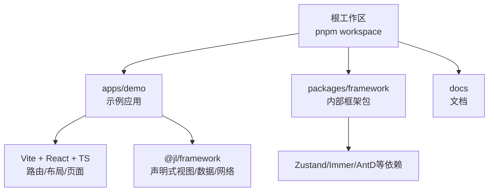
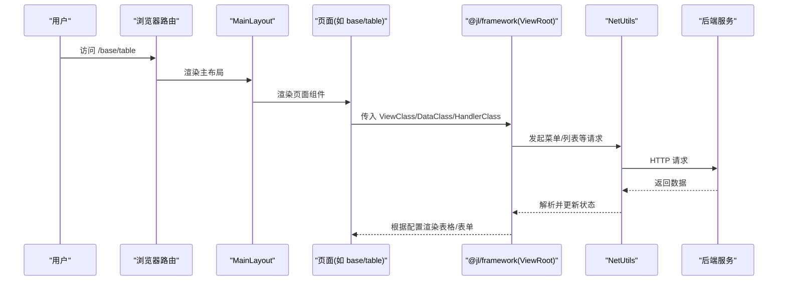

# 项目介绍

<cite>
**本文引用的文件**
- [package.json](file://package.json)
- [turbo.json](file://turbo.json)
- [apps/demo/package.json](file://apps/demo/package.json)
- [apps/demo/README.md](file://apps/demo/README.md)
- [apps/demo/src/main.tsx](file://apps/demo/src/main.tsx)
- [apps/demo/src/layouts/main/MainLayout.tsx](file://apps/demo/src/layouts/main/MainLayout.tsx)
- [apps/demo/src/pages/base/table/index.tsx](file://apps/demo/src/pages/base/table/index.tsx)
- [apps/demo/src/pages/base/table/view.tsx](file://apps/demo/src/pages/base/table/view.tsx)
- [apps/demo/src/pages/base/form/index.tsx](file://apps/demo/src/pages/base/form/index.tsx)
- [packages/framework/package.json](file://packages/framework/package.json)
- [docs/1.运行与构建.md](file://docs/1.运行与构建.md)
- [docs/2.组件用法.md](file://docs/2.组件用法.md)
</cite>

## 目录
1. [简介](#简介)
2. [项目结构](#项目结构)
3. [核心目标与价值](#核心目标与价值)
4. [主要特性](#主要特性)
5. [适用场景与目标用户](#适用场景与目标用户)
6. [架构总览](#架构总览)
7. [关键流程说明](#关键流程说明)
8. [性能与可维护性](#性能与可维护性)
9. [常见问题与排错](#常见问题与排错)
10. [结论](#结论)

## 简介
本项目是一个基于 React + TypeScript 的企业级仓库管理系统（WMS）前端应用，采用 Monorepo 架构组织代码。通过自研框架包 @jl/framework 提供声明式视图配置、统一的数据管理与组件化开发能力，帮助团队快速搭建具备完整 CRUD 能力的业务页面，降低重复劳动，提升交付效率与一致性。

## 项目结构
项目根目录为 Monorepo，使用 pnpm workspace 管理多个子包，并通过 Turbo 进行任务编排与缓存加速。核心结构如下：
- apps/demo：示例应用，演示 WMS 前端的典型页面与布局
- packages/framework：内部框架包，封装通用视图、数据、网络与状态管理能力
- docs：运行与构建、组件用法等文档

图表来源
- [package.json:1-19](file://package.json#L1-L19)
- [turbo.json:1-29](file://turbo.json#L1-L29)
- [apps/demo/package.json:1-44](file://apps/demo/package.json#L1-L44)
- [packages/framework/package.json:1-52](file://packages/framework/package.json#L1-L52)

章节来源
- [package.json:1-19](file://package.json#L1-L19)
- [turbo.json:1-29](file://turbo.json#L1-L29)
- [apps/demo/package.json:1-44](file://apps/demo/package.json#L1-L44)

## 核心目标与价值
- 提供完整的 CRUD 操作界面：通过声明式配置即可生成表格、表单、弹窗、标签页等常用界面，减少样板代码。
- 声明式视图配置：以配置驱动 UI 渲染，开发者聚焦业务字段与交互，而非模板细节。
- 统一的数据管理：集中处理数据获取、缓存、更新与校验，保证数据一致性与可追踪性。
- 组件化开发：将通用能力沉淀到框架包，跨页面复用，提升可维护性与扩展性。
- 企业级工程化：Monorepo + Turbo + Vite + TypeScript，保障多包协作、构建速度与类型安全。

## 主要特性
- 技术栈：React 19 + TypeScript + Vite + Ant Design 6 + ahooks + axios
- 框架能力：ViewRoot 作为入口，结合 DataClass/HandlerClass/ViewClass 实现“数据-事件-视图”解耦
- 路由与布局：BrowserRouter 配合主布局 MainLayout，支持侧边菜单、头部工具栏与内容区
- 网络与鉴权：NetUtils 统一管理接口请求与 Token 校验
- 构建与脚本：Turbo 统一编排 build/dev/lint，支持 mock 模式与多环境配置

章节来源
- [apps/demo/package.json:15-43](file://apps/demo/package.json#L15-L43)
- [apps/demo/src/main.tsx:1-53](file://apps/demo/src/main.tsx#L1-L53)
- [apps/demo/src/layouts/main/MainLayout.tsx:1-77](file://apps/demo/src/layouts/main/MainLayout.tsx#L1-L77)
- [docs/1.运行与构建.md:1-91](file://docs/1.运行与构建.md#L1-L91)

## 适用场景与目标用户
- 适用场景
  - 企业内部仓储管理（入库、出库、盘点、调拨等）
  - 需要快速搭建后台管理系统的中大型项目
  - 希望以声明式方式统一前后端数据交互与页面结构的团队
- 目标用户
  - 前端工程师（快速落地业务页面）
  - 技术负责人（规范与复用）
  - 产品经理与实施人员（理解配置驱动的页面生成方式）

## 架构总览
应用以 React Router 管理路由，主布局负责菜单、头部与内容区域；页面通过 ViewRoot 挂载由框架提供的声明式视图，数据与事件分别由 DataClass 与 HandlerClass 管理，网络请求通过 NetUtils 统一发起。

图表来源
- [apps/demo/src/main.tsx:11-31](file://apps/demo/src/main.tsx#L11-L31)
- [apps/demo/src/layouts/main/MainLayout.tsx:21-39](file://apps/demo/src/layouts/main/MainLayout.tsx#L21-L39)
- [apps/demo/src/pages/base/table/index.tsx:1-10](file://apps/demo/src/pages/base/table/index.tsx#L1-L10)
- [apps/demo/src/pages/base/table/view.tsx:1-86](file://apps/demo/src/pages/base/table/view.tsx#L1-L86)

## 关键流程说明
- 启动与初始化
  - 应用入口创建根节点并注入 BrowserRouter，加载路由表
  - 初始化时调用 netInit 完成网络层基础配置
- 菜单与鉴权
  - 主布局在切换路由时检查 Token，并拉取菜单数据
- 页面渲染
  - 页面通过 ViewRoot 组合 DataClass/HandlerClass/ViewClass，由框架根据配置渲染表格、表单、布局等
- 数据交互
  - 通过 HandlerClass 暴露的方法触发 GET/POST 等请求，框架统一处理响应与状态更新

章节来源
- [apps/demo/src/main.tsx:33-53](file://apps/demo/src/main.tsx#L33-L53)
- [apps/demo/src/layouts/main/MainLayout.tsx:21-39](file://apps/demo/src/layouts/main/MainLayout.tsx#L21-L39)
- [apps/demo/src/pages/base/table/index.tsx:1-10](file://apps/demo/src/pages/base/table/index.tsx#L1-L10)
- [apps/demo/src/pages/base/table/view.tsx:1-86](file://apps/demo/src/pages/base/table/view.tsx#L1-L86)

## 性能与可维护性
- 构建与开发体验
  - 使用 Vite 提供快速热更新与按需编译
  - Turbo 对 build/dev/lint 进行任务编排与缓存，提升多包协作效率
- 运行时优化
  - 使用 ahooks 的 useMemoizedFn 等 Hook 优化回调稳定性
  - SimpleBar 用于长列表滚动性能优化
- 可维护性
  - 声明式视图配置降低样板代码，便于统一规范
  - 框架包集中管理通用能力，便于版本升级与问题修复

章节来源
- [turbo.json:1-29](file://turbo.json#L1-L29)
- [apps/demo/src/layouts/main/MainLayout.tsx:1-77](file://apps/demo/src/layouts/main/MainLayout.tsx#L1-L77)
- [apps/demo/package.json:15-43](file://apps/demo/package.json#L15-L43)

## 常见问题与排错
- 无法启动或端口冲突
  - 确认 Node 版本与环境变量配置，参考运行文档中的端口与环境说明
- 菜单或接口请求失败
  - 检查 VITE_BASE_URL、VITE_API_MENU、VITE_API_LOGIN 等环境变量是否正确
  - 查看 NetUtils.checkToken 是否通过，必要时调整 Token 过期时间
- 页面未渲染或空白
  - 确认 ViewRoot 已正确传入 ViewClass/DataClass/HandlerClass
  - 检查路由路径与页面文件命名是否符合约定

章节来源
- [docs/1.运行与构建.md:18-63](file://docs/1.运行与构建.md#L18-L63)
- [apps/demo/src/layouts/main/MainLayout.tsx:21-39](file://apps/demo/src/layouts/main/MainLayout.tsx#L21-L39)

## 结论
本项目以 React + TypeScript 为基础，结合自研框架与 Monorepo 工程化实践，提供了面向企业级 WMS 的前端解决方案。通过声明式视图配置、统一数据管理与组件化开发，显著降低了复杂页面的开发成本，提升了团队协作效率与系统可维护性。对于需要快速交付、稳定可靠的仓储管理系统前端，本方案具备良好的适配性与扩展空间。