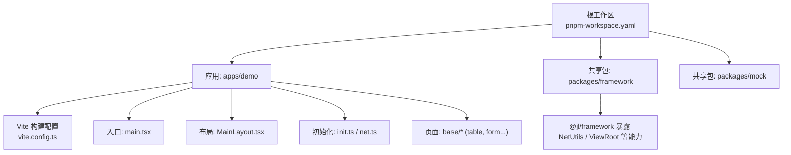
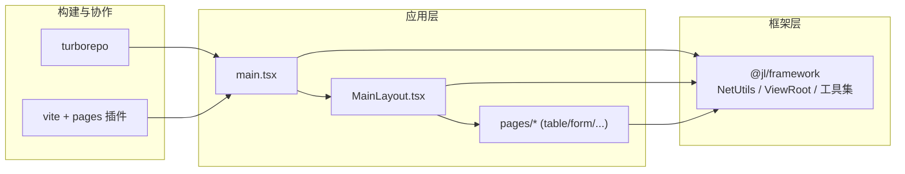
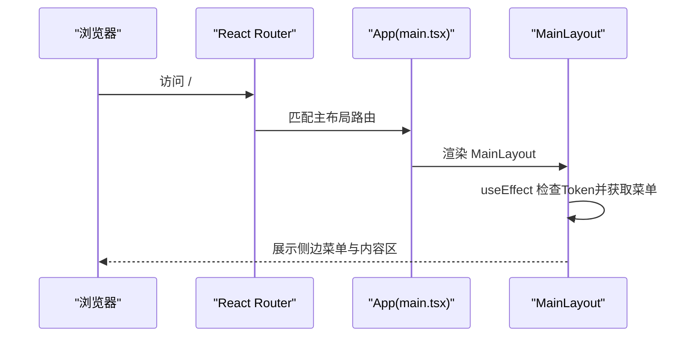
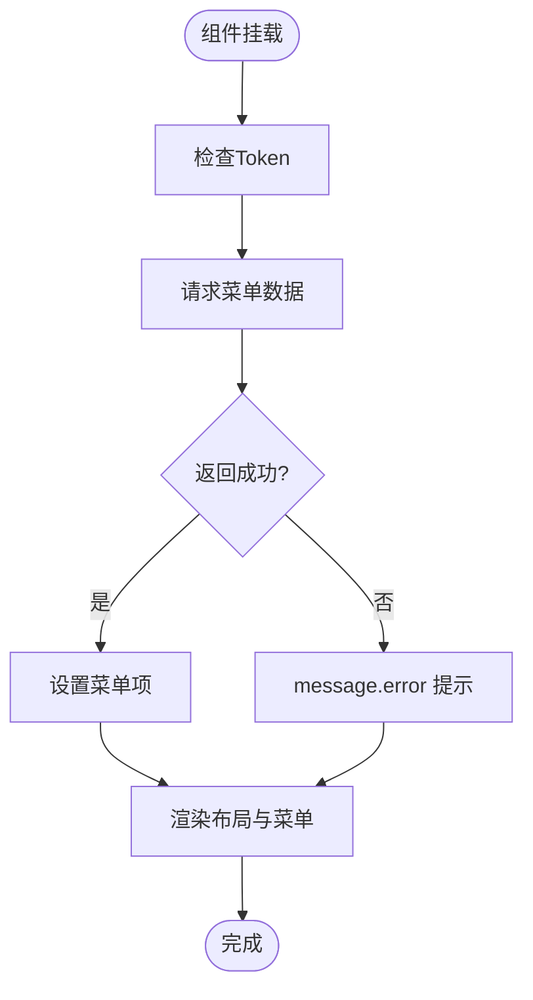
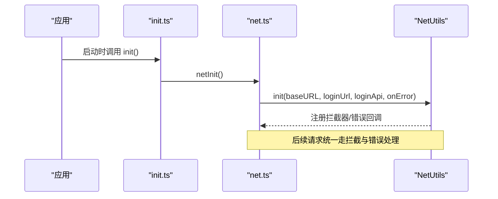
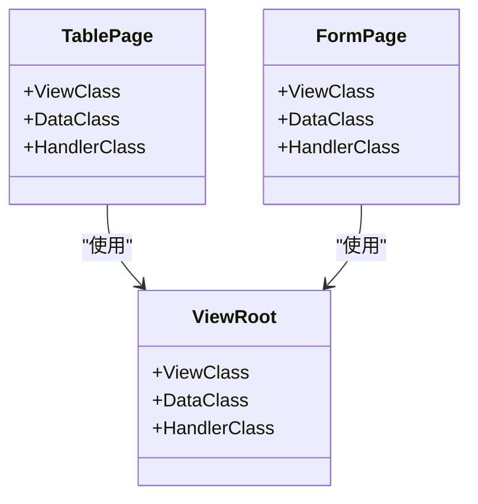
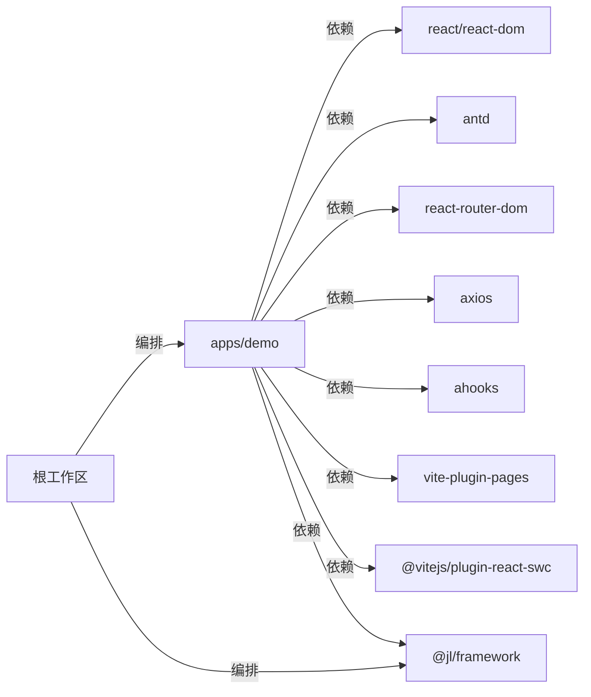

# 项目概述

<cite>
**本文引用的文件**
- [package.json](file://package.json)
- [turbo.json](file://turbo.json)
- [pnpm-workspace.yaml](file://pnpm-workspace.yaml)
- [apps/demo/package.json](file://apps/demo/package.json)
- [apps/demo/vite.config.ts](file://apps/demo/vite.config.ts)
- [apps/demo/src/main.tsx](file://apps/demo/src/main.tsx)
- [apps/demo/src/layouts/main/MainLayout.tsx](file://apps/demo/src/layouts/main/MainLayout.tsx)
- [apps/demo/src/init/init.ts](file://apps/demo/src/init/init.ts)
- [apps/demo/src/init/net.ts](file://apps/demo/src/init/net.ts)
- [apps/demo/src/pages/base/table/index.tsx](file://apps/demo/src/pages/base/table/index.tsx)
- [apps/demo/src/pages/base/form/index.tsx](file://apps/demo/src/pages/base/form/index.tsx)
</cite>

## 目录
1. [简介](#简介)
2. [项目结构](#项目结构)
3. [核心组件](#核心组件)
4. [架构总览](#架构总览)
5. [详细组件分析](#详细组件分析)
6. [依赖关系分析](#依赖关系分析)
7. [性能考量](#性能考量)
8. [故障排查指南](#故障排查指南)
9. [结论](#结论)
10. [附录](#附录)

## 简介
本项目是一个基于 React + TypeScript 的企业级仓库管理系统（WMS）Web 前端，采用 Monorepo 组织方式，通过 pnpm workspace + Turborepo 实现多应用与共享包的统一构建、缓存与任务编排。项目以 Vite 为构建工具，使用 React Router 进行路由管理，Ant Design 作为 UI 基础组件库，结合 ahooks、axios、simplebar-react 等生态工具提升开发体验与运行效率。框架层通过自定义包 @jl/framework 提供网络请求封装、鉴权拦截、页面容器 ViewRoot 等通用能力，配合 pages 插件实现“按目录即路由”的约定式路由，降低样板代码，提高可维护性。

本项目的目标：
- 提供企业级 WMS Web 前端的工程化基座与最佳实践
- 通过 Monorepo 沉淀通用能力，支撑多业务线复用
- 以组件化与约定式路由提升开发效率与一致性
- 借助现代工具链保障构建速度、类型安全与可观测性

## 项目结构
仓库采用 Monorepo 结构：
- apps/*：业务应用（当前包含 demo 应用）
- packages/*：共享包（framework 框架包、mock 数据等）
- 根目录：工作区配置、脚本与全局工具（pnpm-workspace.yaml、turbo.json、ESLint/Prettier/Stylelint 等）

图表来源
- [pnpm-workspace.yaml:1-5](file://pnpm-workspace.yaml#L1-L5)
- [apps/demo/vite.config.ts:1-36](file://apps/demo/vite.config.ts#L1-L36)
- [apps/demo/src/main.tsx:1-53](file://apps/demo/src/main.tsx#L1-L53)
- [apps/demo/src/layouts/main/MainLayout.tsx:1-77](file://apps/demo/src/layouts/main/MainLayout.tsx#L1-L77)
- [apps/demo/src/init/init.ts:1-9](file://apps/demo/src/init/init.ts#L1-L9)
- [apps/demo/src/init/net.ts:1-20](file://apps/demo/src/init/net.ts#L1-L20)

章节来源
- [pnpm-workspace.yaml:1-5](file://pnpm-workspace.yaml#L1-L5)
- [turbo.json:1-29](file://turbo.json#L1-L29)
- [apps/demo/package.json:1-44](file://apps/demo/package.json#L1-L44)
- [apps/demo/vite.config.ts:1-36](file://apps/demo/vite.config.ts#L1-L36)

## 核心组件
- 应用壳与路由装配
  - 入口 main.tsx 使用 React 19 createRoot 渲染，包裹 BrowserRouter、Suspense、ConfigProvider（主题），并通过 useRoutes 将约定式路由与登录/主布局组合。
- 主布局 MainLayout
  - 负责侧边菜单折叠、头部操作区、标签页占位区域与内容区滚动容器（SimpleBar）。
  - 在挂载时校验 Token 并拉取菜单数据，错误通过 Ant Design message 提示。
- 初始化流程
  - init.ts 调用 netInit 完成网络层初始化（BaseURL、登录地址、登录接口、统一错误处理）。
- 页面容器 ViewRoot
  - 通过 @jl/framework 提供的 ViewRoot 将页面拆分为 Data（数据）、Handler（交互）、View（视图）三部分，便于复杂表单/表格页面的解耦与维护。

章节来源
- [apps/demo/src/main.tsx:1-53](file://apps/demo/src/main.tsx#L1-L53)
- [apps/demo/src/layouts/main/MainLayout.tsx:1-77](file://apps/demo/src/layouts/main/MainLayout.tsx#L1-L77)
- [apps/demo/src/init/init.ts:1-9](file://apps/demo/src/init/init.ts#L1-L9)
- [apps/demo/src/init/net.ts:1-20](file://apps/demo/src/init/net.ts#L1-L20)
- [apps/demo/src/pages/base/table/index.tsx:1-10](file://apps/demo/src/pages/base/table/index.tsx#L1-L10)
- [apps/demo/src/pages/base/form/index.tsx:1-10](file://apps/demo/src/pages/base/form/index.tsx#L1-L10)

## 架构总览
整体采用“应用 + 框架包”的分层设计：
- 应用层（apps/demo）：承载具体业务页面、布局、路由与样式；通过 vite-plugin-pages 自动生成路由；通过 Vite 别名指向框架源码以便本地调试。
- 框架层（packages/framework）：提供 NetUtils、ViewRoot、通用 Hook/工具等；被多个应用复用。
- 构建与协作：Turborepo 统一编排 dev/build/lint 任务，启用缓存与持久化任务；pnpm workspace 管理多包依赖。

图表来源
- [apps/demo/src/main.tsx:1-53](file://apps/demo/src/main.tsx#L1-L53)
- [apps/demo/src/layouts/main/MainLayout.tsx:1-77](file://apps/demo/src/layouts/main/MainLayout.tsx#L1-L77)
- [apps/demo/src/pages/base/table/index.tsx:1-10](file://apps/demo/src/pages/base/table/index.tsx#L1-L10)
- [apps/demo/src/pages/base/form/index.tsx:1-10](file://apps/demo/src/pages/base/form/index.tsx#L1-L10)
- [turbo.json:1-29](file://turbo.json#L1-L29)
- [apps/demo/vite.config.ts:1-36](file://apps/demo/vite.config.ts#L1-L36)

## 详细组件分析

### 应用启动与路由装配
- 入口渲染：createRoot 挂载到 #root，StrictMode 下渲染 App。
- 路由策略：useRoutes 组合登录路由与主布局路由，子路由由 vite-plugin-pages 自动扫描生成。
- 主题与加载：ConfigProvider 注入紧凑主题；Suspense 提供加载态。

图表来源
- [apps/demo/src/main.tsx:1-53](file://apps/demo/src/main.tsx#L1-L53)
- [apps/demo/src/layouts/main/MainLayout.tsx:1-77](file://apps/demo/src/layouts/main/MainLayout.tsx#L1-L77)

章节来源
- [apps/demo/src/main.tsx:1-53](file://apps/demo/src/main.tsx#L1-L53)

### 主布局与菜单数据流
- 状态：collapsed（菜单折叠）、menuItems（菜单项）。
- 副作用：useEffect 中执行 Token 校验与菜单数据获取；location 变化时重新拉取菜单。
- 交互：Header 按钮切换折叠；内容区使用 SimpleBar 控制滚动。

图表来源
- [apps/demo/src/layouts/main/MainLayout.tsx:1-77](file://apps/demo/src/layouts/main/MainLayout.tsx#L1-L77)

章节来源
- [apps/demo/src/layouts/main/MainLayout.tsx:1-77](file://apps/demo/src/layouts/main/MainLayout.tsx#L1-L77)

### 网络初始化与错误处理
- 初始化：netInit 调用 NetUtils.init，传入 BaseURL、登录地址、登录接口与统一错误回调。
- 错误处理：当 code 为 401 时触发未授权处理；其他错误通过 message 提示。

图表来源
- [apps/demo/src/init/init.ts:1-9](file://apps/demo/src/init/init.ts#L1-L9)
- [apps/demo/src/init/net.ts:1-20](file://apps/demo/src/init/net.ts#L1-L20)

章节来源
- [apps/demo/src/init/init.ts:1-9](file://apps/demo/src/init/init.ts#L1-L9)
- [apps/demo/src/init/net.ts:1-20](file://apps/demo/src/init/net.ts#L1-L20)

### 页面容器 ViewRoot 模式（表单/表格）
- 约定：每个页面通过 ViewRoot 注入 ViewClass、DataClass、HandlerClass，实现视图、数据与交互逻辑分离。
- 示例：base/table、base/form 均使用该模式，便于扩展与测试。

图表来源
- [apps/demo/src/pages/base/table/index.tsx:1-10](file://apps/demo/src/pages/base/table/index.tsx#L1-L10)
- [apps/demo/src/pages/base/form/index.tsx:1-10](file://apps/demo/src/pages/base/form/index.tsx#L1-L10)

章节来源
- [apps/demo/src/pages/base/table/index.tsx:1-10](file://apps/demo/src/pages/base/table/index.tsx#L1-L10)
- [apps/demo/src/pages/base/form/index.tsx:1-10](file://apps/demo/src/pages/base/form/index.tsx#L1-L10)

## 依赖关系分析
- 应用依赖
  - React 19、ReactDOM 19：最新特性与性能优化
  - Ant Design 6：企业级 UI 组件与主题系统
  - react-router-dom 7：声明式路由与嵌套路由
  - axios：HTTP 客户端
  - ahooks：常用 Hooks 集合
  - simplebar-react：高性能滚动容器
  - vite-plugin-pages：约定式路由
  - @vitejs/plugin-react-swc：基于 SWC 的快速热更新
- 构建与协作
  - Turbo：跨包任务编排与缓存
  - pnpm workspace：多包依赖管理与链接
- 框架包
  - @jl/framework：通过 Vite 别名指向源码，便于联调与迭代

图表来源
- [apps/demo/package.json:1-44](file://apps/demo/package.json#L1-L44)
- [apps/demo/vite.config.ts:1-36](file://apps/demo/vite.config.ts#L1-L36)
- [turbo.json:1-29](file://turbo.json#L1-L29)
- [pnpm-workspace.yaml:1-5](file://pnpm-workspace.yaml#L1-L5)

章节来源
- [apps/demo/package.json:1-44](file://apps/demo/package.json#L1-L44)
- [turbo.json:1-29](file://turbo.json#L1-L29)
- [pnpm-workspace.yaml:1-5](file://pnpm-workspace.yaml#L1-L5)

## 性能考量
- 构建与热更新
  - 使用 @vitejs/plugin-react-swc 获得更快的编译与热更新体验。
  - Turborepo 对 build/dev/lint 启用缓存，减少重复计算。
- 运行时性能
  - 内容区使用 simplebar-react 避免原生滚动条的性能瓶颈。
  - 路由懒加载：vite-plugin-pages 默认异步导入页面，减小首屏体积。
- 资源与主题
  - 通过 ConfigProvider 集中管理主题，减少重复样式开销。
- 建议
  - 按需引入组件与图标，避免全量打包。
  - 合理拆分页面与模块，利用 Suspense 与路由懒加载优化首屏。

[本节为通用性能建议，不直接分析具体文件]

## 故障排查指南
- 网络请求失败或 401 未授权
  - 检查初始化参数是否正确（BaseURL、登录地址、登录接口）。
  - 确认 NetUtils 的错误回调已正确注册，并在 401 时触发未授权处理。
- 菜单无法加载
  - 检查环境变量是否配置了菜单接口地址。
  - 查看控制台 message 提示与网络请求响应码。
- 路由不生效
  - 确认 vite-plugin-pages 的扫描目录与扩展名配置。
  - 检查 useRoutes 的路由数组是否正确组合登录与主布局。
- 构建/开发问题
  - 使用 Turborepo 的任务缓存清理后重试。
  - 确保 pnpm workspace 依赖安装完整。

章节来源
- [apps/demo/src/init/net.ts:1-20](file://apps/demo/src/init/net.ts#L1-L20)
- [apps/demo/src/layouts/main/MainLayout.tsx:1-77](file://apps/demo/src/layouts/main/MainLayout.tsx#L1-L77)
- [apps/demo/vite.config.ts:1-36](file://apps/demo/vite.config.ts#L1-L36)

## 结论
本项目以 Monorepo 为基础，结合现代前端工具链与组件化思想，构建了可扩展、可维护的企业级 WMS Web 前端基座。通过 @jl/framework 沉淀通用能力，配合约定式路由与页面容器模式，显著降低样板代码并提升团队协作效率。未来可在框架层继续抽象权限、国际化、埋点等横切关注点，进一步统一各业务应用的工程规范与用户体验。

[本节为总结性内容，不直接分析具体文件]

## 附录
- 快速开始
  - 安装依赖：在工作区根目录执行包管理器安装命令。
  - 启动开发：使用 Turborepo 启动 demo 应用开发服务器。
  - 构建产物：执行构建任务，输出至应用 dist 目录。
- 环境变量
  - 服务端口、API 基础路径、登录地址、菜单接口等通过环境变量注入，便于不同环境切换。
- 常用命令
  - 开发：启动本地开发服务器（支持热更新）
  - 构建：生产构建（含类型检查与打包）
  - 预览：预览构建产物
  - 代码检查：执行 ESLint 规则检查

章节来源
- [package.json:1-19](file://package.json#L1-L19)
- [apps/demo/package.json:1-44](file://apps/demo/package.json#L1-L44)
- [turbo.json:1-29](file://turbo.json#L1-L29)