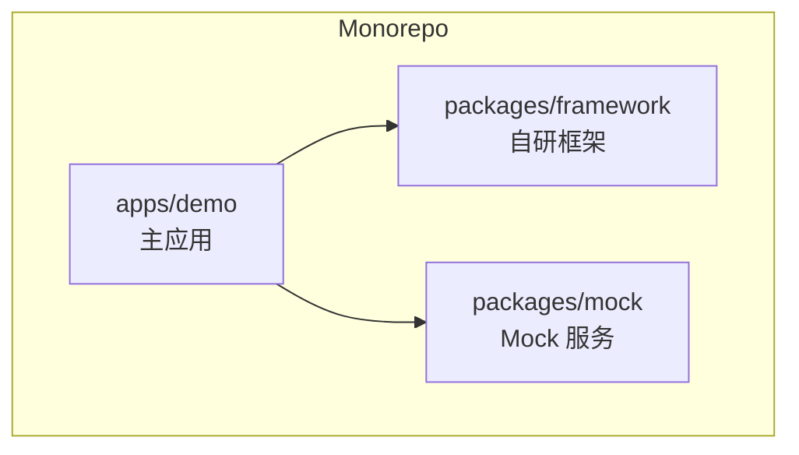
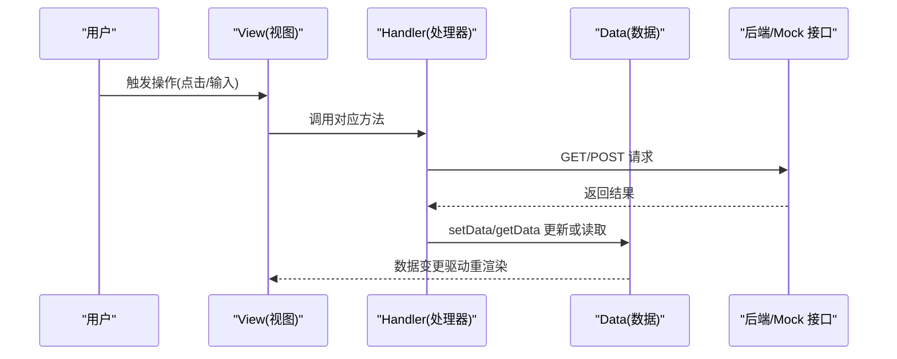
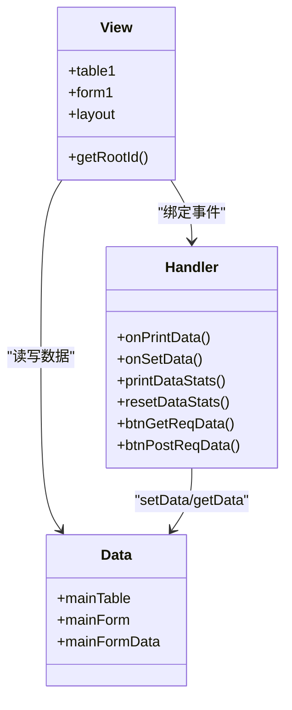
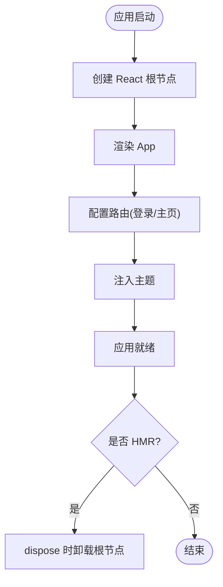
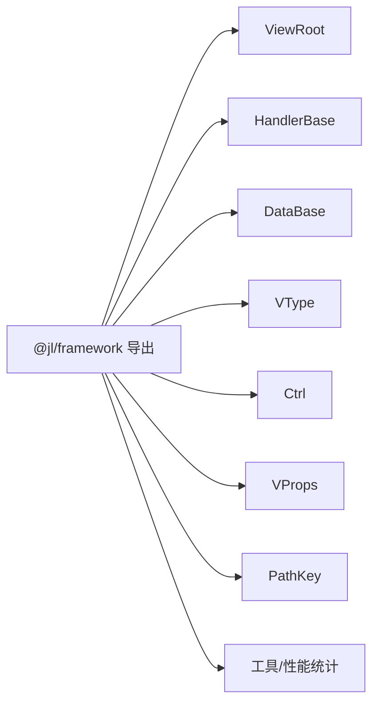
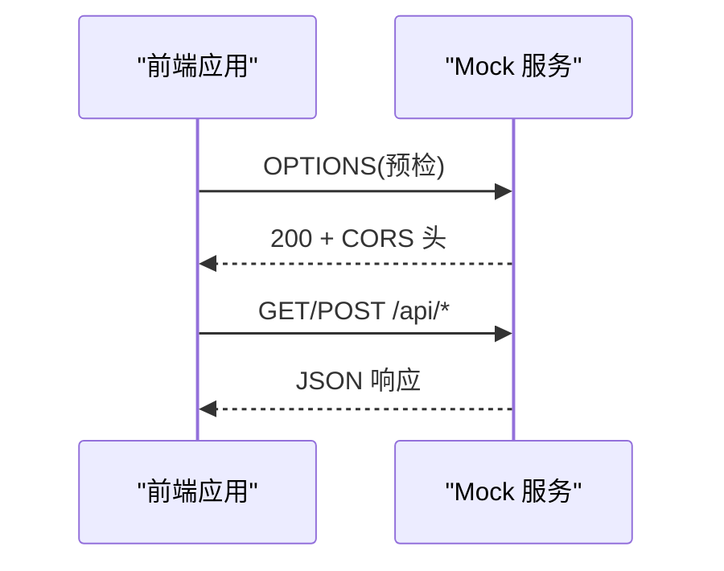
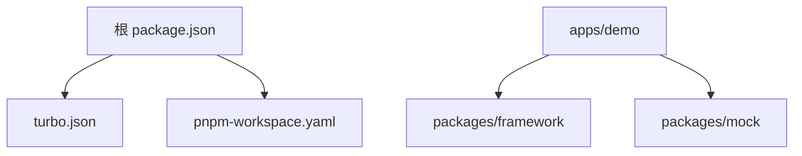

# 项目结构

<cite>
**本文引用的文件**
- [package.json](file://package.json)
- [turbo.json](file://turbo.json)
- [pnpm-workspace.yaml](file://pnpm-workspace.yaml)
- [apps/demo/package.json](file://apps/demo/package.json)
- [apps/demo/vite.config.ts](file://apps/demo/vite.config.ts)
- [apps/demo/src/main.tsx](file://apps/demo/src/main.tsx)
- [apps/demo/src/pages/base/table/index.tsx](file://apps/demo/src/pages/base/table/index.tsx)
- [apps/demo/src/pages/base/table/view.tsx](file://apps/demo/src/pages/base/table/view.tsx)
- [apps/demo/src/pages/base/table/handler.ts](file://apps/demo/src/pages/base/table/handler.ts)
- [apps/demo/src/pages/base/table/data.tsx](file://apps/demo/src/pages/base/table/data.tsx)
- [packages/framework/package.json](file://packages/framework/package.json)
- [packages/framework/src/index.ts](file://packages/framework/src/index.ts)
- [packages/mock/package.json](file://packages/mock/package.json)
- [packages/mock/src/index.ts](file://packages/mock/src/index.ts)
</cite>

## 目录
1. [简介](#简介)
2. [项目结构](#项目结构)
3. [核心组件](#核心组件)
4. [架构总览](#架构总览)
5. [详细组件分析](#详细组件分析)
6. [依赖分析](#依赖分析)
7. [性能考虑](#性能考虑)
8. [故障排查指南](#故障排查指南)
9. [结论](#结论)
10. [附录](#附录)

## 简介
本仓库采用 Monorepo 组织方式，包含三个主要部分：
- apps/demo：主应用（WMS Web 前端），基于 React + Vite 构建，使用自研框架 @jl/framework。
- packages/framework：自研前端框架，提供 View-Data-Handler 的 MVC 能力、类型与工具导出。
- packages/mock：本地 Mock 服务，基于 Express + Mock.js，为前端开发提供接口数据。

通过 pnpm workspace 与 Turbo 进行统一脚本编排与缓存加速，配合 Vite Pages 插件实现页面路由自动生成。

## 项目结构
Monorepo 根目录职责与约定：
- apps/*：所有应用入口，当前为 demo 应用。
- packages/*：共享库与工具，当前包含 framework 与 mock。
- 根级配置：
  - package.json：定义 monorepo 脚本（build/dev/lint）并引入 turbo。
  - turbo.json：任务定义与缓存策略，统一 dev/build/lint 行为。
  - pnpm-workspace.yaml：声明 apps/* 与 packages/* 为工作区。

应用层（apps/demo）职责与约定：
- src/pages：按功能域划分页面，每个页面遵循 MVC 三件套（view.tsx、data.tsx、handler.ts）与 index.tsx 聚合。
- src/layouts：布局组件（登录/主布局）。
- src/init：全局初始化逻辑（网络、存储等）。
- src/theme：主题配置。
- vite.config.ts：Vite 配置，集成 Pages 插件、别名映射到框架源码、环境变量注入。

框架层（packages/framework）职责与约定：
- 统一导出：ViewRoot、HandlerBase、DataBase、VType、Ctrl、VProps、PathKey、工具与性能统计等。
- peerDependencies 声明运行时依赖（React、AntD、Axios 等），由宿主应用安装。
- 输出 UMD/ESM 与类型声明，供应用以模块方式引用。

Mock 服务层（packages/mock）职责与约定：
- 基于 Express 启动 HTTP 服务，提供 /api/login、/api/menu、/api/demo 等路由。
- 启用 CORS，支持预检请求；默认端口 3001。
- 通过 nodemon 热重载，便于开发调试。

图表来源
- [pnpm-workspace.yaml:1-5](file://pnpm-workspace.yaml#L1-L5)
- [turbo.json:1-29](file://turbo.json#L1-L29)
- [apps/demo/vite.config.ts:1-36](file://apps/demo/vite.config.ts#L1-L36)

章节来源
- [package.json:1-19](file://package.json#L1-L19)
- [turbo.json:1-29](file://turbo.json#L1-L29)
- [pnpm-workspace.yaml:1-5](file://pnpm-workspace.yaml#L1-L5)
- [apps/demo/package.json:1-44](file://apps/demo/package.json#L1-L44)
- [apps/demo/vite.config.ts:1-36](file://apps/demo/vite.config.ts#L1-L36)

## 核心组件
- 应用入口与路由
  - main.tsx：创建 React 根节点，包裹 BrowserRouter，挂载 App；根据环境变量注入登录页与主布局路由；HMR 时卸载根节点避免重复渲染。
  - vite.config.ts：启用 Pages 插件扫描 src/pages，自动异步导入页面；将 @jl/framework 指向源码目录以便开发期联调；注入 __APP_ENV__。
- 框架导出
  - packages/framework/src/index.ts：集中导出 ViewRoot、HandlerBase、DataBase、VType、Ctrl、VProps、PathKey、工具与性能统计方法。
- Mock 服务
  - packages/mock/src/index.ts：Express 应用，注册 /api/* 路由，开启 CORS，监听端口。

章节来源
- [apps/demo/src/main.tsx:1-53](file://apps/demo/src/main.tsx#L1-L53)
- [apps/demo/vite.config.ts:1-36](file://apps/demo/vite.config.ts#L1-L36)
- [packages/framework/src/index.ts:1-69](file://packages/framework/src/index.ts#L1-L69)
- [packages/mock/src/index.ts:1-53](file://packages/mock/src/index.ts#L1-L53)

## 架构总览
本项目在应用中采用 MVC 模式：
- View：负责 UI 结构与控件配置，继承 ViewBase，声明表单、表格、布局等视图属性。
- Data：管理数据模型与数据源，继承 DataBase，定义数据项、关联关系与 URL。
- Handler：处理用户交互与业务逻辑，继承 HandlerBase，封装 get/post 请求与状态更新。

页面入口通过 ViewRoot 将三者装配，形成“声明式视图 + 数据驱动 + 事件处理”的解耦结构。

图表来源
- [apps/demo/src/pages/base/table/view.tsx:1-86](file://apps/demo/src/pages/base/table/view.tsx#L1-L86)
- [apps/demo/src/pages/base/table/handler.ts:1-30](file://apps/demo/src/pages/base/table/handler.ts#L1-L30)
- [apps/demo/src/pages/base/table/data.tsx:1-22](file://apps/demo/src/pages/base/table/data.tsx#L1-L22)
- [packages/mock/src/index.ts:1-53](file://packages/mock/src/index.ts#L1-L53)

## 详细组件分析

### 页面 MVC 示例：基础表格页
- 入口聚合：index.tsx 使用 ViewRoot 装配 View、Data、Handler。
- 视图层：view.tsx 定义表格、表单、布局等控件配置，并通过工具栏按钮绑定 handler 方法。
- 数据层：data.tsx 定义主表与主表单的数据项，建立父子数据关联。
- 处理层：handler.ts 提供打印、设置数据、GET/POST 请求等方法。

图表来源
- [apps/demo/src/pages/base/table/index.tsx:1-10](file://apps/demo/src/pages/base/table/index.tsx#L1-L10)
- [apps/demo/src/pages/base/table/view.tsx:1-86](file://apps/demo/src/pages/base/table/view.tsx#L1-L86)
- [apps/demo/src/pages/base/table/data.tsx:1-22](file://apps/demo/src/pages/base/table/data.tsx#L1-L22)
- [apps/demo/src/pages/base/table/handler.ts:1-30](file://apps/demo/src/pages/base/table/handler.ts#L1-L30)

章节来源
- [apps/demo/src/pages/base/table/index.tsx:1-10](file://apps/demo/src/pages/base/table/index.tsx#L1-L10)
- [apps/demo/src/pages/base/table/view.tsx:1-86](file://apps/demo/src/pages/base/table/view.tsx#L1-L86)
- [apps/demo/src/pages/base/table/data.tsx:1-22](file://apps/demo/src/pages/base/table/data.tsx#L1-L22)
- [apps/demo/src/pages/base/table/handler.ts:1-30](file://apps/demo/src/pages/base/table/handler.ts#L1-L30)

### 应用启动流程
- main.tsx 创建根节点并挂载 App。
- App 内使用 useRoutes 组合登录与主布局路由。
- 通过 ConfigProvider 注入主题，Suspense 包裹路由内容。
- HMR 环境下在 dispose 中卸载根节点，避免内存泄漏。

图表来源
- [apps/demo/src/main.tsx:1-53](file://apps/demo/src/main.tsx#L1-L53)

章节来源
- [apps/demo/src/main.tsx:1-53](file://apps/demo/src/main.tsx#L1-L53)

### 框架导出与类型体系
- 统一导出：ViewRoot、HandlerBase、DataBase、VType、Ctrl、VProps、PathKey、工具与性能统计。
- 类型命名空间：VProps 下包含 Form/Table/Tab/ToolBar/Flex/Modal/Drawer 等视图类型。
- 依赖声明：peerDependencies 要求宿主应用安装 React、AntD、Axios 等。

图表来源
- [packages/framework/src/index.ts:1-69](file://packages/framework/src/index.ts#L1-L69)
- [packages/framework/package.json:1-52](file://packages/framework/package.json#L1-L52)

章节来源
- [packages/framework/src/index.ts:1-69](file://packages/framework/src/index.ts#L1-L69)
- [packages/framework/package.json:1-52](file://packages/framework/package.json#L1-L52)

### Mock 服务与跨域
- 启动 Express 应用，监听端口（默认 3001）。
- 启用 JSON body 解析与 CORS 中间件，支持预检请求。
- 注册 /api/login、/api/menu、/api/demo 路由，根路径返回欢迎信息。

图表来源
- [packages/mock/src/index.ts:1-53](file://packages/mock/src/index.ts#L1-L53)

章节来源
- [packages/mock/src/index.ts:1-53](file://packages/mock/src/index.ts#L1-L53)
- [packages/mock/package.json:1-32](file://packages/mock/package.json#L1-L32)

## 依赖分析
- 工作区与包管理
  - pnpm-workspace.yaml 声明 apps/* 与 packages/* 为工作区。
  - 根 package.json 通过 turbo 统一脚本。
- 应用依赖
  - apps/demo 依赖 @jl/framework、antd、axios、react-router-dom 等。
  - 通过 vite.config.ts 将 @jl/framework 指向源码目录，便于开发期联调。
- 框架依赖
  - packages/framework 以 peerDependencies 声明运行时依赖，自身依赖 zustand、immer 等。
- Mock 依赖
  - packages/mock 依赖 express、mockjs、nodemon 等。

图表来源
- [package.json:1-19](file://package.json#L1-L19)
- [turbo.json:1-29](file://turbo.json#L1-L29)
- [pnpm-workspace.yaml:1-5](file://pnpm-workspace.yaml#L1-L5)
- [apps/demo/package.json:1-44](file://apps/demo/package.json#L1-L44)
- [packages/framework/package.json:1-52](file://packages/framework/package.json#L1-L52)
- [packages/mock/package.json:1-32](file://packages/mock/package.json#L1-L32)

章节来源
- [package.json:1-19](file://package.json#L1-L19)
- [turbo.json:1-29](file://turbo.json#L1-L29)
- [pnpm-workspace.yaml:1-5](file://pnpm-workspace.yaml#L1-L5)
- [apps/demo/package.json:1-44](file://apps/demo/package.json#L1-L44)
- [packages/framework/package.json:1-52](file://packages/framework/package.json#L1-L52)
- [packages/mock/package.json:1-32](file://packages/mock/package.json#L1-L32)

## 性能考虑
- 构建与缓存
  - turbo.json 对 build 与 lint 启用缓存，dev 与 dev:mock 设置为持久任务，减少重复执行开销。
- 页面加载
  - vite-plugin-pages 使用 importMode: 'async' 实现页面按需加载，降低首屏体积。
- 运行时优化
  - 使用 Suspense 包裹路由，提升加载体验。
  - 框架提供 printStats/resetStats 用于 getData 性能追踪，便于定位热点。

[本节为通用指导，不直接分析具体文件]

## 故障排查指南
- 开发环境无法访问 Mock 服务
  - 检查 Mock 服务是否已启动且端口未被占用（默认 3001）。
  - 确认浏览器控制台是否存在 CORS 错误；Mock 服务已启用 CORS，若自定义代理需保持一致。
- 页面路由未生效
  - 确认页面文件位于 src/pages 下，并按 MVC 规范提供 view.tsx、data.tsx、handler.ts 与 index.tsx。
  - 检查 vite.config.ts 中 Pages 插件配置是否正确。
- 框架模块无法解析
  - 确认 vite.config.ts 中 @jl/framework 别名指向源码目录。
  - 确保框架依赖已在宿主应用安装（peerDependencies）。
- 构建失败
  - 使用根脚本 turbo run build 统一构建；检查各子包的 TypeScript 与 ESLint 配置。

章节来源
- [packages/mock/src/index.ts:1-53](file://packages/mock/src/index.ts#L1-L53)
- [apps/demo/vite.config.ts:1-36](file://apps/demo/vite.config.ts#L1-L36)
- [turbo.json:1-29](file://turbo.json#L1-L29)

## 结论
本项目通过 Monorepo 将应用、框架与 Mock 服务解耦，结合 Vite 与 Turbo 提升开发与构建效率。在应用中采用 MVC 模式，以 View-Data-Handler 分离关注点，提高可维护性与扩展性。统一的导出与类型体系使框架能力易于复用，Mock 服务则有效支撑前后端并行开发。

[本节为总结性内容，不直接分析具体文件]

## 附录
- 快速导航
  - 应用入口：apps/demo/src/main.tsx
  - 页面示例：apps/demo/src/pages/base/table/*
  - 框架导出：packages/framework/src/index.ts
  - Mock 服务：packages/mock/src/index.ts
- 常用脚本
  - 根目录：pnpm dev / pnpm build / pnpm lint
  - 应用：pnpm dev:mock（切换 mock 模式）
  - Mock：pnpm dev:mock（启动本地服务）

[本节为补充说明，不直接分析具体文件]